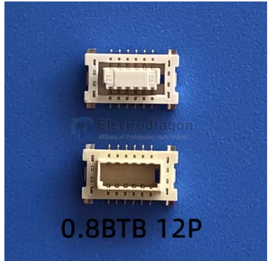
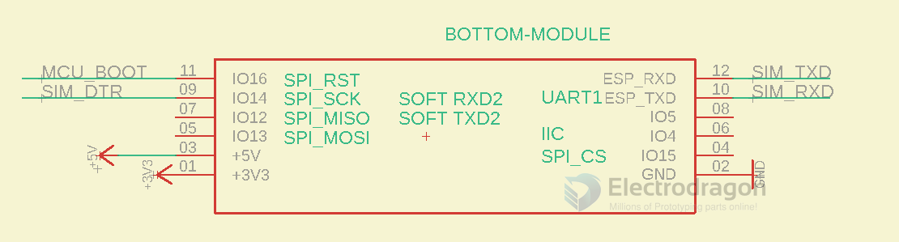

# BTB dat 

- [[ESP32-SPI-dat]]

| ESP32 Pin | Function | Lora       |
| --------- | -------- | ---------- |
| IO14      | SPI_SCK  |            |
| IO12      | SPI_MISO |            |
| IO13      | SPI_MOSI |            |
| IO15      | SPI_CS   |            |
| IO4       | IO       | LORA_IRQ   |
| IO27      | IO       | LORA_RESET |

## connectors 

- total height = 3.0
- 12P, 0.8mm pitch 

## base board

## attach board ref 

### lora

- [[Lora-dat]] - [[ESP32-SPI-dat]]

- use UART as main interface 

### SIM7020 

- use UART as main interface 

### SIM7080

- [[NGS1128-dat]]
- removed, due to less popular 

## ref 

- [[BTB]]