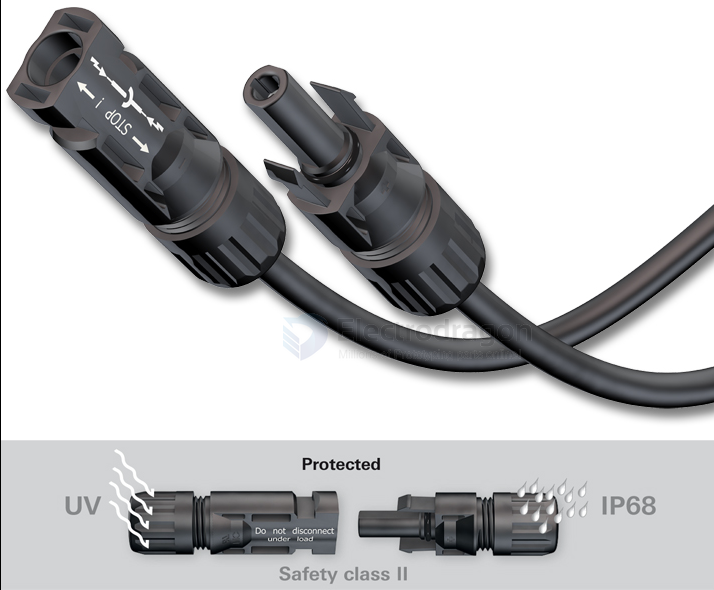
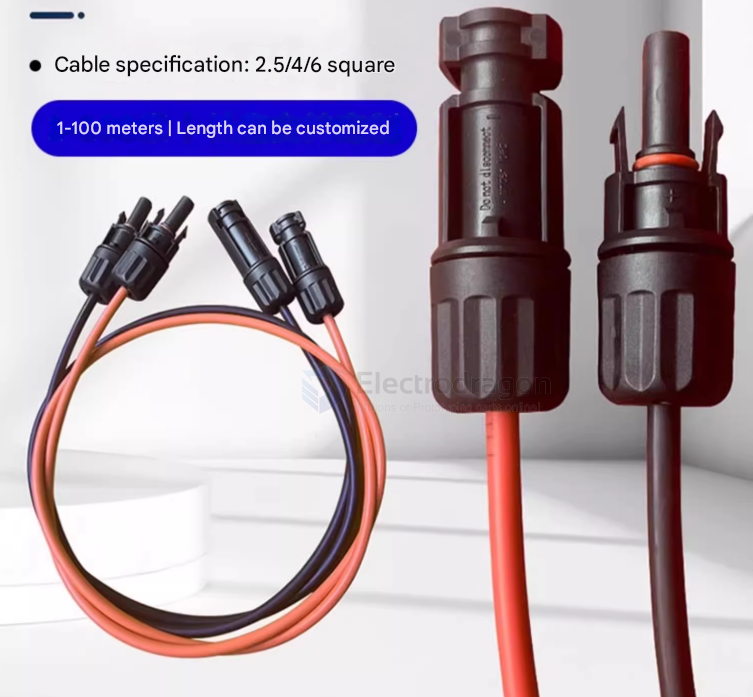

# Conn-dat 

- [[crimp-terminal-dat]]

- [[conn-PCIE-dat]] - [[conn-pin-header-dat]]

- [[Conn-IPEX-dat]] - [[CONN-SMA-dat]]

- board to board [[BTB-dat]]

- [[RJ-11-dat]] - [[RJ-45-dat]]

- [[DB9-dat]]

- [[XH2.54-dat]] - [[PH2.0-dat]] - [[JST-dat]]

- [[CONN-Plug-dat]]

- [[conn-cable-terminal-dat]]

- [[conn-audio-dat]] - [[conn-video-dat]]

## BOM 

- [[CCO3515-dat]] - [[CCO3612-dat]] - [[CCO3587-dat]] 

## unlisted 

### MC4 CONN 

https://en.wikipedia.org/wiki/MC4_connector

solar extension cable 

### JOINT TECH

#### A1001WR-S-2P

- Manufacturer - JOINT TECH
- Type of connector - wire-board
- Connector - socket
- Kind of connector - male
- Contacts pitch - 1mm
- Number of pins - 2
- Electrical mounting - SMT
- Rated voltage - 50V
- Current rating - 1A
- [TME](https://www.tme.eu/lr/en/details/nx1001-02smr/raster-signal-connectors-1-00mm/joint-tech/a1001wr-s-2p/)

#### NX1001-TF

- Contact; female; phosphor bronze; tinned; 32AWG÷28AWG; crimped; 1A
- Manufacturer part number: A1001-TPE-B
- TME Symbol: NX1001-TF
- https://www.tme.eu/lr/en/details/nx1001-tf/raster-signal-connectors-1-00mm/joint-tech/a1001-tpe-b/

### PBD2-8 == PBD2-8 (KLS1-208B-4.3-2-8-S) (board sockets, 2x4, 2.00mm)

- Manufacturer : KLS
- Functional description : 2-row sockets for the board, straight, 8 contacts 2x4, pitch 2.00mm, height 4.3mm, 2A, plating: gold 0.8u"
- Pins or sockets : Sockets (socket)
- Pitch : 2.00 mm
- Number of rows : 2-row
- Number of contacts : 8

## ref 

- [[power-dat]]

- [[BOM-dat]]