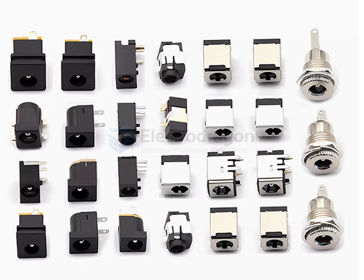
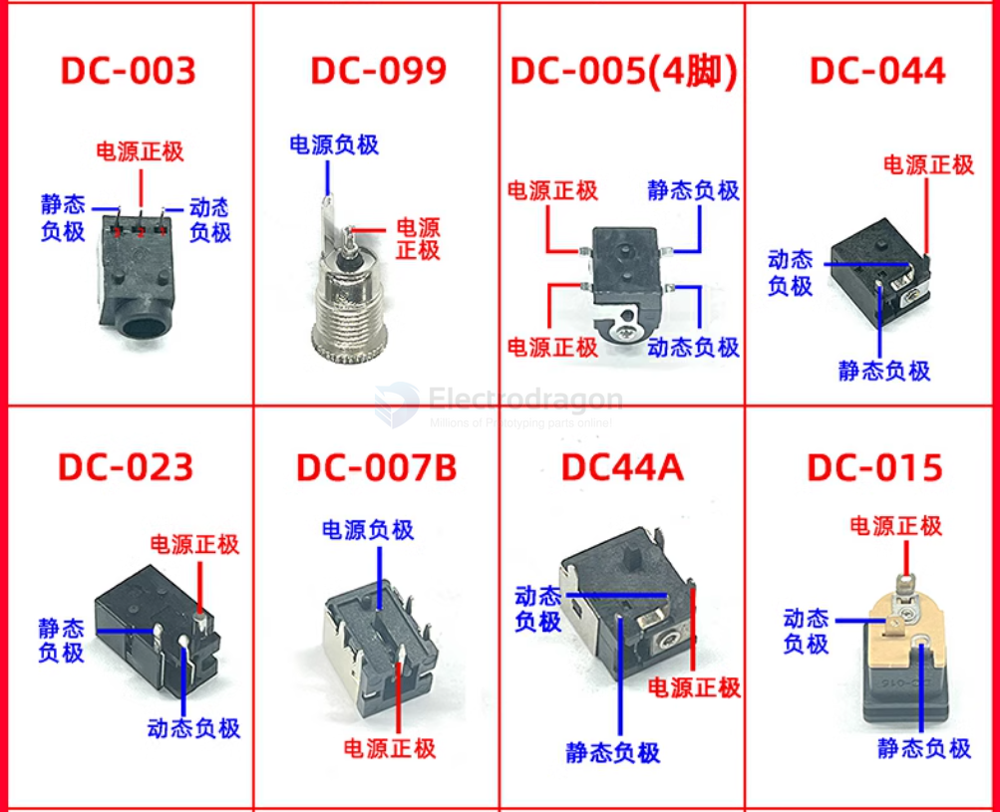
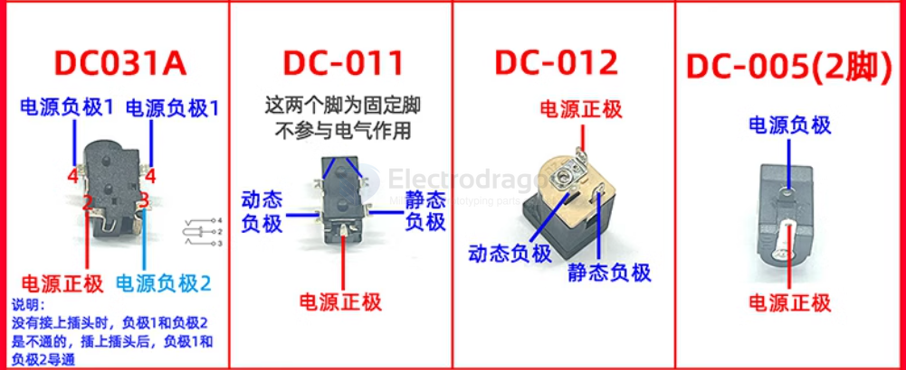
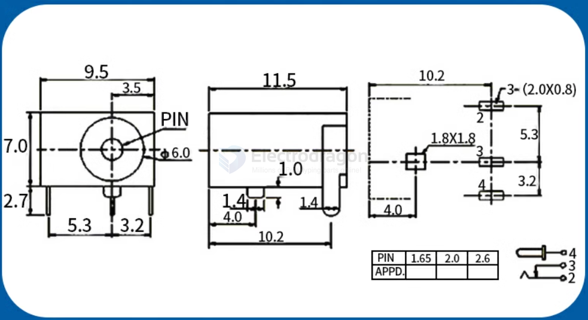

# DC-barrel-jack-dat

- [[CCO3548-dat]] == 5.5-2.1mm DC barrel jack, 5.5mm outer diameter, 2.1mm inner diameter == https://www.electrodragon.com/product/dc-power-jack-male/

- [[CCO3546-dat]] 5.5-2.1mm - [[CCO3547-dat]] 3.5-1.35mm DC barrel jack, 3.5mm outer diameter, 1.35mm inner diameter == https://www.electrodragon.com/product/20pcs-dc-5-5mm-female-pcb-power-jack-pole/

- [[CCO3527-dat]] - 10PCs DC Male to Cable Terminal Connector - https://www.electrodragon.com/product/5pcs-dc-male-cable-connector/

- [[CPP1012-dat]] - 10PCs Panel/Wall Mounted DC Power Connector (5.5-2.1mm) - https://www.electrodragon.com/product/panel-wall-mounted-power-female-connector-5-5-2-1-mm/

# power-jack-dat

- https://www.electrodragon.com/product/20pcs-dc-5-5mm-female-pcb-power-jack-pole/

- plug-head: https://www.electrodragon.com/product/dc-power-jack-male/

- [[CPP1012-dat]] - [[CCO3546-dat]] - [[CCO3548-dat]] - [[CCO3527-dat]] 
  
## Power Jack List 

DC-099 DC电源插座 5.5*2.1（1个）

DC-099 DC电源插座 5.5*2.5（1个）

DC-099 DC电源插座 5.5*2.1 螺纹扁口（1个）

DC-099 DC电源插座 5.5*2.5 螺纹扁口（1个）

DC003A 3.5*1.3 DC电源插座（10个）

DC003/3.5*1.3mm 平口（10个）

DC005 四脚贴片 5.5-2.1（5个）

DC005 四脚贴片 5.5-2.5（5个）

DC-099 DC电源插座 5.5*2.1带防水帽（1个）

DC-099 DC电源插座 5.5*2.5带防水帽（1个）

DC-044 电源接口 5.5*2.1MM(10个）

DC023 电源座 4.4*1.65mm 内径4.0*1.7(5个）

DC-007B带铁壳支架5.5*2.1（1个）

DC-007B带铁壳支架5.5*2.5（1个）

DC44A 5.5*2.1 DC电源插座（2个）

DC-015插座 5.5-2.1MM（10个）

DC031A 四脚贴片 DC电源插座（5个）

DC-011C 2.5-0.7 DC011CDC座 5脚贴片（5个）

5.5*2.5 DC-012插座(10个)

5.5*2.1 DC-005插座2脚（20个）

DC-015插座 5.5-2.5MM(5个）

电源插座带线5.5*2.1MM 长15CM (2个)

DC5.5*2.1 弹片式 电源插头 黄头（2个）

DC5.5*2.5 弹片式 电源插头 黄头（2个）

DC4.0*1.7 电源插头 黄头（2个）

DC4.8*1.7 电源插头 黄头（2个）

## ref 

- [[power-jack]]

- [[conn-power-dat]]