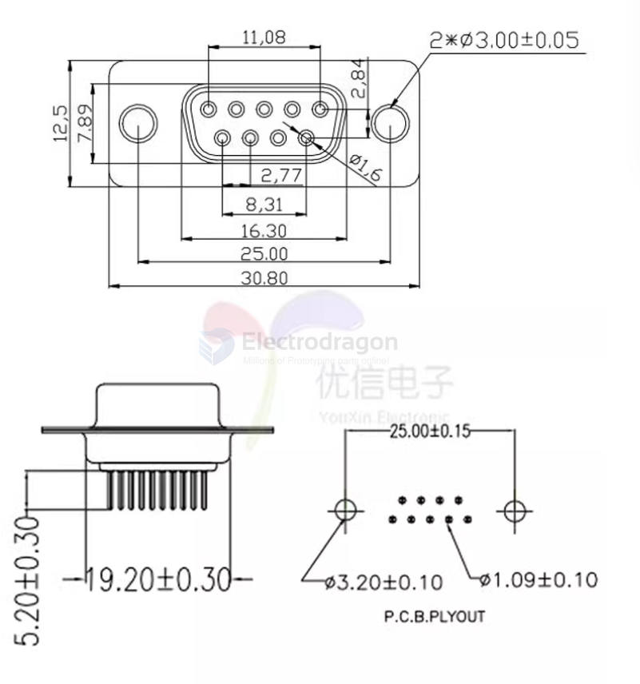
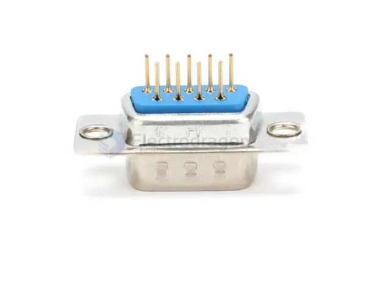

# DB9-dat

- [[RS232-dat]] - [[RS485-dat]]

| -   | DB9 | RS232_Male | RS422   | RS485      |
| --- | --- | ---------- | ------- | ---------- |
|     | 1   | DCD        | T- = A+ | DATA- = A+ |
|     | 2   | RX         | T+ = B- | DATA+ = B- |
|     | 3   | TX         | R+ = A+ | -          |
|     | 4   | DTR        | R- = B- | -          |
|     | 5   | GND        | GND     | GND        |
|     | 6   | DSR        | RTS-    | -          |
|     | 7   | RTS        | RTS+    | -          |
|     | 8   | CTS        | CTS+    | -          |
|     | 9   | RI         | CTS-    | -          |
|     | 10  | -          | -       | -          |

## sticker DB9 connector 

- hover out 

## ref 

- [[DB9]]