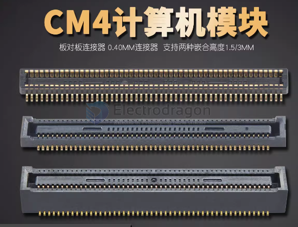
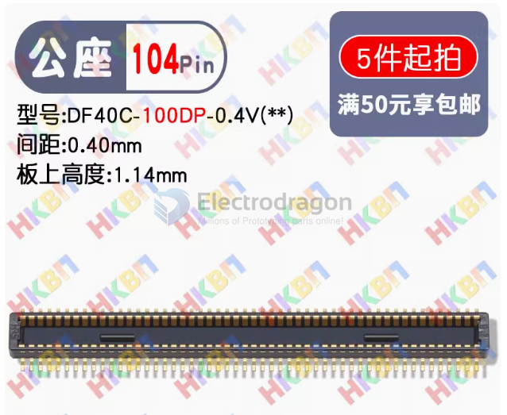

# DF40-dat

- commonly used for holding [[RPI-CM4-dat]]

- height support 1.5 mm or 3 mm

【母座 嵌合1.50MM 】DF40C-100DS-0.4V(51)

## female 【母座 嵌合3.0MM 】DF40HC(3.0)-100DS-0.4V(51)

## male 【公座 嵌合1.50MM/3MM】DF40C-100DP-0.4V(51)

