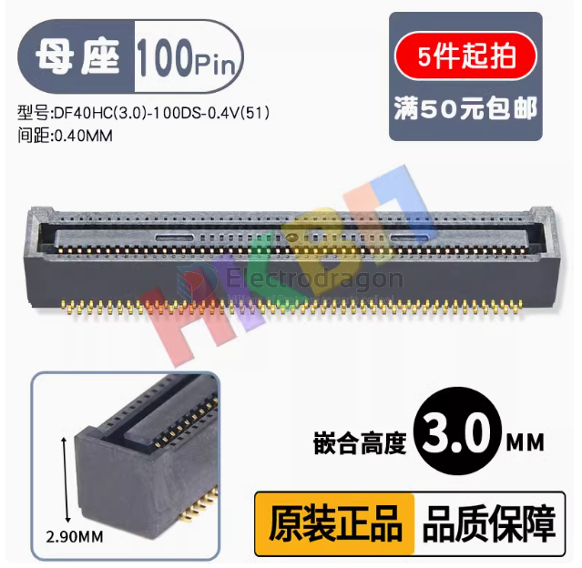

# DF40-dat

- commonly used for holding [[RPI-CM4-dat]]

- height support 1.5 mm or 3 mm

## DF40 

The Hirose DF40 series comes in multiple pin counts — it’s not fixed.

They are fine-pitch board-to-board connectors (0.4 mm pitch) with versions starting from 10 pins all the way up to 100 pins (and even beyond, depending on the variant).

For example:

**DF40C-10** → 10 pins (5 per side)

**DF40C-40** → 40 pins (20 per side)

**DF40C-100** → 100 pins (50 per side)

If you tell me your exact DF40 model number, I can tell you exactly how many pins it has.

## DF40-100 

【母座 嵌合1.50MM 】DF40C-100DS-0.4V(51)

## female 【母座 嵌合3.0MM 】DF40HC(3.0)-100DS-0.4V(51)

## male 【公座 嵌合1.50MM/3MM】DF40C-100DP-0.4V(51)

## ref 

- [[BTB-dat]]