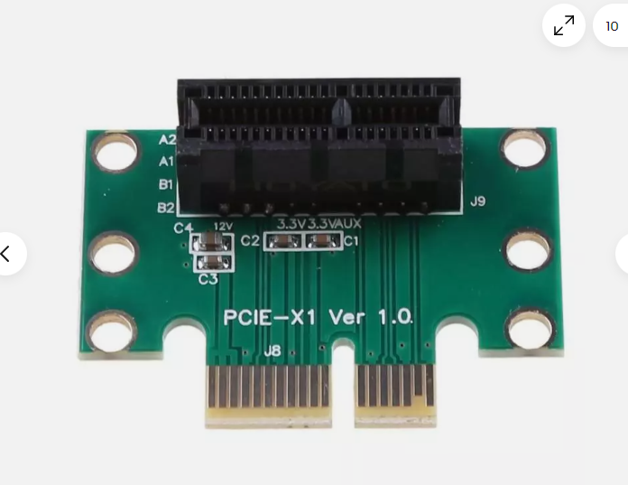

# PCIE-dat

Low-profile PCIe cards still use 1.57 mm thickness; only the bracket changes.

- [[mini-PCIE-dat]]

## PCIE 1x 

A PCIe x1 slot is a type of expansion slot on a computer motherboard, primarily designed for low-bandwidth devices. It has a single PCIe lane, offering the lowest data transfer rate among different PCIe slot types. Despite its limitations, it's useful for various low-power peripheral cards. 

18 *2 = 36 pins

## ref 

- [[interface-dat]]

## PCIE vs mini-PCIE

## 📏 1. Physical Size

| Feature         | PCIe (Desktop)                 | Mini PCIe (Mini PCI Express)     |
|-----------------|--------------------------------|----------------------------------|
| Form Factor     | Add-in card (e.g., x1, x4, x16) | Small card (30 × 50.95 mm)       |
| Connector       | Edge connector (gold fingers)   | 52-pin card edge                 |
| Mounting        | Slot + bracket                  | Screwed to standoffs             |

---

## 🔌 2. Interface & Lanes

| Feature            | PCIe                          | Mini PCIe                        |
|--------------------|-------------------------------|----------------------------------|
| PCIe Lanes         | x1, x4, x8, x16, etc.         | Only **x1 PCIe lane** supported  |
| USB Support        | ❌ No (PCIe only)             | ✅ Optional USB 2.0 integrated    |
| SATA Support       | ❌ Not directly                | ✅ Optional SATA support (rare)  |
| Electrical Standard| PCIe Gen 1/2/3/4/5/6          | PCIe Gen 1 or 2 (typically)      |

🧠 **Mini PCIe** may carry **PCIe + USB** or even **SATA**, depending on system wiring.

## ⚡ 3. Data Rate (Theoretical)

| PCIe Version | Data Rate per Lane | Total (Mini PCIe x1) |
|--------------|--------------------|-----------------------|
| PCIe 1.0     | 250 MB/s           | 250 MB/s              |
| PCIe 2.0     | 500 MB/s           | 500 MB/s              |
| PCIe 3.0     | 1.0 GB/s           | Rare on Mini PCIe     |

⚠️ **Mini PCIe is usually limited to Gen 1 or 2**, due to older spec and hardware.

---

## 🧰 4. Use Cases

| PCIe (Standard)                | Mini PCIe                     |
|-------------------------------|-------------------------------|
| GPUs, SSDs, network cards     | Wi-Fi cards, 3G/4G modems     |
| Desktop motherboards          | Laptops, embedded systems     |
| High-speed, high-power cards  | Low-power, compact modules    |

---

## 🔌 5. Connector & Pinout

| Feature          | PCIe x1/x16            | Mini PCIe                       |
|------------------|------------------------|---------------------------------|
| Pin Count        | 36 pins (x1) to 164 (x16) | 52 pins (edge connector)       |
| Signal Types     | PCIe lanes only         | PCIe + USB + SMBus + LED + more |

📎 Mini PCIe includes:
- PCIe x1
- USB 2.0 (shared bus)
- SMBus
- 3.3V Power
- Optional SATA
- LED control pins

---

## ⚙️ 6. Hot Plug / Power

| Feature           | PCIe                  | Mini PCIe                    |
|-------------------|-----------------------|------------------------------|
| Hot Plug Support  | ✅ (in some systems)  | ❌ Usually not supported     |
| Power             | 12V / 3.3V (depends)  | 3.3V only (3.3Vaux + 3.3V)   |
| Max Power         | 10–75W+ (x16 GPU)     | ~3W typical                  |

## ref 

- [[CONN-dat]]