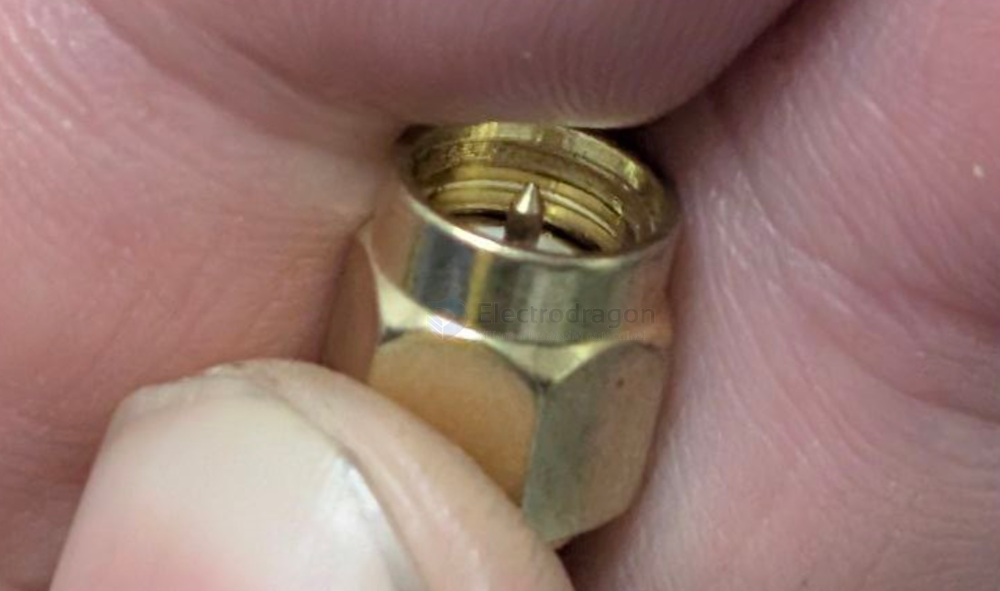
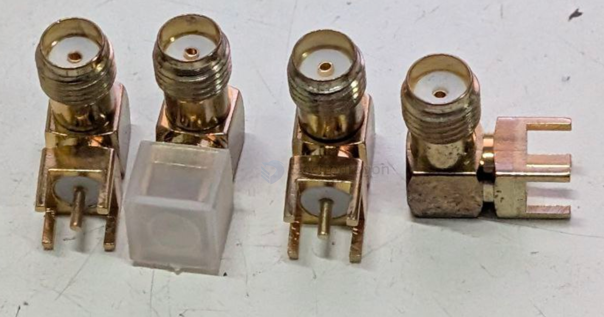

# conn-SMA-dat

Connector SMA 

- more suitable to install on the plastic panel or wall by drilling a installation hole

## product 

- [[NAN1001-dat]]

## male pin == normally cable 

on the cable of [[NAN1001-dat]]

## female pin == normally PCB connector 

Vertical CONN 

Flat CONN

## ref 

- [[CONN-dat]]