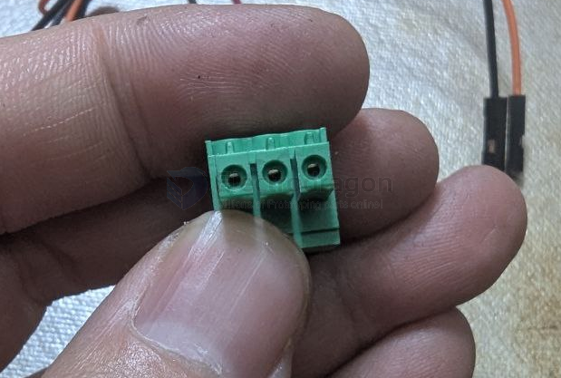

# conn-cable-terminal-dat

## 3.5mm pitch 

- [[KF2EDG-dat]]
  
- [[KF350-dat]]

- [[KF15EDG-dat]] - 两边需要预留间隙

## 5.0mm pitch 

- [[dg202-dat]]

- [[kf126-dat]]
- [[kf128-dat]]

## check the holes first 

no thing block and then push again 

## ref 

- [[cable-terminal]]