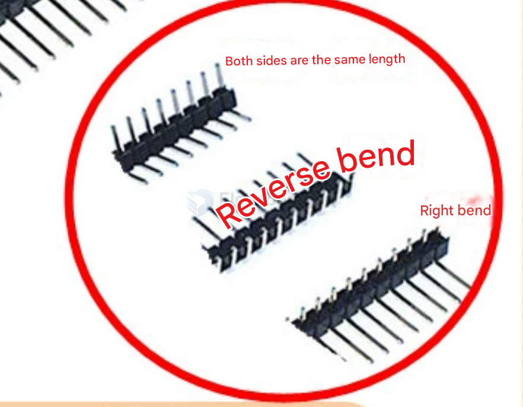
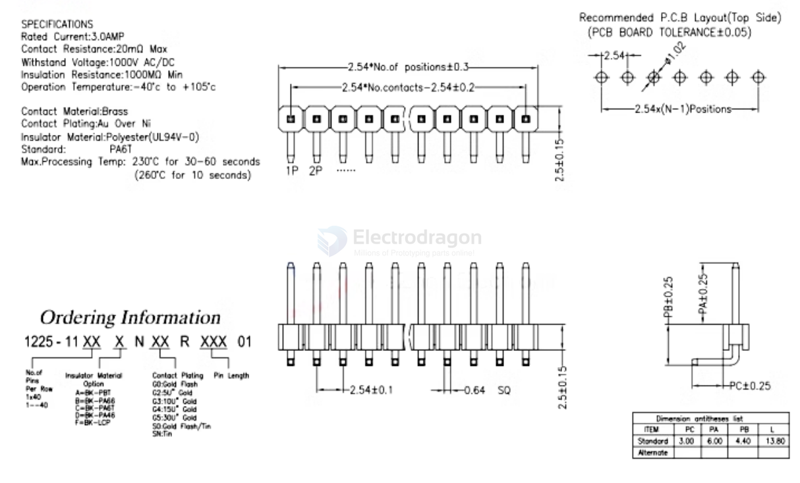
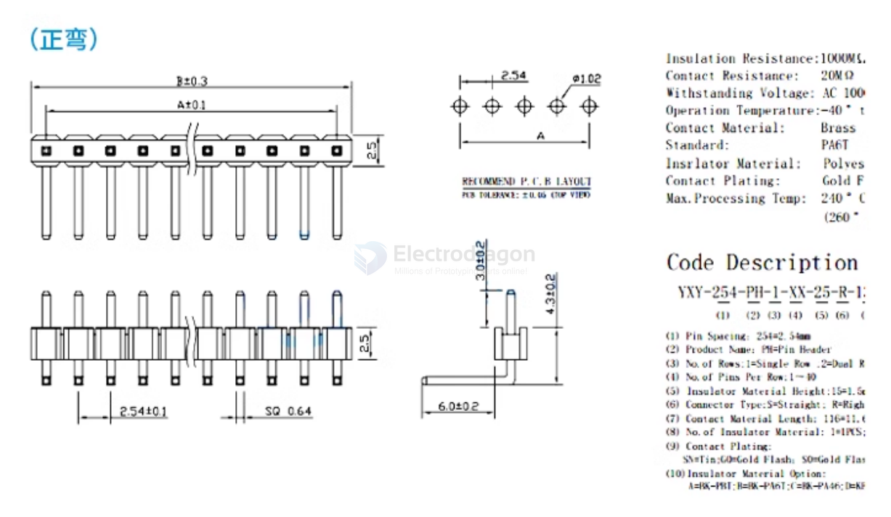

# common connector headers 

- dupont pin headers 

- MX1.25 = 1.25mm pitch
- ZH1.5 = 1.5mm pitch 
- PH2.0 = 2.0mm pitch
- XH2.54 = 2.54mm pitch

Connector_PinHeader_2.54mm:PinHeader_2x20_P2.54mm_Vertical

## Common Pin headers 

| name | SKU             | type      | male/female | breakable     | pin material | full length |
| ---- | --------------- | --------- | ----------- | ------------- | ------------ | ----------- |
|      | [[CCO3612-dat]] | round-pin | F           | yes           |              |             |
|      | [[CCO3611-dat]] | round-pin | M           | yes           |              |             |
|      | [[CCO3588-dat]] | common    | F           | not, need cut |              |             |
|      | [[CCO3587-dat]] | common    | M           | yes           |              | 11 mm       |
|      | [[CCO3590-dat]] | common    | M           | yes           |              |             |

## straight pin header

### dimension 

## bended 90-degree pin header

material version: 

- Iron needle (nickel-plated)
- Copper needle (nickel-plated)
- Gold-plated (0.8U)

note below three version available, we only sell "right-bend" version here [[CCO3515-dat]]

### reversed bend 

### right bend 

