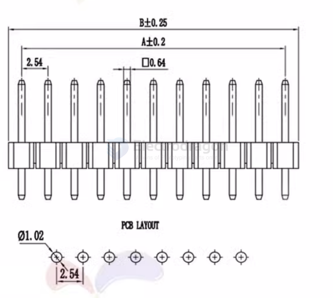

# common connector headers 

- dupont pin headers 

- MX1.25 = 1.25mm pitch
- ZH1.5 = 1.5mm pitch 
- PH2.0 = 2.0mm pitch
- XH2.54 = 2.54mm pitch

Connector_PinHeader_2.54mm:PinHeader_2x20_P2.54mm_Vertical

## dimension 

