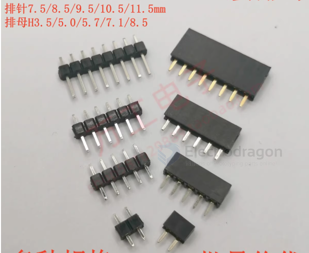
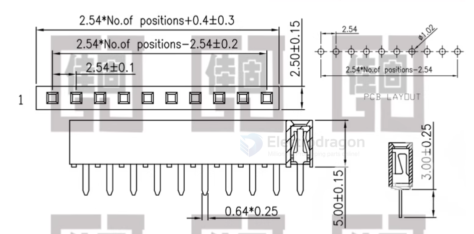

# conn-pin-header-dat

- [[CONN-dat]]

- dupont pin headers 

- MX1.25 = 1.25mm pitch
- ZH1.5 = 1.5mm pitch 
- PH2.0 = 2.0mm pitch
- XH2.54 = 2.54mm pitch

Connector_PinHeader_2.54mm:PinHeader_2x20_P2.54mm_Vertical

## Common Pin headers 

| name | SKU             | type      | male/female | breakable     | pin material | full length |
| ---- | --------------- | --------- | ----------- | ------------- | ------------ | ----------- |
|      | [[CCO3612-dat]] | round-pin | F           | yes           |              |             |
|      | [[CCO3611-dat]] | round-pin | M           | yes           |              |             |
|      | [[CCO3588-dat]] | common    | F           | not, need cut |              |             |
|      | [[CCO3587-dat]] | common    | M           | yes           |              | 11 mm       |
|      | [[CCO3590-dat]] | common    | M           | yes           |              |             |
|      | [[CCO3515-dat]] | common    | M           | yes           |              |             |

## straight pin header

dimension 

## bended 90-degree pin header

- [[CCO3515-dat]]

material version: 

- Iron needle (nickel-plated)
- Copper needle (nickel-plated)
- Gold-plated (0.8U)

note below three version available, we only sell "right-bend" version here [[CCO3515-dat]]

### reversed bend 

## right bend 

## male pin header height

- [[CCO3587-dat]]

- [] 7.5mm 
- [] 8.5mm 
- [] 9.5mm 
- [] 10.5mm 
- [] 11.5mm 

## female pin socket height 

- [[CCO3588-dat]]

- [] 3.5mm
- [] 5.0mm
- [] 5.7mm
- [] 7.1mm
- [] 8.5mm

| pins | price/pcs | height | type | price |
| ---- | --------- | ------ | ---- | ----- |
| 40P  | 1         | 7.1    | F    | 0.5   |
| 40P  | 1         | 5      | F    | 0.5   |
| 10P  | 10        | 7.1    | F    | 1.5   |

- plastic part height == mm 

## ref 

- [[conn-pin-header]]