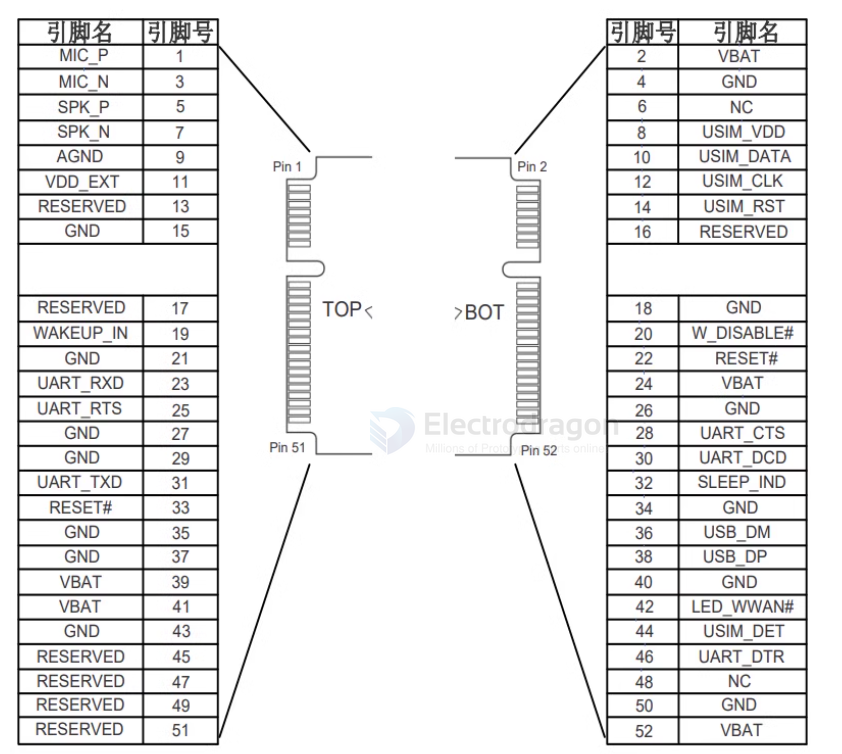
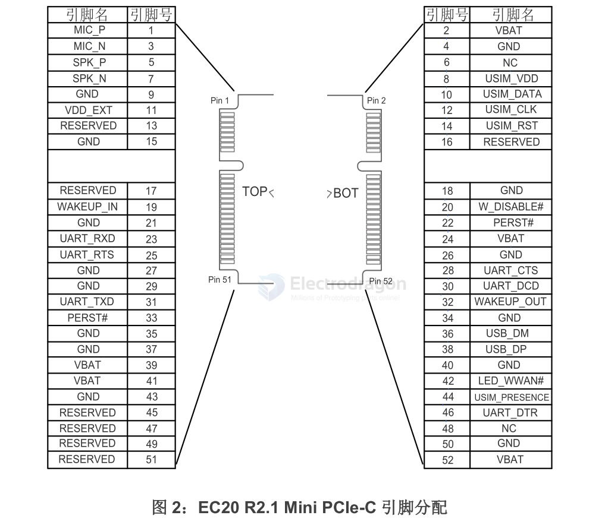
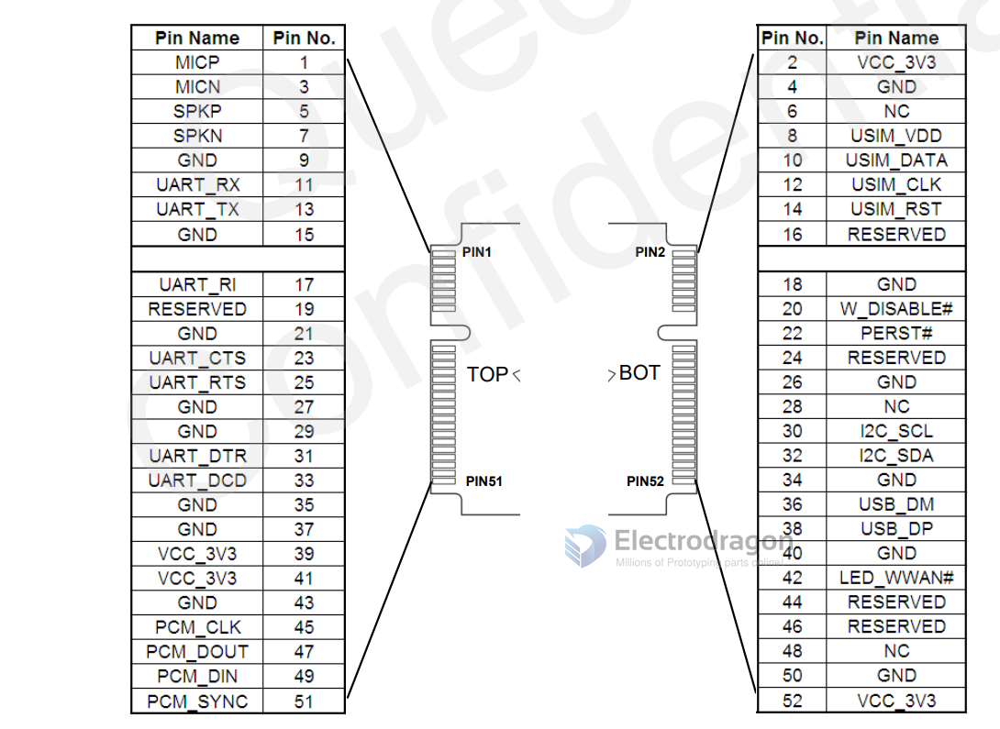
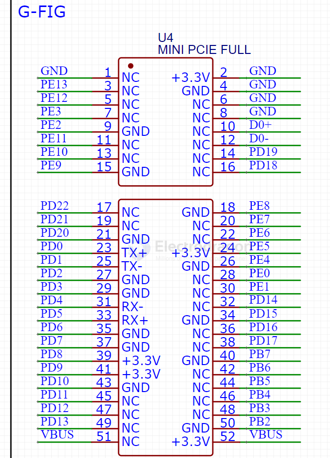
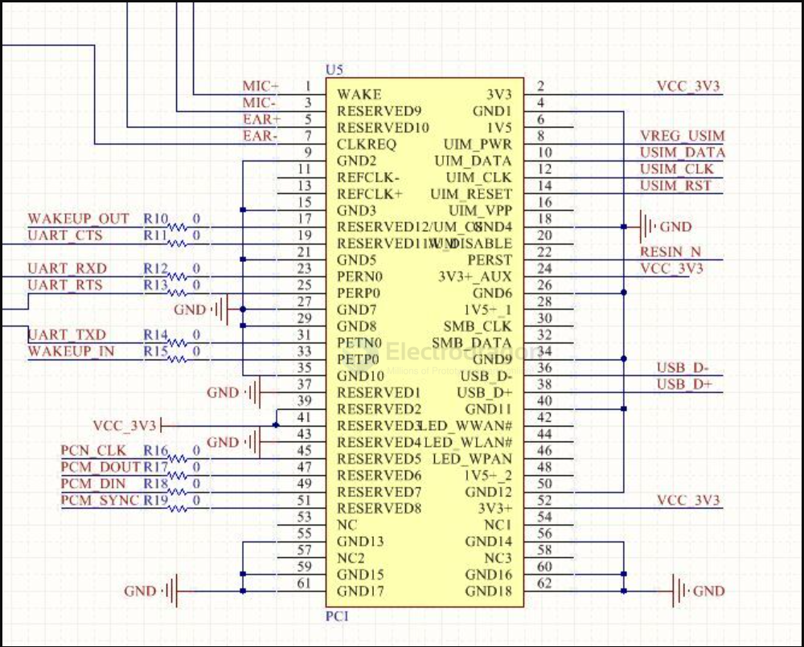
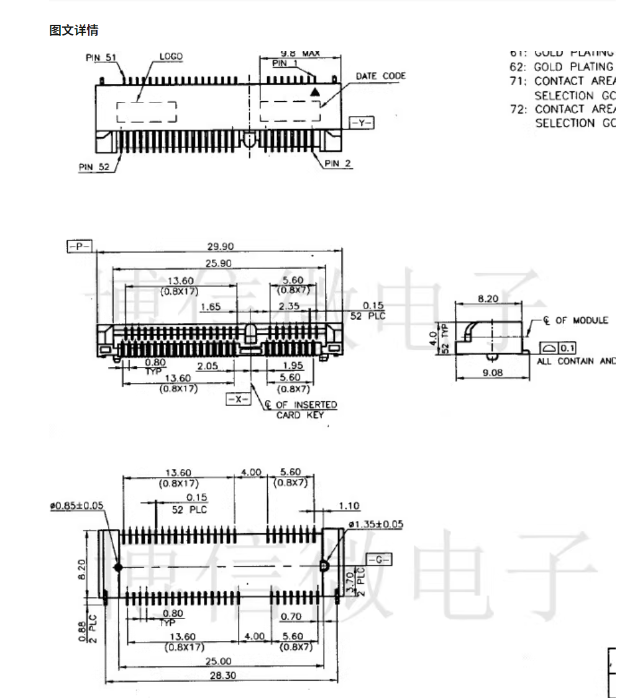

# mini-PCIE-dat

- 52-pin

- [[F133-dat]]

## SCH 

## M2M Module 

| left      | pin | pin | right      |
| --------- | --- | --- | ---------- |
| MIC_P     | 1   | 2   | VBAT       |
| MIC_N     | 3   | 4   | GND        |
| SPK_P     | 5   | 6   | NC         |
| SPK_N     | 7   | 8   | USIM_VDD   |
| AGND      | 9   | 10  | USIM_DATA  |
| VDD_EXT   | 11  | 12  | USIM_CLK   |
| RESERVED  | 13  | 14  | USIM_RST   |
| GND       | 15  | 16  | RESERVED   |
| RESERVED  | 17  | 18  | GND        |
| WAKEUP_IN | 19  | 20  | W_DISABLE# |
| GND       | 21  | 22  | RESET#     |
| UART_RXD  | 23  | 24  | VBAT       |
| UART_RTS  | 25  | 26  | GND        |
| GND       | 27  | 28  | UART_CTS   |
| GND       | 29  | 30  | UART_DCD   |
| UART_TXD  | 31  | 32  | SLEEP_IND  |
| RESET#    | 33  | 34  | GND        |
| GND       | 35  | 36  | USB_DM     |
| GND       | 37  | 38  | USB_DP     |
| VBAT      | 39  | 40  | GND        |
| VBAT      | 41  | 42  | LED_WWAN#  |
| GND       | 43  | 44  | USIM_DET   |
| RESERVED  | 45  | 46  | UART_DTR   |
| RESERVED  | 47  | 48  | NC         |
| RESERVED  | 49  | 50  | GND        |
| RESERVED  | 51  | 52  | VBAT       |

## Standard MINI-PCIE specs

| Specification      | Value                                    |
| ------------------ | ---------------------------------------- |
| **PCB Thickness**  | **0.8 mm** (standard)                    |
| **Edge Connector** | ~**0.8 mm**, beveled                     |
| **Card Width**     | 30 mm                                    |
| **Card Length**    | 30 mm (Half-size) / 50.95 mm (Full-size) |

4-layer PCB in the Mini PCIe form factor — and it’s actually common practice in commercial designs, especially for:

- Wireless cards (Wi-Fi/BT)
- 3G/4G/5G modem modules
- Industrial I/O modules
- Embedded controllers

- [[PCB-dat]]

- [[PCIE-dat]] - [[M2-dat]]

- [[Msata-dat]]

## board 

- [[NGS1075-dat]]

## info 

- [[quectel-dat]] - [[SIMCOM-dat]]

mini PCIe

## SIM7600 PLUG 

- [[SIM7600-dat]]

## smplified pins 

## smplified pins (template format)

| function   | chip | left pin | right pin | chip | function   |
| ---------- | ---- | -------- | --------- | ---- | ---------- |
| WAKE#/MICP |      | 1        | 2         |      | VCC        |
| MICN       |      | 3        | 4         |      | GND        |
| EARP       |      | 5        | 6         |      | NC         |
| EARN       |      | 7        | 8         |      | USIM_VDD   |
| NC         |      | 9        | 10        |      | USIM_DATA  |
| NC         |      | 11       | 12        |      | USIM_CLK   |
| NC         |      | 13       | 14        |      | USIM_RST   |
| GND        |      | 15       | 16        |      | USIM_DET   |
| -          |      | -        | -         |      | -          |
| UART_RXD   |      | 17       | 18        |      | GND        |
| UART_TXD   |      | 19       | 20        |      | W_DISABLE# |
| NC         |      | 21       | 22        |      | PERST#     |
| NC         |      | 23       | 24        |      | VCC        |
| NC         |      | 25       | 26        |      | GND        |
| NC         |      | 27       | 28        |      | NC         |
| GND        |      | 29       | 30        |      | SCL        |
| NC         |      | 31       | 32        |      | SDA        |
| NC         |      | 33       | 34        |      | GND        |
| GND        |      | 35       | 36        |      | USB_DN     |
| GND        |      | 37       | 38        |      | USB_DP     |
| VCC        |      | 39       | 40        |      | GND        |
| VCC        |      | 41       | 42        |      | LED_WWAN#  |
| GND        |      | 43       | 44        |      | UART_RI    |
| PCM_CLK    |      | 45       | 46        |      | UART_DTR   |
| PCM_SYNC   |      | 47       | 48        |      | NC         |
| PCM_IN     |      | 49       | 50        |      | GND        |
| PCM_OUT    |      | 51       | 52        |      | VCC        |

## EC20 R2.1 plug 

## UC15 plug 

## F133 plug 

- [[f133-dat]]

|          | fun1     | chip | left pin | right pin | chip | fun2    |
| -------- | -------- | ---- | -------- | --------- | ---- | ------- |
| GND      |          | GND  | 1        | 2         | GND  | GND     |
|          | DVP_SDA  | PE13 | 3        | 4         | GND  | GND     |
|          | DVP_SCL  | PE12 | 5        | 6         | GND  | GND     |
| UART0 rx | DVP_XCLK | PE3  | 7        | 8         | GND  | GND     |
| UART0 tx | DVP_CLK  | PE2  | 9        | 10        | D0+  | D0+     |
|          | DVP_Y9   | PE11 | 11       | 12        | D0-  | D0-     |
|          | DVP_Y8   | PE10 | 13       | 14        | PD19 | LCD_DE  |
|          | DVP_Y7   | PE9  | 15       | 16        | PD18 | LCD_CLK |
|          | -        | -    | -        | -         | -    | -       |
|          | LCD_PWM  | PD22 | 17       | 18        | PE8  | DVP_Y6  |
|          | LCD_VS   | PD21 | 19       | 20        | PE7  | DVP_Y5  |
|          | LCD_HS   | PD20 | 21       | 22        | PE6  | DVP_Y4  |
|          | LCD_D2   | PD0  | 23       | 24        | PE5  | DVP_Y3  |
|          | LCD_D3   | PD1  | 25       | 26        | PE4  | DVP_Y2  |
|          | LCD_D4   | PD2  | 27       | 28        | PE0  | DVP_HS  |
|          | LCD_D5   | PD3  | 29       | 30        | PE1  | DVP_VS  |
|          | LCD_D6   | PD4  | 31       | 32        | PD14 | LCD_D20 |
|          | LCD_D7   | PD5  | 33       | 34        | PD15 | LCD_D21 |
|          | LCD_D10  | PD6  | 35       | 36        | PD16 | LCD_D22 |
|          | LCD_D11  | PD7  | 37       | 38        | PD17 | LCD_D23 |
|          | LCD_D12  | PD8  | 39       | 40        | PB7  |         |
|          | LCD_D13  | PD9  | 41       | 42        | PB6  |         |
|          | LCD_D14  | PD10 | 43       | 44        | PB5  |         |
|          | LCD_D15  | PD11 | 45       | 46        | PB4  |         |
|          | LCD_D18  | PD12 | 47       | 48        | PB3  | CTP_INT |
|          | LCD_D19  | PD13 | 49       | 50        | PB2  | CTP_RST |
|          | VBUS     | VBUS | 51       | 52        | VBUS | VBUS    |

## MU709 PCI plug 

| function | chip | left pin | right pin | chip | function   |
| -------- | ---- | -------- | --------- | ---- | ---------- |
| WAKE#    |      | 1        | 2         |      | VCC_3V3    |
| NC       |      | 3        | 4         |      | GND        |
| NC       |      | 5        | 6         |      | NC         |
| NC       |      | 7        | 8         |      | USIM_PWR   |
| GND      |      | 9        | 10        |      | USIM_DATA  |
| NC       |      | 11       | 12        |      | USIM_CLK   |
| NC       |      | 13       | 14        |      | USIM_RESET |
| GND      |      | 15       | 16        |      | NC         |
| -        |      | -        | -         |      | -          |
| NC       |      | 17       | 18        |      | GND        |
| NC       |      | 19       | 20        |      | NC         |
| GND      |      | 21       | 22        |      | RESIN_N    |
| NC       |      | 23       | 24        |      | VCC_3V3    |
| NC       |      | 25       | 26        |      | GND        |
| GND      |      | 27       | 28        |      | NC         |
| GND      |      | 29       | 30        |      | NC         |
| NC       |      | 31       | 32        |      | NC         |
| NC       |      | 33       | 34        |      | GND        |
| GND      |      | 35       | 36        |      | USB_DM     |
| GND      |      | 37       | 38        |      | USB_DP     |
| VCC_3V3  |      | 39       | 40        |      | GND        |
| VCC_3V3  |      | 41       | 42        |      | LED_WWAN#  |
| GND      |      | 43       | 44        |      | NC         |
| PCM_CLK  |      | 45       | 46        |      | NC         |
| PCM_DOUT |      | 47       | 48        |      | NC         |
| PCM_DIN  |      | 49       | 50        |      | GND        |
| PCM_SYNC |      | 51       | 52        |      | VCC_3V3    |

## PCIE template table 

| function | chip | left pin | right pin | chip | function |
| -------- | ---- | -------- | --------- | ---- | -------- |
|          |      | 1        | 2         |      |          |
|          |      | 3        | 4         |      |          |
|          |      | 5        | 6         |      |          |
|          |      | 7        | 8         |      |          |
|          |      | 9        | 10        |      |          |
|          |      | 11       | 12        |      |          |
|          |      | 13       | 14        |      |          |
|          |      | 15       | 16        |      |          |
| -        |      | -        | -         |      | -        |
|          |      | 17       | 18        |      |          |
|          |      | 19       | 20        |      |          |
|          |      | 21       | 22        |      |          |
|          |      | 23       | 24        |      |          |
|          |      | 25       | 26        |      |          |
|          |      | 27       | 28        |      |          |
|          |      | 29       | 30        |      |          |
|          |      | 31       | 32        |      |          |
|          |      | 33       | 34        |      |          |
|          |      | 35       | 36        |      |          |
|          |      | 37       | 38        |      |          |
|          |      | 39       | 40        |      |          |
|          |      | 41       | 42        |      |          |
|          |      | 43       | 44        |      |          |
|          |      | 45       | 46        |      |          |
|          |      | 47       | 48        |      |          |
|          |      | 49       | 50        |      |          |
|          |      | 51       | 52        |      |          |

## socket dimension 

## Reference
UC15 Quectel board
* https://auroraevernet.ru/upload/iblock/b6a/b6ae0f6f18c4f94770d63eead14b9954.pdf
Mechanical dimension 
* https://s3.amazonaws.com/fit-iot/download/facet-cards/documents/PCI_Express_miniCard_Electromechanical_specs_rev1.2.pdf

## ref 

- [[F133-dat]]

- [[CONN-dat]]