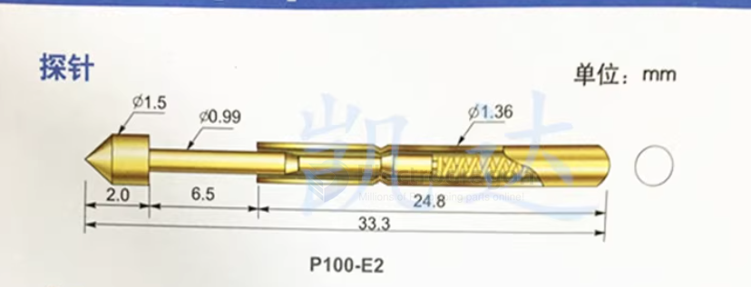
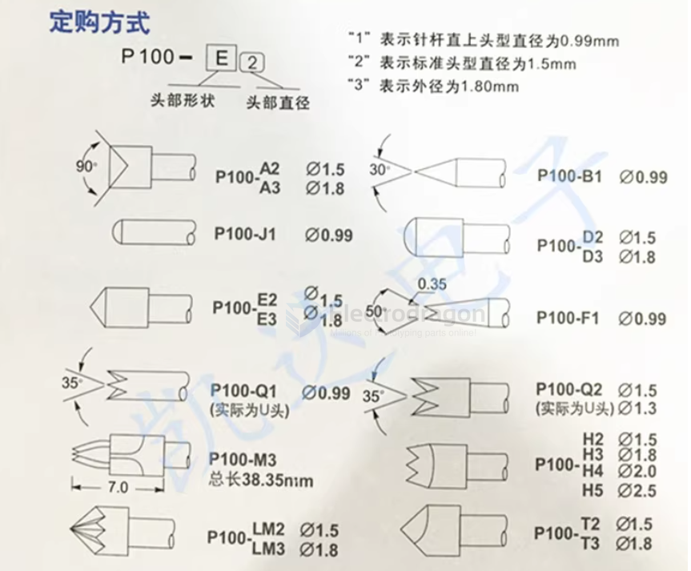
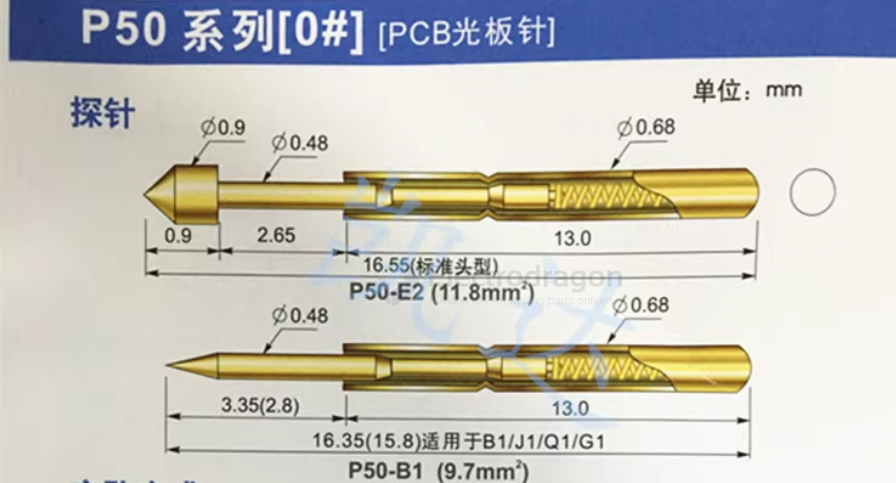
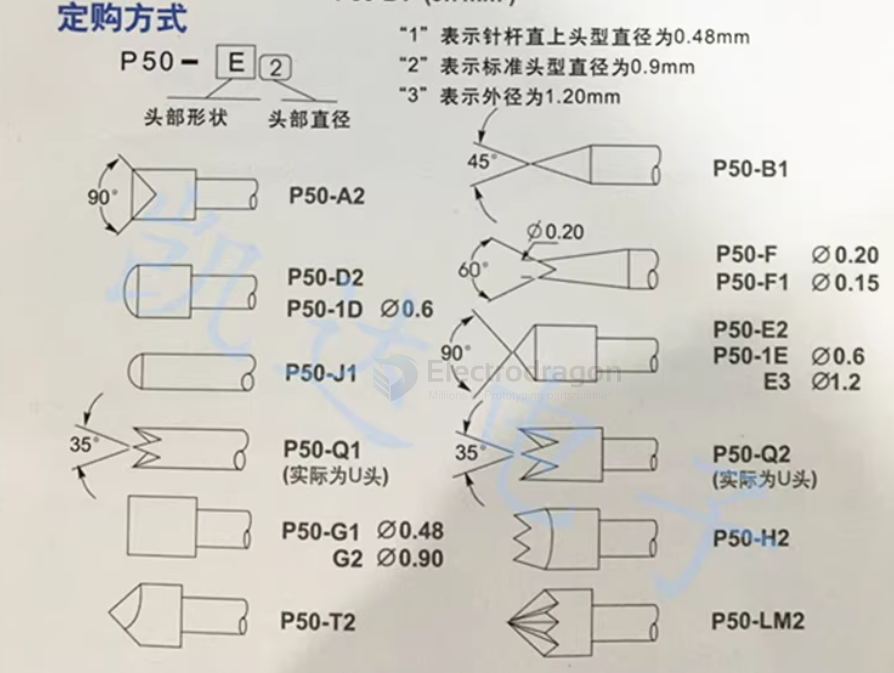
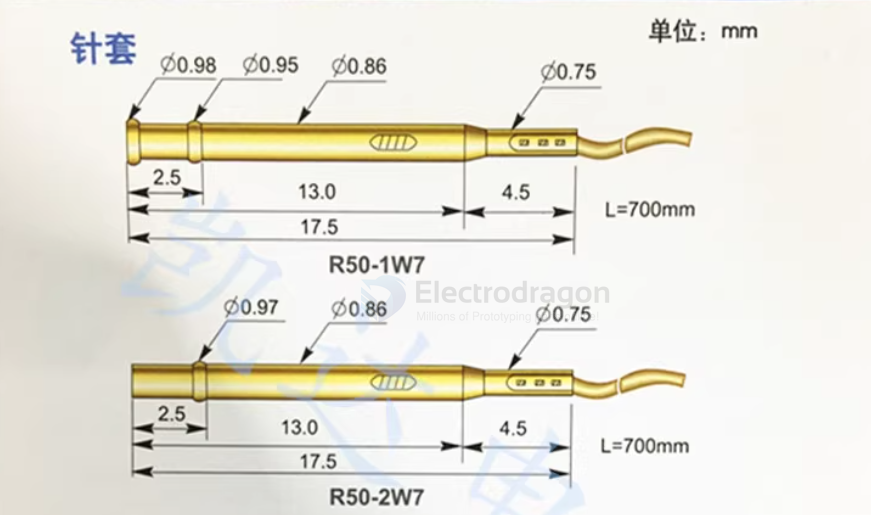
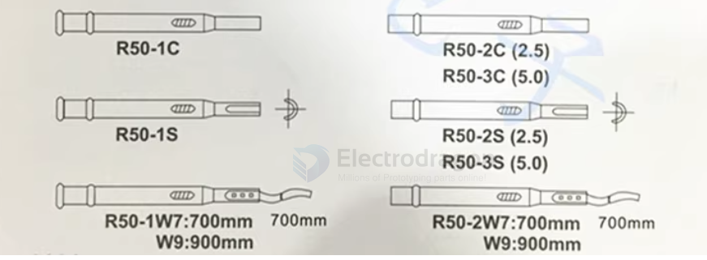

# pogo-pin-dat

## TH178 

- solder pin 0.7 ~ 0.8 
- test target pin 0.8~0.9

## 探针 test pin 

### P100 series 

- P100-E2
- P100-E3
- P100-D2 
- P100-H2 

### P50 series 

### P50 series holder 

through-hole == 0.7 ~ 0.8 mm

## demo video 

- [a lot pins test](https://x.com/electro_phoenix/status/1874755441533894696)

## ref

- [[pogo-pin]]