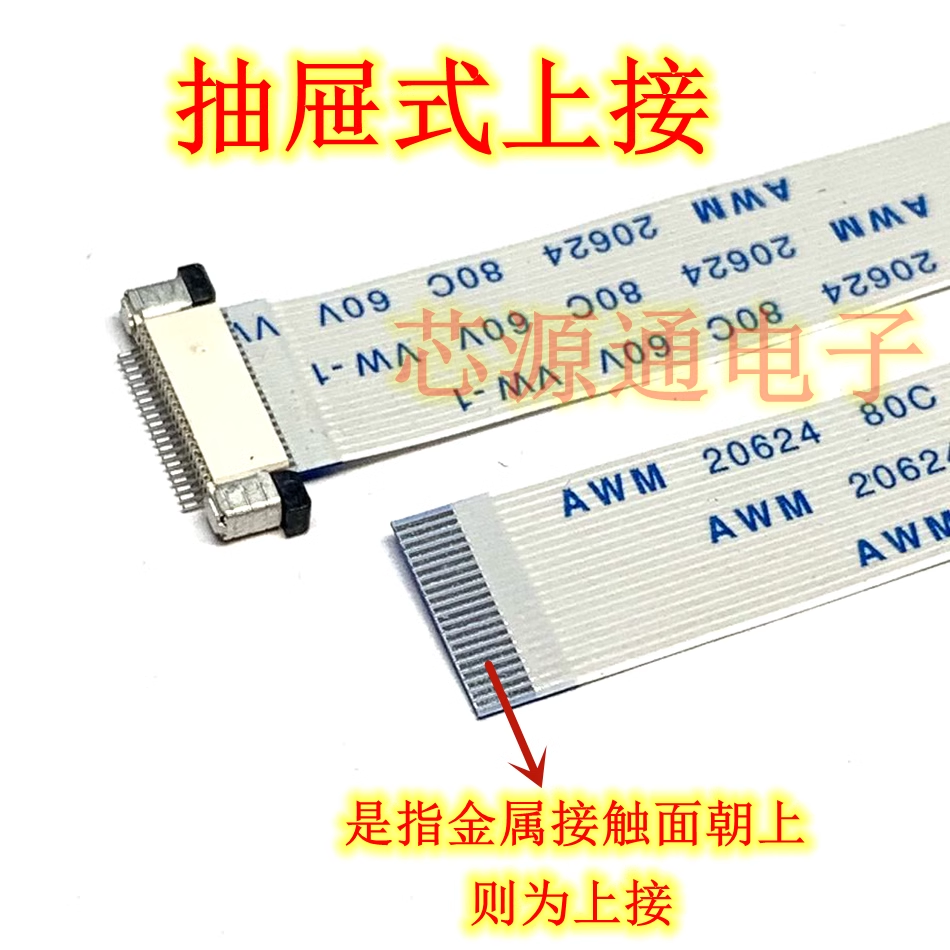

# FPC dat 

## Info 
- common pitch 0.5 mm

## type 
FPC down flip 

FPC upper flip 

## footprint 

THD0510－xxCL－GF == datasheet [[THD0510-xxCL-GF.pdf]]

- FPC-SMD_9P-P0.50_THD0510-09CL-GF
- FPC-SMD_5P-P0.50_THD0510-05CL-GF == 间距:0.5mm P数:5P 翻盖式 下接

## dimension 

## soldering 

Use low-temperature solder [[solder-paste-dat]] to tin the pads first, then clean the pads with board cleaning solution, brush on BGA soldering flux, and finally use a hot plate. The result is almost as good as factory production.

## ref 

- [[soldering-dat]]

- [[FPC-fab-dat]]
