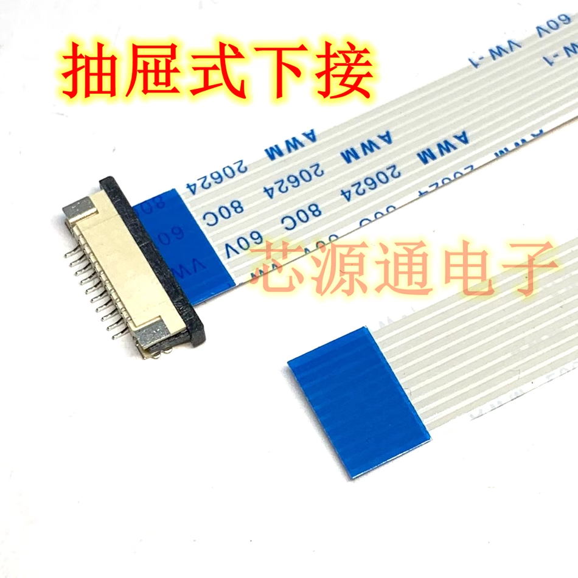

# FPC dat 

## Info 
- common pitch 0.5 mm

## type 
FPC down flip 

FPC upper flip 

## dimension 

## soldering 

Use low-temperature solder [[soldering-paste-dat]] to tin the pads first, then clean the pads with board cleaning solution, brush on BGA soldering flux, and finally use a hot plate. The result is almost as good as factory production.

## ref 

- [[soldering-dat]]