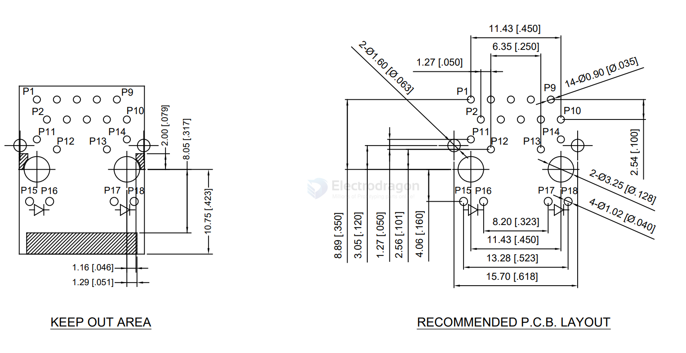
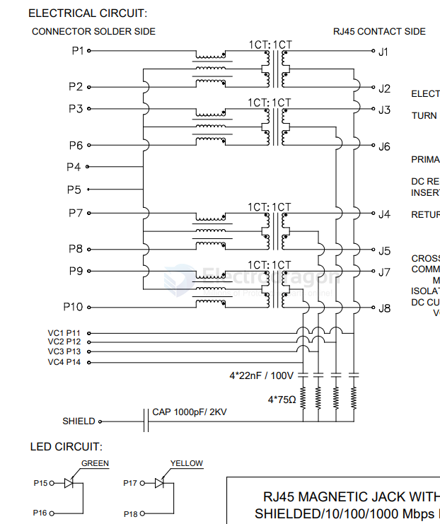
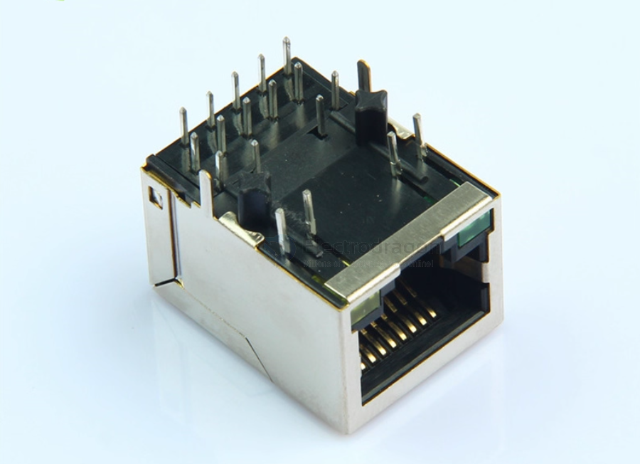
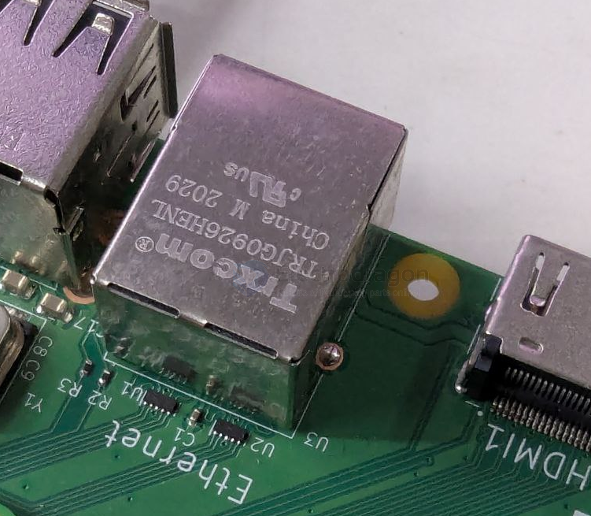
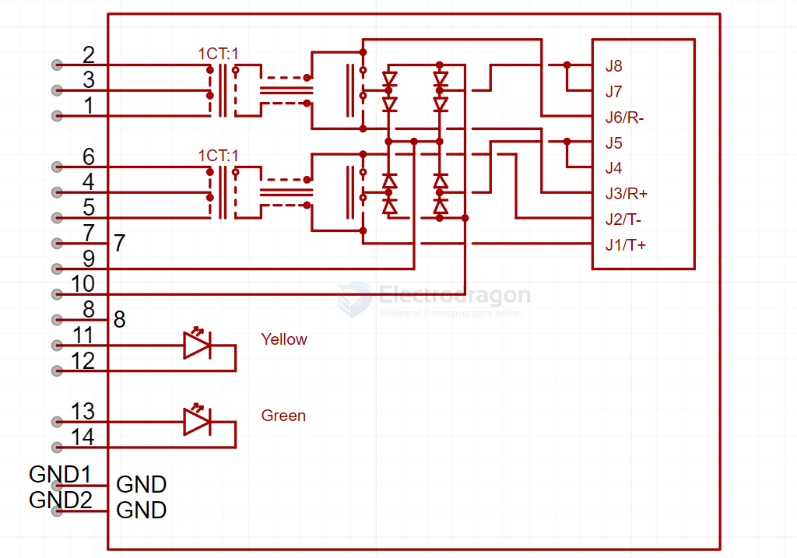
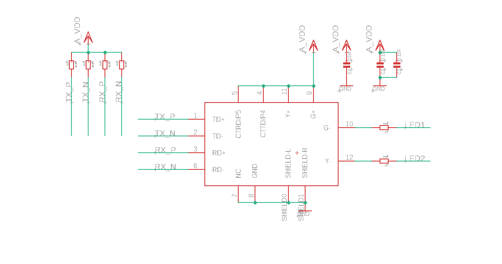
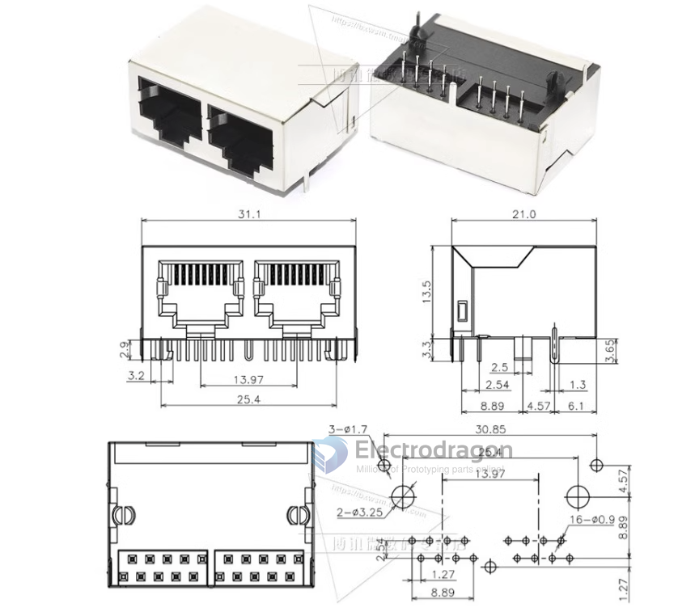

# RJ45

- [[RJ45-dat]] - [[RJ11-dat]]

## MagJack-A70-112-331N126

- [[POE-dat]]

P1 ~ P10 == [[ethernet-dat]]

P11 ~ P14 == [[POE-dat]]

P15 ~ P18 == [[LED-dat]] 

SCH 

- [[TRXCOM-dat]] 

## HanRun 

HR911130A

HR911105A

HY931147C == CT == 2 pairs 

## standard 

datasheet

https://datasheet.lcsc.com/lcsc/2204251600_HCTL-HC-RJ45-059-1-2_C3000199.pdf

## dual port silm 

## ref 

- [[ethernet-dat]]

- [[RJ45]]