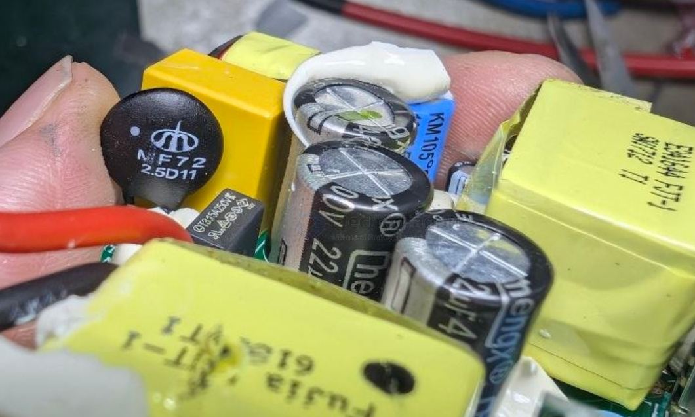

# resistor-ICL-dat


- [[resistor-ICL-dat]] - [[power-adapter-dat]]

The MF72 2.5D13 is a power-type NTC (Negative Temperature Coefficient) thermistor used as an inrush current limiter (ICL) in electronic circuits.

Its core specifications include:
- Zero-power Resistance (R₂₅): 2.5 Ω (with a ± 20% tolerance).
- Maximum Steady-State Current: 6 Amps.
- Body Diameter: 13 mm (often marked as 15.5 mm maximum over the coating).
- Operating Range: -55°C to +200°C.


== PTC

- [[resistor-dat]] - [[resistor-Inrush-dat]] - [[thermistor-dat]]


	
ICL 2.5 OHM 20% 5A 13MM == inrush current suppression



Power NTC Thermistor. The MF72 series Power NTC Thermistors provide inrush current suppression for sensitive electronics. Connecting a MF72 in series with the power source will limit the current surges typically created at turn on. Once the circuit is energized the resistance of the MF72 will decrease rapidly to a very low value, power consumption can be ignored and there will be no effect on normal operating current. Using the MF72 Power NTC

Thermistor is a most cost-effective way to curb surge current and protect sensitive electronics from damage.


## 🔍 Purpose of 2W 300Ω Resistor Before LM317 Input

### 🔧 Common Use Cases

#### 1. 🛡️ Inrush Current Limiting
- **Function:** When power is first applied, capacitors (especially large filter caps) can draw a big inrush current.
- **The 300Ω resistor** slows the charging rate of the input capacitor.
- Helps protect:
  - Transformer
  - Diodes (in rectifier)
  - LM317 itself

#### 2. 🔥 Power Dissipation / Pre-Regulation
- **Drops excess voltage** before it hits the LM317
- Reduces the **heat load on the LM317**, especially if there's a large **Vin − Vout** difference.

For example:
```
Vin = 24V, Vout = 12V, Load = 50mA
→ Voltage drop across LM317 = 12V
→ Power = 12V × 0.05A = 0.6W (hot!)

Insert a 300Ω resistor:
  V = I × R = 0.05A × 300Ω = 15V drop before LM317
  New Vin = 24V − 15V = 9V → not enough
  So you may adjust value to drop just a few volts
```

- You must ensure **enough voltage remains** after the resistor so that LM317 operates normally (requires at least **Vin ≈ Vout + 2V**).


## ref 

- [[resistor-dat]]