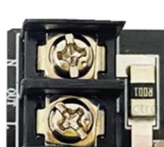
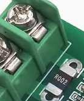
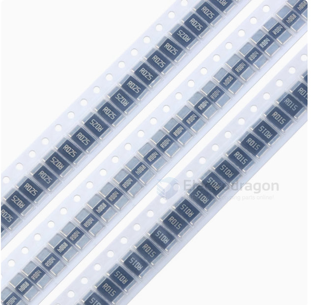
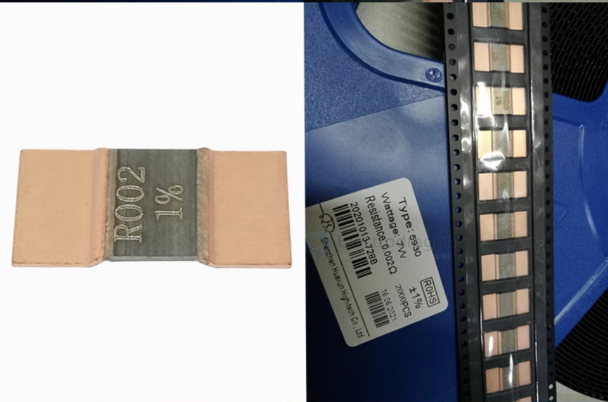
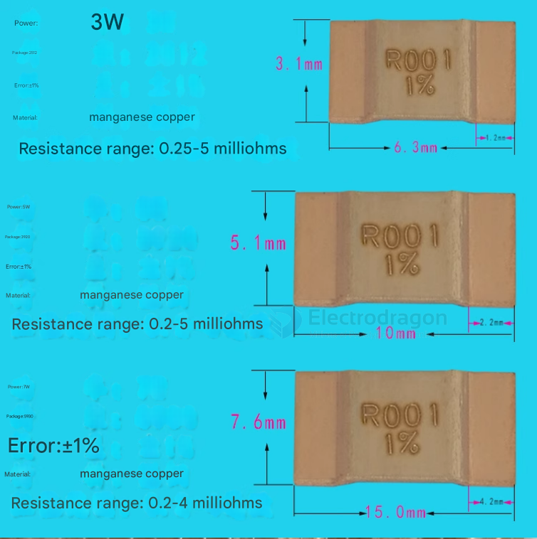
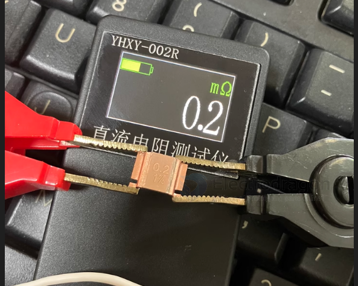

# burden-resistor-dat

A burden resistor is a component used with current transformers (CTs). - [[current-transformer-dat]]

- used by [[SVC1035-dat]] and [[SVC1038-dat]] == 100K 2512

## Purpose:

**Convert Current to Voltage**: The primary function of a burden resistor is to convert the current output of a current transformer into a voltage signal. CTs are designed to produce a current in their secondary winding that is proportional to the current in their primary winding. 

Many measurement circuits (like analog-to-digital converters in microcontrollers) are designed to read voltage, not current directly. 

The burden resistor, when placed across the secondary winding of the CT, allows this current to develop a voltage across it (V = I * R).

**Provide a Load**: It provides a necessary load for the current transformer. Operating a CT without a burden (i.e., with an open-circuited secondary) can lead to dangerously high voltages across the secondary terminals, potentially damaging the CT or posing a safety hazard.
Selection:

The value of the burden resistor is chosen based on the CT's characteristics (like its turns ratio and maximum secondary current) and the desired output voltage range for the measurement circuitry.

It's important **not to choose a burden resistor value that is too high**, as this can lead to saturation of the CT core, causing inaccurate readings.

In summary, a burden resistor is crucial for safely and accurately measuring current using a current transformer by converting its current output to a measurable voltage and providing a safe operating load.

# sample-resistor-dat

- footprint 2512 

- [[HLW8032-faq-dat]]

- 0.003Ω_3W = The 10A version uses a 0.003Ω (3mΩ) sampling resistor, and its current coefficient is 0.333.
- 0.001Ω_3W = The 20A version uses a 0.001Ω (1mΩ) sampling resistor, and its current coefficient is 1.

R0003 = 0.3 mR

## Manganese-copper resistor

## Iron-Chromium-Aluminum resistor

## 3W / 5W / 7W 

## Testing precision

## ref 

- [[resistor-dat]] - [[resistor-sample]] - [[resistor]]

-

## ref 

- [[resistor-dat]]