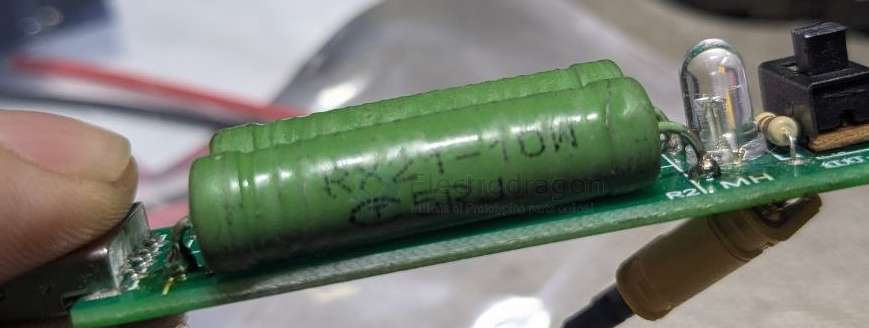

# resistor-load-dat.md

- [[OPM1073-dat]] - [[resistor-load-dat]]

== dummy load 

RX21-10W 5RJ == 5R 

The **RX21-10W 5RJ** is a high-power wirewound resistor commonly used in industrial circuits, power supplies, and motor control projects where heat dissipation is required.

### 1. Breakdown of Part Number

| Code | Meaning | Details |
| :--- | :--- | :--- |
| **RX21** | **Type/Series** | Wirewound resistor with a heat-resistant glaze/enamel coating. |
| **10W** | **Power Rating** | Maximum power dissipation of **10 Watts**. |
| **5R** | **Resistance** | **5.0 Ω** (Ohms). The "R" represents the decimal point. |
| **J** | **Tolerance** | **±5%** precision (actual range: 4.75Ω to 5.25Ω). |

### 2. Physical Construction
These resistors consist of a resistive wire (often Nichrome) wound around a ceramic core and sealed with a protective coating. This construction allows them to withstand high temperatures and temporary power surges better than carbon film resistors.

### 3. Technical Specifications

* **Resistance:** 5 Ω
* **Power Dissipation:** 10 Watts (Max)
* **Tolerance:** ±5%
* **Coating:** Typically Green or Grey Silicone/Enamel Glaze
* **Mounting:** Axial leads (through-hole)

### 4. Application Notes

* **Heat Management:** At its full 10W rating, this resistor will become extremely hot (often exceeding 100°C). Ensure it is mounted with adequate clearance from PCBs or plastic enclosures.
* **Inductance:** Because it is "wirewound," it has a small amount of inherent inductance. It is ideal for DC or low-frequency AC applications but may not be suitable for high-frequency RF circuits.
* **Common Uses:** * Current limiting in LED arrays.
    * Inrush current protection.
    * Brake resistors for small motors.
    * Dummy loads for testing power supplies.

## ref 