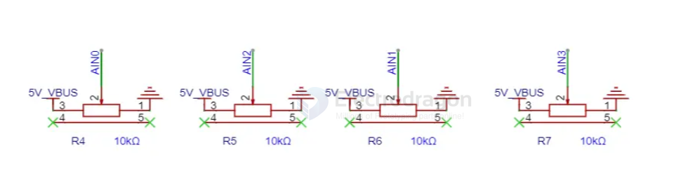
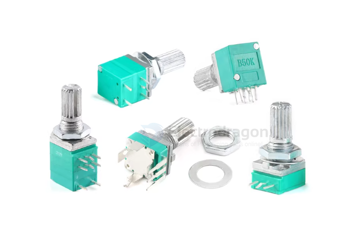
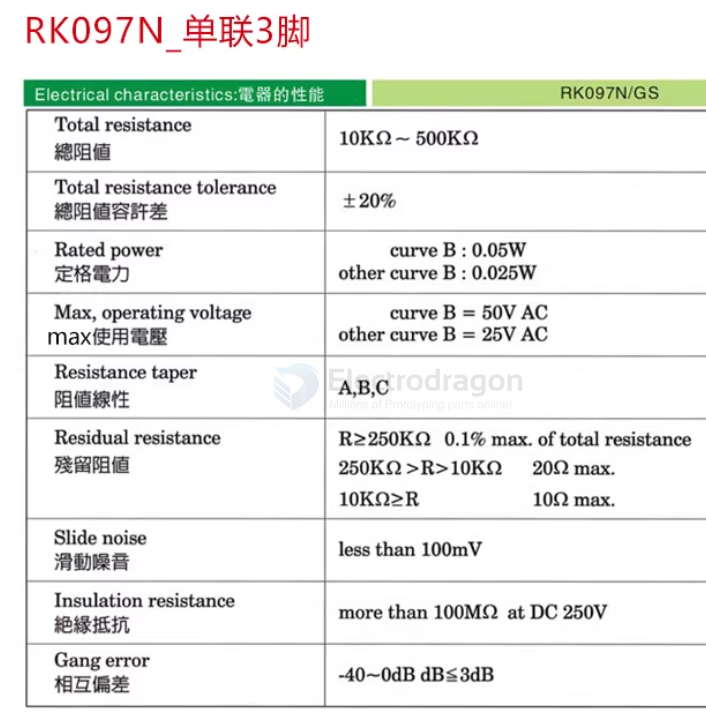
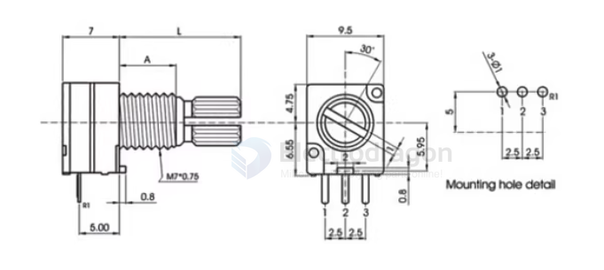

# resistor-trim-pot-dat 

- [[resistor-dat]] - [[resistor-trim-pot-dat]]

- [[peripherals-dat]]

## presision trim pot 

WXD3-13-2W 220R470欧 1K 2.2K 4.7K 5.6K 10K 47K

- [[CKI1080-dat]] - [[CKI1081-dat]] - [[CKI1082-dat]] - [[CKI1083-dat]] - [[resistor-trim-pot-dat]]

## SCH 

## Potentiometer, trim-pot 

- [[CCO3647-dat]] 

- 065 Blue&White Potentiometer / Adjustable Resistor Kit (100R-1M, 13 Kinds*5Pcs) - [[CKI1050-dat]]
- https://www.electrodragon.com/product/065-bluewhite-potentiometer-adjustable-resistor-kit-100r-1m-13-kinds5pcs/

- 10PCs 3296 Potentiometer [Value] - [[4002305]]
- https://www.electrodragon.com/product/3296w-potentiometer-5pcs/

- 3362 - [[CKI1044-dat]]
- https://www.electrodragon.com/product/3362-type-potentiometer-kit-100r-1m-13kinds1pcs-per-type/

- 5PCs Rotary Encoder - SCU1007
- https://www.electrodragon.com/product/5pcs-rotary-encoder/

## factory seetings 

2. Factory Setting (Default Wiper Position)

From the factory, the wiper is typically set to the midpoint, so for a 10k potentiometer, it may be close to 5kΩ between the wiper and one end.

However, this is not guaranteed, and you should always calibrate or measure the actual resistance before use in sensitive circuits.

## RK097G 双联 B1K/5K/10K/20K/50K/100/500K 功放/密封电位器 6脚

- RK097N/B5K/单联3脚
- RK097N_B10K_单联3脚
- RK097N_B20K_单联3脚
- RK097N_B50K_单联3脚
- RK097N_B100K_单联3脚
- RK097N_B1K_单联3脚
- RK097N_B500K_单联3脚
- RK097N(立式)_B5K_单联3脚
- RK097N(立式)_B10K_单联3脚
- RK097N(立式)_B20K_单联3脚
- RK097N(立式)_B50K_单联3脚
- RK097N(立式)_B100K_单联3脚
- RK097N(立式)_B500K_单联3脚
- RV097NS_B5K_单联5脚(带开关)
- RV097NS_B10K_单联5脚(带开关)
- RV097NS_B20K_单联5脚(带开关)
- RV097NS_B50K_单联5脚(带开关)
- RV097NS_B100K_单联5脚(带开关)
- RV097NS_B500K_单联5脚(带开关)
- RK097G_B1K_双联6脚
- RK097G_B500K_双联6脚
- RK097G_B5K_双联6脚
- RK097G_B10K_双联6脚
- RK097G_B20K_双联6脚

## ref 

- [[SSL1027-dat]]

- [[encoder-dat]]

- [[trim-pot]]