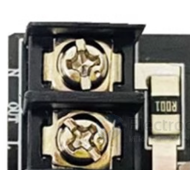
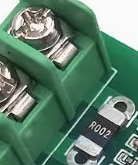
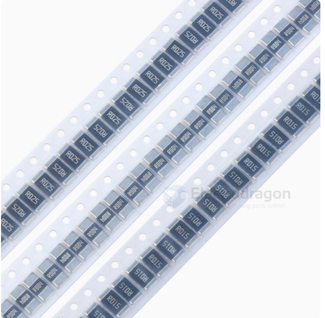

# sample-resistor-dat

- footprint 2512 

- [[HLW8032-faq-dat]]

- 0.003Ω_3W = The 10A version uses a 0.003Ω (3mΩ) sampling resistor, and its current coefficient is 0.333.
- 0.001Ω_3W = The 20A version uses a 0.001Ω (1mΩ) sampling resistor, and its current coefficient is 1.

## ref 

- [[resistor-dat]] - [[sample-resistor]] - [[resistor]]