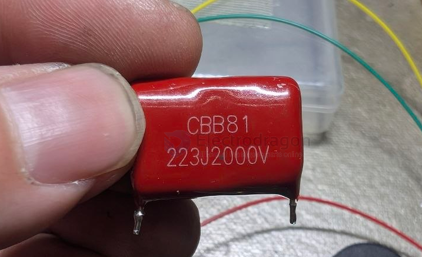

# capacitor-CBB-dat

## capacitor CBB and types 

CBB capacitors are non-polarized, metallized polypropylene film capacitors known for high stability, low loss, and excellent self-healing properties. Operating commonly between \(63V\) to \(2000V\), they are ideal for high-frequency, AC motor running, filtering, and power supply applications. They come in various types, including CBB22 (general film) and CBB60/CBB61 (motor run). 

| Marking   | Dielectric         | Typical Use                  |
| --------- | ------------------ | ---------------------------- |
| CBB / MKP | Polypropylene (PP) | Audio, timing, AC, precision |
| MKT       | Polyester (PET)    | General-purpose              |
| X7R       | Ceramic            | Decoupling, compact size     |
| C0G/NP0   | Ceramic            | RF, precision                |

## CBB81 

## apps 

- [[bug-zapper-dat]]

## ref 

