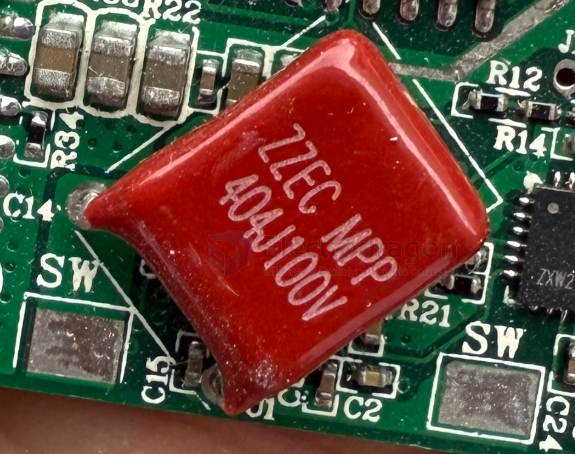

# capacitor-CBB-dat

- [[capacitor-CBB-dat]] == CBB21 - 474J 450V - [[power-adapter-dat]]

ZZEC MPP 404J100V

Metallized Polypropylene Film Capacitor is used for wireless charger - ZZEC

CBB(MPP)Capacitor

FEATURES
-  Capacitor size is super mini and ultra-thin (Thickness: 3.0-3.5mm).
-  The industry's highest standard test: 100KHZ test, DF value: 100KHZ ≤ 0.0016-0.0035.
-  The temperature rise ≤ 8 degrees, less internal heat, conversion rate is high.
-  High-frequency high-current (The temperature rise only has 7.9~8 degrees under the 3.63A current).
-  The product don't have any signs of deterioration after 150 days aging test.
-  The wireless charging 10W-15w product chose our All capacitor specifications have passed the QI Certification.

## capacitor CBB and types 

CBB capacitors are non-polarized, metallized polypropylene film capacitors known for high stability, low loss, and excellent self-healing properties. Operating commonly between \(63V\) to \(2000V\), they are ideal for high-frequency, AC motor running, filtering, and power supply applications. They come in various types, including CBB22 (general film) and CBB60/CBB61 (motor run). 

| Marking   | Dielectric         | Typical Use                  |
| --------- | ------------------ | ---------------------------- |
| CBB / MKP | Polypropylene (PP) | Audio, timing, AC, precision |
| MKT       | Polyester (PET)    | General-purpose              |
| X7R       | Ceramic            | Decoupling, compact size     |
| C0G/NP0   | Ceramic            | RF, precision                |

## CBB81 

CBB81 High Voltage Metallized Polypropylene Film Capacitor

 FEATURES
- Extended foil, flame retardant epoxy coated.
- Ideal for high AC current applizations, such as CRT deflection for R-F generators and pulse-forming networks.
- Coated with flame retardative epoxy resin which provides from humidity and mechanical damage.
- Temperature coefficient is negative and variety linear over the operation temperature.

SPECIFICATIONS
- Operating Temperature -40к~ +85к
- Rated Voltage 1000V, 1250V, 1600V, 2000V.DC 2000s (CR>0.1F)
- Capacitance Range 0.001 ~ 0.15ӴF
- Capacitance Tolerance ̈́+-5%, ̈́+-10%
- Dissipation Factor 0.1% (20C, 1KHz)
- Insulation Resistance 
  - >=25000M (CR<=0.1uF) (20к, 1min)
  - >=2000s (CR>0.1uF) (20к, 1min)

CBB81 High Voltage Metallized Polypropylene Film Capacitor
 

## apps 

- [[bug-zapper-dat]]

## ref 

