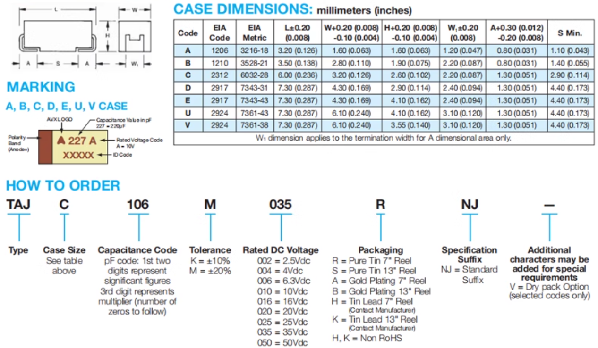
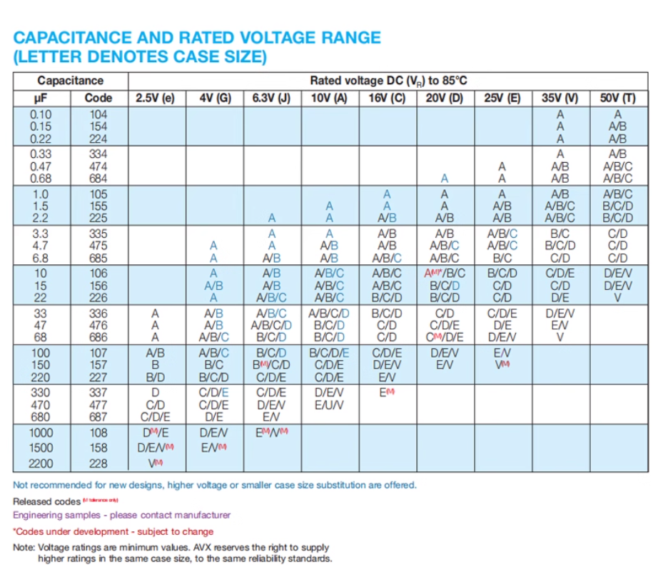

# Tantalum-dat

## examples 

107E == 100UF 

## specs - series TAJ 

rated voltage range 

**476C == 16V**

- 品牌名称：Kyocera AVX
- 产品类型：钽电容
- 封装：CASE-D-7343
- 容值：47uF
- 精度：±10%
- 额定电压：16V
- 等效串联电阻(ESR)：900mΩ@100kHz
- 工作温度：-55°℃~+125℃
- 丝印标识：476C
- 包装方式：编带
- 整盘数量：500个/圆盘

**476V == 35V**

- 品牌名称：Kyocera AVX
- 产品类型：钽电容
- 封装：CASE-E-7343-43(mm)
- 容值：47uF
- 精度：±10%
- 额定电压：35V
- 等效串联电阻(ESR)：900mΩ@100kHz
- 工作温度：-55℃~+125°℃
- 丝印标识：476V
- 包装方式：编带
- 整盘数量：400个/圆盘

## list 

| Capacitance | Tolerance | Voltage | Case  |
| :---------: | :--------: | :-----: | :---: |
|    10uF     |    ±10%    |   35V   |  D型  |
|    10uF     |    ±10%    |   50V   |  D型  |
|    22uF     |    ±10%    |   25V   |  D型  |
|    22uF     |    ±10%    |   35V   |  D型  |
|    33uF     |    ±10%    |   25V   |  D型  |
|    33uF     |    ±10%    |   35V   |  D型  |
|    47uF     |    ±10%    |   16V   |  D型  |
|    47uF     |    ±10%    |   20V   |  D型  |
|    47uF     |    ±10%    |   25V   |  D型  |
|    47uF     |    ±10%    |   35V   |  E型  |
|    68uF     |    ±10%    |   16V   |  D型  |
|    100uF    |    ±10%    |   10V   |  D型  |
|    100uF    |    ±20%    |   16V   |  D型  |
|    100uF    |    ±10%    |   16V   |  D型  |
|    100uF    |    ±20%    |   20V   |  D型  |
|    100uF    |    ±10%    |   20V   |  D型  |
|    100uF    |    ±20%    |   25V   |  E型  |
|    150uF    |    ±10%    |   16V   |  D型  |
|    220uF    |    ±10%    |   10V   |  D型  |
|    220uF    |    ±10%    |   16V   |  E型  |
|    330uF    |    ±10%    |  6.3V   |  D型  |
|    330uF    |    ±10%    |   10V   |  D型  |
|    330uF    |    ±10%    |   10V   |  E型  |
|    470uF    |    ±20%    |  6.3V   |  D型  |
|    470uF    |    ±10%    |  6.3V   |  D型  |
|    470uF    |    ±10%    |   10V   |  E型  |
|   1000uF    |    ±20%    |  6.3V   |  E型  |

## TAJ Series 

## ref 

- [[capacitor-dat]]
