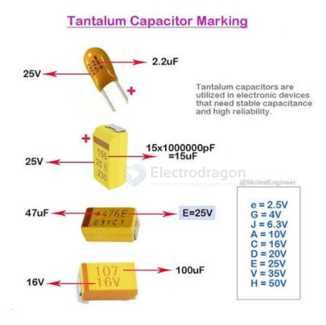
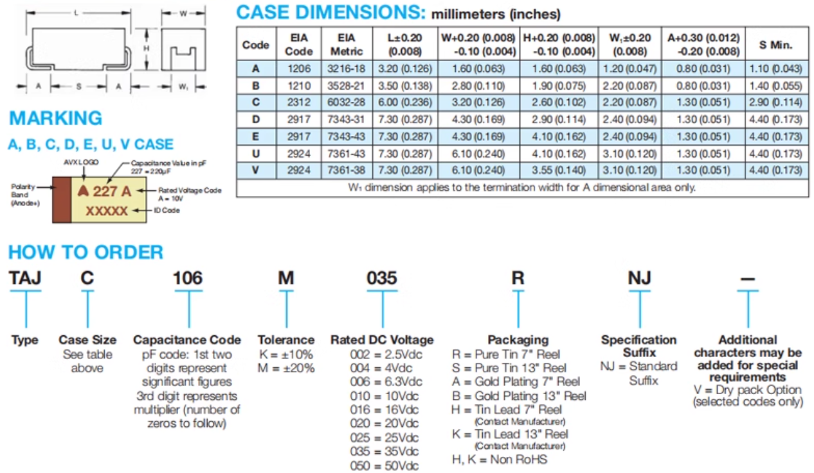
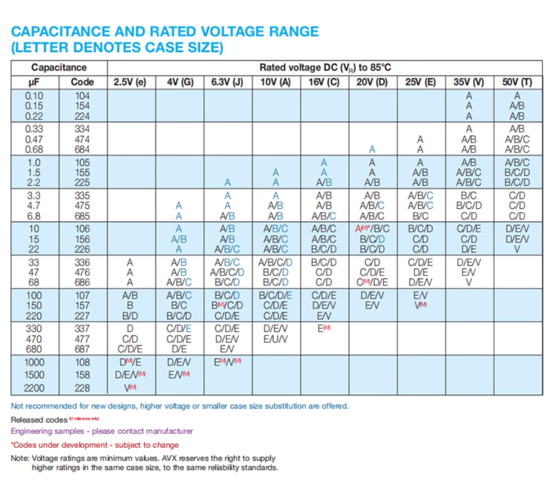
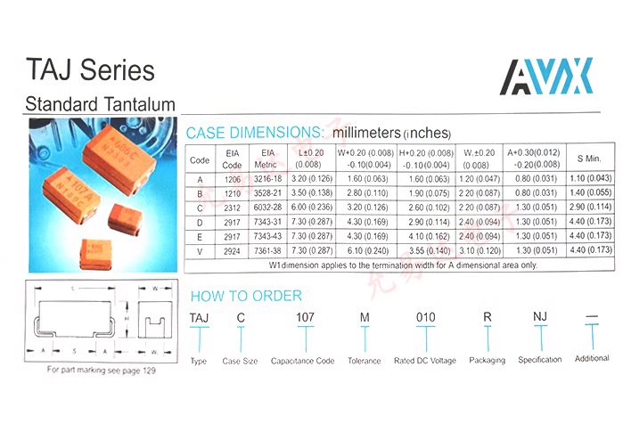

# capacitor-Tantalum-dat

## examples 

107E == 100UF 

## types 

### 7343 == E 

贴片钽电容6.3V 1000UF 6V E型7343H 2917 108J 黑色 胆电容

### 7343 == D 

贴片钽电容7343 D型 10V 470UF 印字477A

### 1206 == A 

### 3528/1210 == B 

## specs - series TAJ 

rated voltage range 

**476C == 16V**

- 品牌名称：Kyocera AVX
- 产品类型：钽电容
- 封装：CASE-D-7343
- 容值：47uF
- 精度：±10%
- 额定电压：16V
- 等效串联电阻(ESR)：900mΩ@100kHz
- 工作温度：-55°℃~+125℃
- 丝印标识：476C
- 包装方式：编带
- 整盘数量：500个/圆盘

**476V == 35V**

- 品牌名称：Kyocera AVX
- 产品类型：钽电容
- 封装：CASE-E-7343-43(mm)
- 容值：47uF
- 精度：±10%
- 额定电压：35V
- 等效串联电阻(ESR)：900mΩ@100kHz
- 工作温度：-55℃~+125°℃
- 丝印标识：476V
- 包装方式：编带
- 整盘数量：400个/圆盘

## list 

| Capacitance | Tolerance | Voltage | Case  |
| :---------: | :--------: | :-----: | :---: |
|    10uF     |    ±10%    |   35V   |  D型  |
|    10uF     |    ±10%    |   50V   |  D型  |
|    22uF     |    ±10%    |   25V   |  D型  |
|    22uF     |    ±10%    |   35V   |  D型  |
|    33uF     |    ±10%    |   25V   |  D型  |
|    33uF     |    ±10%    |   35V   |  D型  |
|    47uF     |    ±10%    |   16V   |  D型  |
|    47uF     |    ±10%    |   20V   |  D型  |
|    47uF     |    ±10%    |   25V   |  D型  |
|    47uF     |    ±10%    |   35V   |  E型  |
|    68uF     |    ±10%    |   16V   |  D型  |
|    100uF    |    ±10%    |   10V   |  D型  |
|    100uF    |    ±20%    |   16V   |  D型  |
|    100uF    |    ±10%    |   16V   |  D型  |
|    100uF    |    ±20%    |   20V   |  D型  |
|    100uF    |    ±10%    |   20V   |  D型  |
|    100uF    |    ±20%    |   25V   |  E型  |
|    150uF    |    ±10%    |   16V   |  D型  |
|    220uF    |    ±10%    |   10V   |  D型  |
|    220uF    |    ±10%    |   16V   |  E型  |
|    330uF    |    ±10%    |  6.3V   |  D型  |
|    330uF    |    ±10%    |   10V   |  D型  |
|    330uF    |    ±10%    |   10V   |  E型  |
|    470uF    |    ±20%    |  6.3V   |  D型  |
|    470uF    |    ±10%    |  6.3V   |  D型  |
|    470uF    |    ±10%    |   10V   |  E型  |
|   1000uF    |    ±20%    |  6.3V   |  E型  |

## TAJ Series 

## common used 

A3216 100nF 104 35V ±10% 10个
A3216 220nF 224 35V ±10% 10个
A3216 330nF 334 35V ±10% 10个
A3216 470nF 474 35V ±10% 10个
A3216 680nF 684 35V ±10% 10个
A3216 1uF 105 16V ±10% 10个
A3216 1uF 105 25V ±10% 10个
A3216 1uF 105 35V ±10% 10个
A3216 2.2uF 225 16V ±10% 10个
A3216 2.2uF 225 25V ±10% 10个
A3216 2.2uF 225 35V ±10% 10个
A3216 3.3uF 335 16V ±10% 10个
A3216 3.3uF 335 25V ±10% 10个
A3216 4.7uF 475 16V ±10% 10个
A3216 4.7uF 475 25V ±10% 10个
A3216 6.8uF 685 16V ±10% 10个
A3216 10uF 106 10V ±10% 10个
A3216 10uF 106 16V ±10% 10个
A3216 10uF 106 25V ±10% 10个
A3216 15uF 156 10V ±10% 10个
A3216 15uF 156 16V ±10% 10个
A3216 22uF 226 10V ±10% 10个
A3216 22uF 226 16V ±10% 10个
A3216 33uF 336 10V ±10% 10个
A3216 33uF 336 16V ±10% 10个
A3216 47uF 476 6.3V ±10% 10个
A3216 47uF 476 10V ±10% 10个
A3216 47uF 476 16V ±10% 10个
A3216 100uF 107 6.3V ±20% 10个
A3216 100uF 107 10V ±20% 10个
B3528 1uF 105 35V ±10% 10个
B3528 1uF 105 50V ±10% 10个
B3528 2.2uF 225 35V ±10% 10个
B3528 3.3uF 335 25V ±10% 10个
B3528 3.3uF 335 35V ±10% 10个
B3528 4.7uF 475 16V ±10% 10个
B3528 4.7uF 475 25V ±10% 10个
B3528 4.7uF 475 35V ±10% 10个
B3528 6.8uF 685 16V ±10% 10个
B3528 6.8uF 685 25V ±10% 10个
B3528 10uF 106 16V ±10% 10个
B3528 10uF 106 25V ±10% 10个
B3528 15uF 156 16V ±10% 10个
B3528 22uF 226 10V ±10% 10个
B3528 22uF 226 16V ±10% 10个
B3528 22uF 226 25V ±10% 10个
B3528 33uF 336 16V ±10% 10个
B3528 47uF 476 6.3V ±10% 10个
B3528 47uF 476 10V ±10% 10个
B3528 47uF 476 16V ±10% 10个
B3528 68uF 686 10V ±10% 10个
B3528 100uF 107 6.3V ±10% 10个
B3528 100uF 107 10V ±10% 10个
B3528 100uF 107 16V ±10% 10个
B3528 150uF 157 6.3V ±20% 10个
B3528 150uF 157 10V ±20% 10个
**B3528 220uF 227 6.3V ±20% 10个**
C6032 1uF 105 50V ±10% 10个
C6032 2.2uF 225 35V ±10% 10个
C6032 2.2uF 225 50V ±10% 10个
C6032 3.3uF 335 35V ±10% 10个
C6032 4.7uF 475 35V ±10% 10个
C6032 4.7uF 475 50V ±10% 10个
C6032 6.8uF 685 35V ±10% 10个
C6032 6.8uF 685 50V ±10% 10个
C6032 10uF 106 16V ±10% 10个
C6032 10uF 106 25V ±10% 10个
C6032 10uF 106 35V ±10% 10个
C6032 15uF 156 25V ±10% 10个
C6032 15uF 156 35V ±10% 10个
C6032 22uF 226 16V ±10% 10个
C6032 22uF 226 25V ±10% 10个
C6032 33uF 336 16V ±10% 10个
C6032 33uF 336 25V ±10% 10个
C6032 47uF 476 16V ±10% 10个
C6032 47uF 476 25V ±10% 10个
C6032 68uF 686 16V ±10% 10个
C6032 100uF 107 10V ±10% 5个
C6032 100uF 107 16V ±10% 5个
C6032 150uF 157 10V ±10% 5个
C6032 220uF 227 6.3V ±10% 5个
C6032 220uF 227 10V ±10% 5个
C6032 330uF 337 6.3V ±10% 5个
D7343 4.7uF 475 50V ±10% 5个
D7343 6.8uF 685 35V ±10% 5个
D7343 6.8uF 685 50V ±10% 5个
D7343 10uF 106 35V ±10% 5个
D7343 10uF 106 50V ±10% 5个
D7343 15uF 156 35V ±10% 5个
D7343 15uF 156 50V ±10% 5个
D7343 22uF 226 25V ±10% 5个
D7343 22uF 226 35V ±10% 5个
D7343 33uF 336 25V ±10% 5个
D7343 33uF 336 35V ±10% 5个
D7343 47uF 476 16V ±10% 5个
D7343 47uF 476 25V ±10% 5个
D7343 47uF 476 35V ±10% 5个
D7343 68uF 686 16V ±10% 5个
D7343 68uF 686 25V ±10% 5个
D7343 100uF 107 10V ±10% 5个
D7343 100uF 107 16V ±10% 5个
D7343 100uF 107 25V ±10% 5个
D7343 100uF 107 35V ±10% 5个
D7343 150uF 157 10V ±10% 5个
D7343 150uF 157 16V ±10% 5个
D7343 220uF 227 10V ±10% 5个
D7343 220uF 227 16V ±10% 5个
D7343 330uF 337 10V ±10% 5个
D7343 330uF 337 16V ±10% 5个
D7343 470uF 477 6.3V ±10% 5个
D7343 470uF 477 10V ±10% 5个
E7343 10uF 106 50V ±10% 2个
E7343 15uF 156 50V ±10% 2个
E7343 22uF 226 35V ±10% 2个
E7343 22uF 226 50V ±10% 2个
E7343 33uF 336 35V ±10% 2个
E7343 47uF 476 25V ±10% 2个
E7343 47uF 476 35V ±10% 2个
E7343 68uF 686 25V ±10% 2个
E7343 100uF 107 25V ±10% 2个
E7343 100uF 107 35V ±10% 2个
E7343 150uF 157 16V ±10% 2个
E7343 220uF 227 16V ±10% 2个
E7343 220uF 227 25V ±10% 2个
E7343 330uF 337 10V ±10% 2个
E7343 330uF 337 16V ±10% 2个
E7343 470uF 477 10V ±10% 2个
E7343 470uF 477 16V ±10% 2个
E7343 680uF 687 6.3V ±20% 2个
E7343 1000uF 108 6.3V ±20% 2个

## ref 

- [[capacitor-dat]]

- [[capacitor-tantalum]] - [[capacitor]]