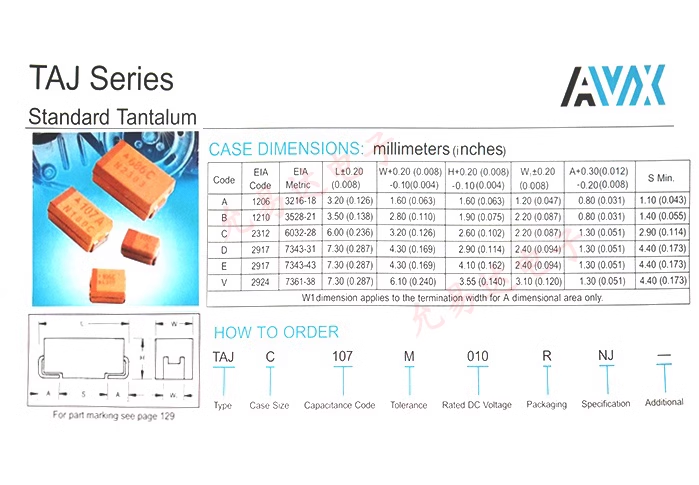
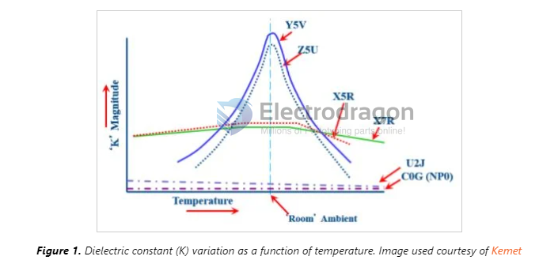

# cap-dat 

common brand: 	Chemi-Con, Vishay, TDK, Pansonic, KEMET, Nichicon

## Aluminum Electrolytic Capacitors - Radial Leaded

UPM1C102MPD

- Capacitance:	1000 uF	
- Voltage Rating DC:	16 VDC	
- Diameter:	10 mm	
- Length:	31.5 mm	
- Lead Spacing:	5 mm
- Product:	Low Impedance Electrolytic Capacitors
- ESR:	47 mOhms
- [mouser](https://www.mouser.com/ProductDetail/Nichicon/UPM1C102MPD?qs=sGAEpiMZZMvwFf0viD3Y3asoeH%252BozipbRshjmM7HrXA%3D)

ESE476M063AG3AA

- Capacitance:	47 uF	
- Voltage Rating DC:	63 VDC	
- Diameter:	8 mm	
- Length:	11 mm	
- Lead Spacing:	3.5 mm	
- Product:	General Purpose Electrolytic Capacitors

## CPOL SMD == Aluminum Organic Polymer Capacitors

### 10SVP150MX

- Capacitance:	150 uF
- Voltage Rating DC:	10 VDC
- Manufacturer:	Panasonic
- ESR:	35 mOhms
- [mouser](https://www.mouser.com/ProductDetail/Panasonic/10SVP150MX?qs=OE1iw1LrrPHivwvo07HIWQ%3D%3D&srsltid=AfmBOoo4rCaynTxtMDlHuMfp_wQLsJcUsBf7wrQTaFRQ64rotDMANhCK)
- Aluminum Organic Polymer Capacitors 10volts 150uF ESR 35mohm

## TAJ Series 

## Specs 

The 3-Character Capacitor Code
The three-character code with the letter-number-letter format is used for capacitors with Class 2 and Class 3 dielectrics. C0G is a Class 1 dielectric, so it’s not included (more on this later). X5R and X7R are in Class 2, and Y5V is in Class 3.

- The first character indicates the lowest temperature that the capacitor can handle. The letter X (as in X7R, X5R) corresponds to –55°C.
- The second character indicates the maximum temperature. The theoretical range is from 45°C to 200°C; 5 (as in X5R) corresponds to 85°C, and 7 (as in X7R) corresponds to 125°C.
- The third character indicates the maximum amount of capacitance change over the part’s temperature range. The spec for --R capacitors (such as X5R and X7R) is ±15%. The capacitance of parts with a code ending in V can actually decrease by as much as 82%! This probably explains why Y5V capacitors are not so popular.

- [[capacitor]]