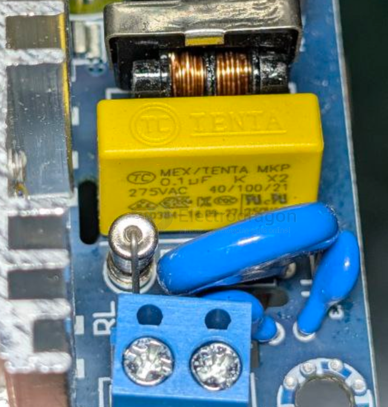
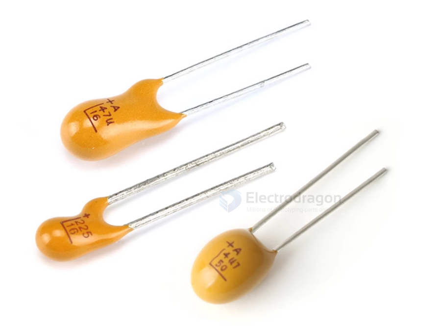
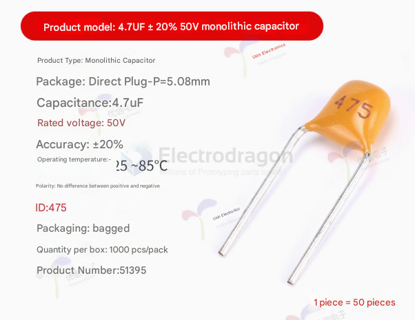

# cap-dat 

- [[ESR-capacitor-dat]] - [[MLCC-dat]] - [[Electrolytic-cap-dat]] - [[tantalum-dat]]

## brands 

common brand: 	Chemi-Con, Vishay, TDK, Pansonic, KEMET, Nichicon

## function 

- [[capacitor-decoupling-dat]]

- [[capacitor-start-dat]] - [[capacitor-CBB-dat]]

- [[capacitor-x-y-dat]]

## capacitor CBB and types 

CBB capacitors are non-polarized, metallized polypropylene film capacitors known for high stability, low loss, and excellent self-healing properties. Operating commonly between \(63V\) to \(2000V\), they are ideal for high-frequency, AC motor running, filtering, and power supply applications. They come in various types, including CBB22 (general film) and CBB60/CBB61 (motor run). 

| Marking   | Dielectric         | Typical Use                  |
| --------- | ------------------ | ---------------------------- |
| CBB / MKP | Polypropylene (PP) | Audio, timing, AC, precision |
| MKT       | Polyester (PET)    | General-purpose              |
| X7R       | Ceramic            | Decoupling, compact size     |
| C0G/NP0   | Ceramic            | RF, precision                |

## Aluminum Electrolytic Capacitors - Radial Leaded

UPM1C102MPD

- Capacitance:	1000 uF	
- Voltage Rating DC:	16 VDC	

- Length:	31.5 mm	
- Lead Spacing:	5 mm
- Product:	Low Impedance Electrolytic Capacitors
- ESR:	47 mOhms
- [mouser](https://www.mouser.com/ProductDetail/Nichicon/UPM1C102MPD?qs=sGAEpiMZZMvwFf0viD3Y3asoeH%252BozipbRshjmM7HrXA%3D)

ESE476M063AG3AA

- Capacitance:	47 uF	
- Voltage Rating DC:	63 VDC	
- Diameter:	8 mm	
- Length:	11 mm	
- Lead Spacing:	3.5 mm	
- Product:	General Purpose Electrolytic Capacitors

## CPOL SMD == Aluminum Organic Polymer Capacitors

Tantium PTH capacitor 

- 470nF_±10%_35V
- 1uF_±10%_50V
- 2.2uF_±10%_16V
- 2.2uF_±10%_35V
- 4.7uF_±10%_16V
- 4.7uF_±10%_25V
- 4.7uF_±10%_35V
- 4.7uF_±10%_50V
- 10uF_±10%_16V
- 10uF_±10%_25V
- 10uF_±10%_35V
- 10uF_±10%_50V
- 22uF_±10%_16V
- 22uF_±10%_35V
- 47uF_±10%_16V

### 10SVP150MX

- Capacitance:	150 uF
- Voltage Rating DC:	10 VDC
- Manufacturer:	Panasonic
- ESR:	35 mOhms
- [mouser](https://www.mouser.com/ProductDetail/Panasonic/10SVP150MX?qs=OE1iw1LrrPHivwvo07HIWQ%3D%3D&srsltid=AfmBOoo4rCaynTxtMDlHuMfp_wQLsJcUsBf7wrQTaFRQ64rotDMANhCK)
- Aluminum Organic Polymer Capacitors 10volts 150uF ESR 35mohm

## Specs 

The 3-Character Capacitor Code
The three-character code with the letter-number-letter format is used for capacitors with Class 2 and Class 3 dielectrics. C0G is a Class 1 dielectric, so it’s not included (more on this later). X5R and X7R are in Class 2, and Y5V is in Class 3.

- The first character indicates the lowest temperature that the capacitor can handle. The letter X (as in X7R, X5R) corresponds to –55°C.
- The second character indicates the maximum temperature. The theoretical range is from 45°C to 200°C; 5 (as in X5R) corresponds to 85°C, and 7 (as in X7R) corresponds to 125°C.
- The third character indicates the maximum amount of capacitance change over the part’s temperature range. The spec for --R capacitors (such as X5R and X7R) is ±15%. The capacitance of parts with a code ending in V can actually decrease by as much as 82%! This probably explains why Y5V capacitors are not so popular.

### DC blocking capacitor

## What is a DC Blocking Capacitor?

A **DC blocking capacitor** is an electronic component used to:

- **Block DC (direct current)** signals
- **Pass AC (alternating current)** signals

### How it works:
- Capacitors **do not allow DC** to flow through once fully charged.
- Capacitors **allow AC** to pass because the voltage across them is always changing.

### Common Usage:
- Audio circuits (to prevent DC offset)
- Signal coupling between stages of amplifiers
- Input protection for sensitive devices

### Symbol:

    ---||---

### Example:

In an audio amplifier:

The capacitor blocks DC from the source, letting only the AC audio signal pass.

##  None-Polarized Capacitors

### monolithic ceramic capacitor

- 20pF_±10%_50V (50只)
- 22pF_±10%_50V (50只)
- 30pF_±10%_50V (50只)
- 33pF_±10%_50V (50只)
- 47pF_±10%_50V (50只)
- 100pF_±10%_50V (50只)
- 150pF_±10%_50V (50只)
- 200pF_±10%_50V (50只)
- 220pF_±10%_50V (50只)
- 330pF_±10%_50V (50只)
- 470pF_±10%_50V (50只)
- 680pF_±10%_50V (50只)
- 1nF_±10%_50V (50只)
- 2.2nF_±10%_50V (50只)
- 3.3nF_±10%_50V (50只)
- 4.7nF_±10%_50V (50只)
- 10nF_±10%_50V (50只)
- 22nF_±10%_50V (50只)
- 33nF_±10%_50V (50只)
- 47nF_±10%_50V (50只)
- 100nF_±20%_50V (50只)
- 150nF_±10%_50V (50只)
- 220nF_±10%_50V (50只)
- 330nF_±10%_50V (50只)
- 470nF_±10%_50V (50只)
- 1uF_±10%_50V (50只)
- 4.7uF_±10%_50V (50只)

## C0805 

- **100NF / 50V**
- **1UF / 16V**
- **10UF / 10V**

## C1206 

- **22UF / 35V**
- **22UF / 50V**
- **100UF / 10V**

## feed through capacitor 

657-PSM1-402Z-10B == Feed Through Capacitors 4000PF 10A PI - Surface Mount Low Pass Filters PSM Series

## JNC JN 222M 

| Parameter        | Value (typical)          |
|------------------|--------------------------|
| Capacitance      | 2.2 nF (2200 pF)         |
| Tolerance        | ±20%                     |
| Dielectric       | Ceramic (disc type)      |
| Voltage rating   | ~400 VAC (may vary)      |
| Package          | Radial ceramic disc      |

### Common applications

- EMI / noise suppression
- Snubber or filtering circuits
- High-voltage signal coupling
- Non-precision timing circuits

## ref 

- [[capacitor]]

- [[BOM-dat]]