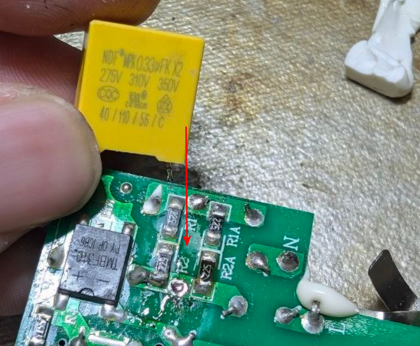
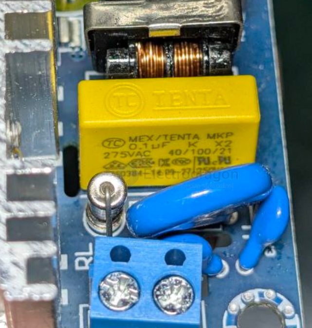

# capacitor-x-y-dat

- [[capacitor-x-y-dat]] - SHM X1400~ Y1250~ B 331K - [[power-adapter-dat]]

This is a Safety Ceramic Disc Capacitor manufactured by South Hongming (SHM). These are typically used for EMI/RFI suppression in power supplies and appliances. The markings translate to:

- SHM: Manufacturer (South Hongming)
- X1400 Y1250: Safety certification ratings of X1 (400V AC) and Y1 (250V AC)
- 331K: Capacitance and tolerance. 331: 33 × 10¹ pF = 330 pF (Picofarads), K: ± 10% tolerance.

https://www.vishay.com/docs/28518/safetydn.pdf

Ceramic Disc Capacitors Safety, Class X1/Y2 400/250 V (AC) Series DN

- [[capacitor-X2-dat]] - [[capacitor-dat]] - [[capacitor-x-y-dat]]

## X - Y capacitor 

An X2 capacitor is a safety-rated EMI suppression capacitor designed to be connected across the AC mains (Line–Neutral).

It is defined by IEC 60384-14 and used mainly for noise suppression and interference filtering in power supplies and AC equipment.

Where X2 capacitors are used

    AC Line (L) ──||── AC Neutral (N)
                ↑
                X2

Typical locations:

- Across L–N in SMPS input
- EMI filters
- Appliances, chargers, adapters
- Motor controllers

What “X2” specifically means

| Parameter                | X2 Rating                     |
| ------------------------ | ----------------------------- |
| Connection               | Line ↔ Neutral                |
| Rated AC voltage         | ≤ 300 VAC (typically 275 VAC) |
| Surge voltage capability | 2.5 kV                        |
| Failure mode             | Self-healing, non-flammable   |
| Safety standard          | IEC 60384-14                  |

X-class vs Y-class (important)

- X capacitors → across L–N
- Y capacitors → from L/N to Earth (PE)

| Class | Location    | Safety Risk       | Typical Rating |
| ----- | ----------- | ----------------- | -------------- |
| X2    | L–N         | Low               | 275 VAC        |
| X1    | L–N         | Higher surge      | 440 VAC        |
| Y2    | L–PE / N–PE | High (shock risk) | 250 VAC        |
| Y1    | L–PE / N–PE | Highest           | 500 VAC        |

- ⚠ Never replace a Y capacitor with an X capacitor
- ⚠ Never use a normal film capacitor in place of X2

Typical X2 capacitor characteristics

- Dielectric: Metallized polypropylene (MKP / CBB)
- Capacitance range: ~100 pF to 1 µF
- Flame-retardant epoxy case
- Certified marks: ENEC, VDE, UL, CQC

## ref 

- [[capacitor-dat]]