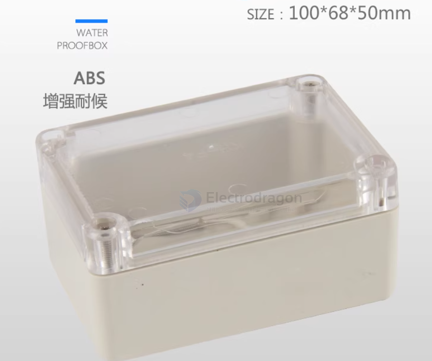
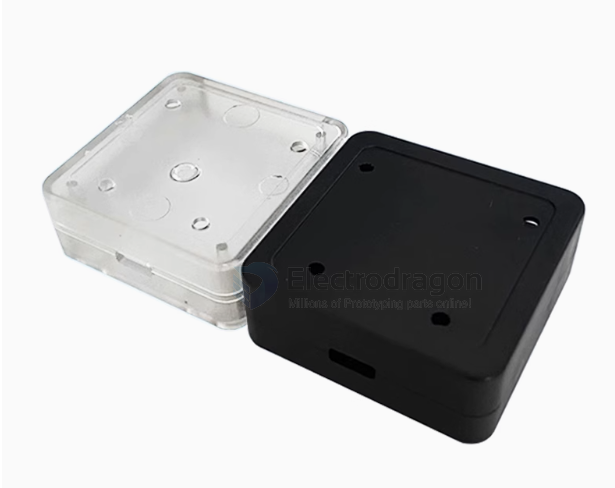
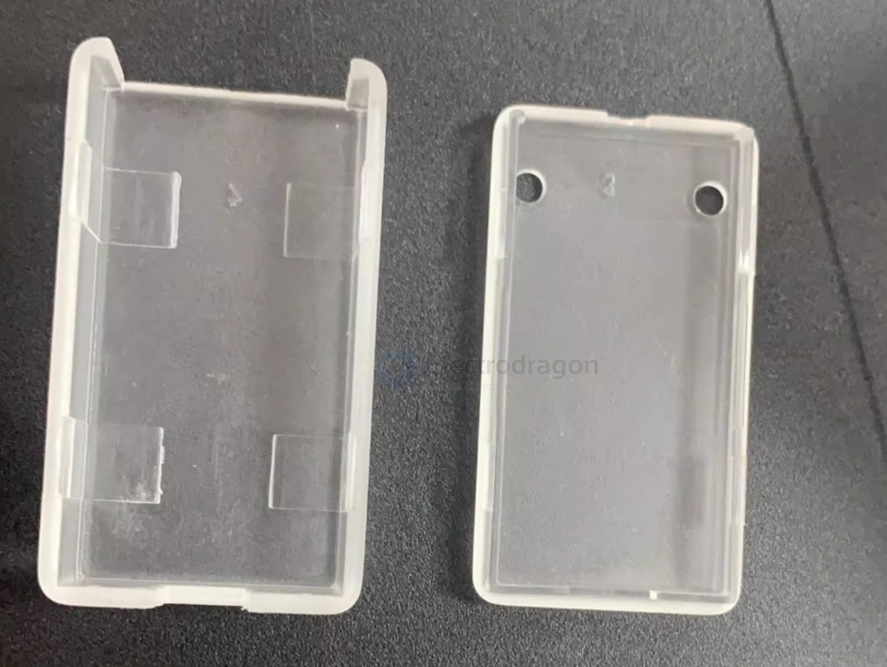

# case-dat.md

https://www.electrodragon.com/product-category/prototype/proto-case/

- [[plate-dat]]

## Case used for our boards 

- [[esp-relay-board-dat]]

- [[case-header-dat]] - [[IMS1044-dat]] - [[IMS1038-dat]] - [[IMS1030-dat]] - [[3201586-dat]]

- [[NWI1252-dat]]

## pre-built cases by material and manufacturing method

- [[case-led-dat]] 

- [[case-layered-dat]] 

- [[case-waterproof-dat]]

- normal plastic case - [[PENS005-dat]] - [[PENS007-dat]] - retired - [[PENS001-dat]]

- [[aluminium-extrusion-case-dat]] - [[PENS010-dat]]

- [[3d-print-dat]] - [[3d-print-case-dat]]

## Purpose 

- [[arduino-dat]] - [[PENS020-dat]]

- [[RPI-dat]] - [[MPCS039-dat]]

- industrial PLC purpose - [[PENS019-dat]]

## Case list 

### fully-transaparent case 

100-68-50

### semi-transaparent - retangular case 

- industrial PLC purpose - [[PENS019-dat]]

two side open, size 50 x 50 mm

- [[NWI1252-dat]]

49-27-14

## ref 

- [[BOM-dat]] - [[case]]