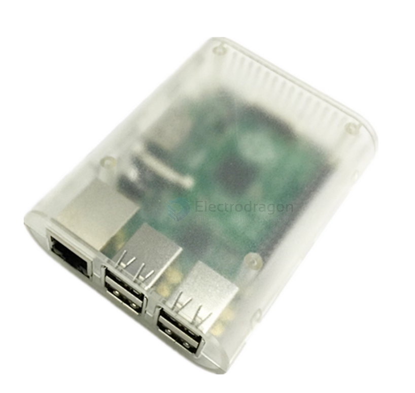
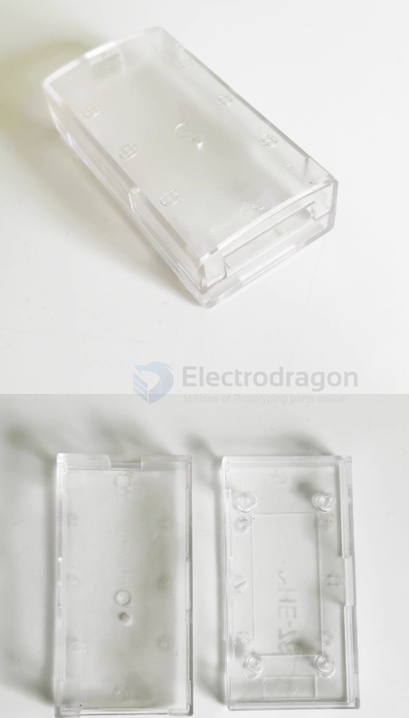
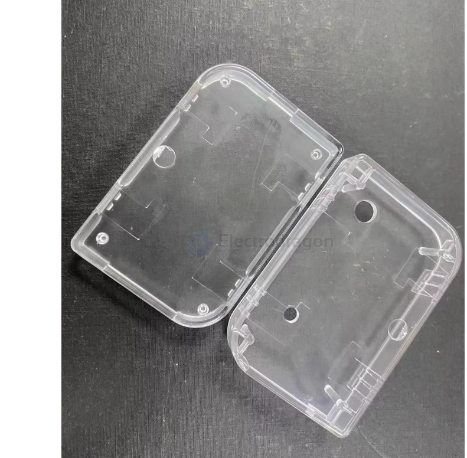
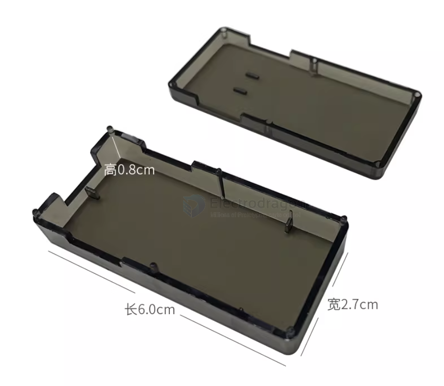
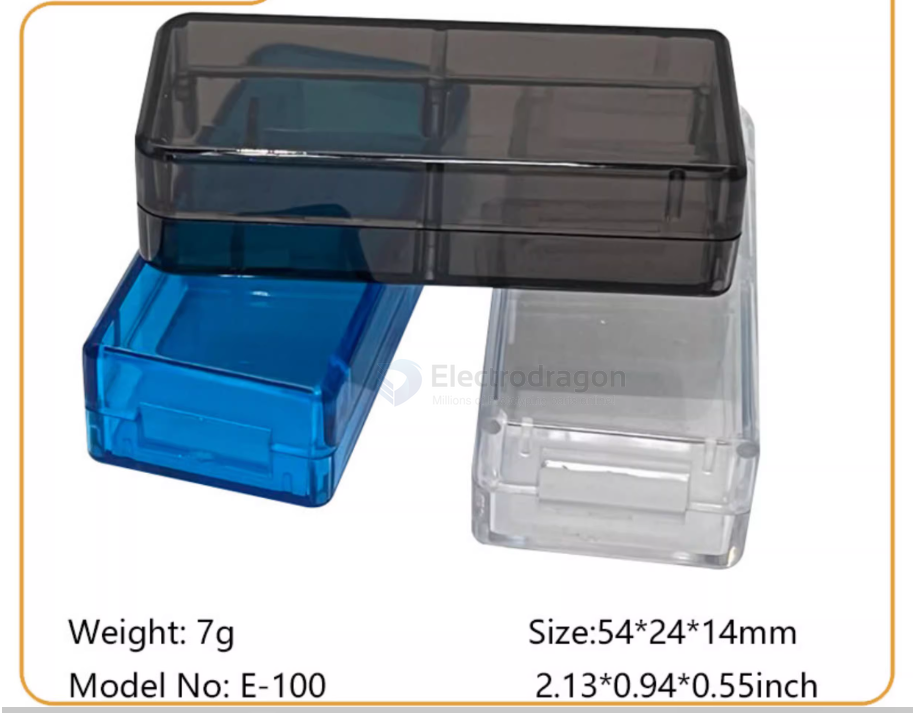

# case-gadget-dat

- normal plastic case - [[PENS005-dat]] - [[PENS007-dat]] - retired - [[PENS001-dat]]

two side open, size 50 x 50 mm

- [[NWI1252-dat]]

49-27-14

raspberry pi 2 semi-transparent case 

- [[RPI-SBC-dat]] - [[RPI3-dat]]

[[JLINK-dat]] case == dimension == 103 x 53 x 27 mm 

- [[case-waterproof-dat]]

外尺寸60*40*20mm

## ref 

- [[case-gadget-dat]]

- [[case-dat]]

- [[case-gadget]]