# case-din-rail-dat

- [[DIN-rail-35mm-dat]] - [[DIN-rail-15mm-dat]]

din rail is a standardized metal rail used for mounting electrical and electronic components in control cabinets and enclosures.

88 - 59 - 24
- **Product Code**: ED4-01
- **Dimensions**: 88x37x59 MM
- **Colors**: Beige, Black, Gray
- **Material**: ABS for upper and lower covers, POM for buckles
- **Mounting Post Size**: 22x51 MM
- **Terminal Option**: Can be equipped with 2EDG-5P terminal on one side
- **Custom Options**: Colors and materials can be customized for bulk orders (subject to factory shipment)
- **Pricing Notes**: Discounts available for large quantities; unit price excludes

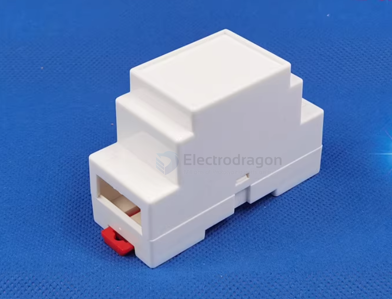

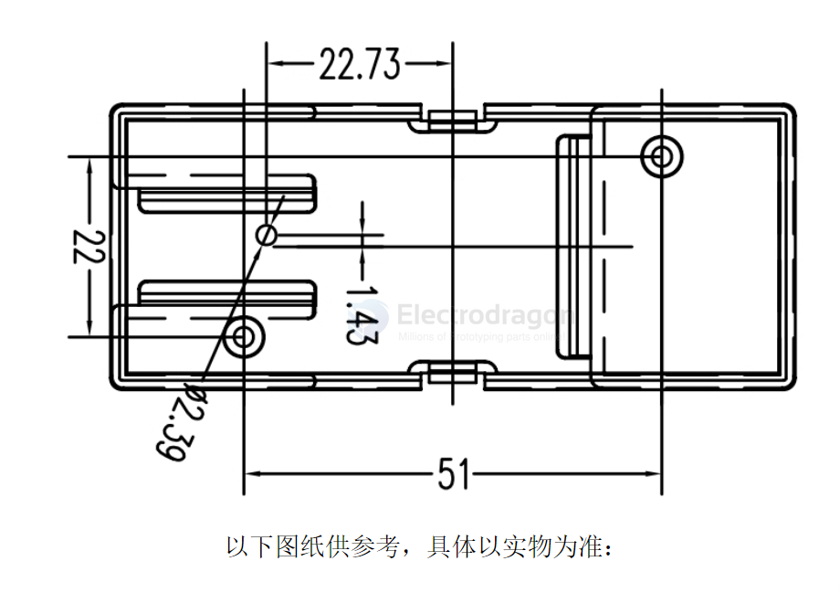

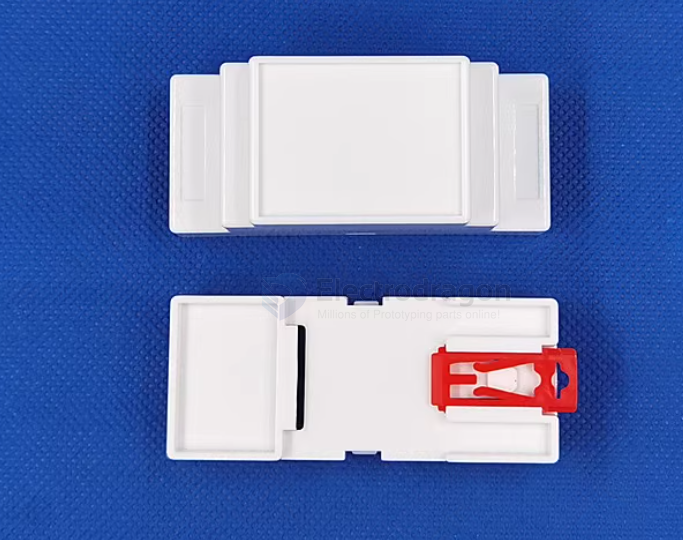

H 88 - D 59 - W 24 - 2 

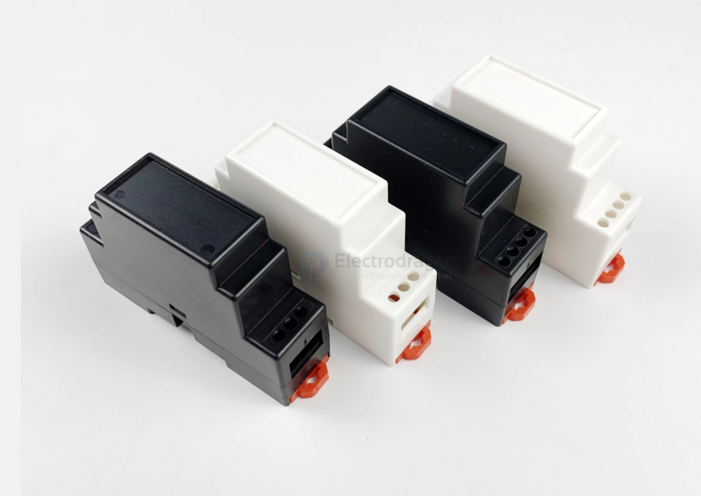

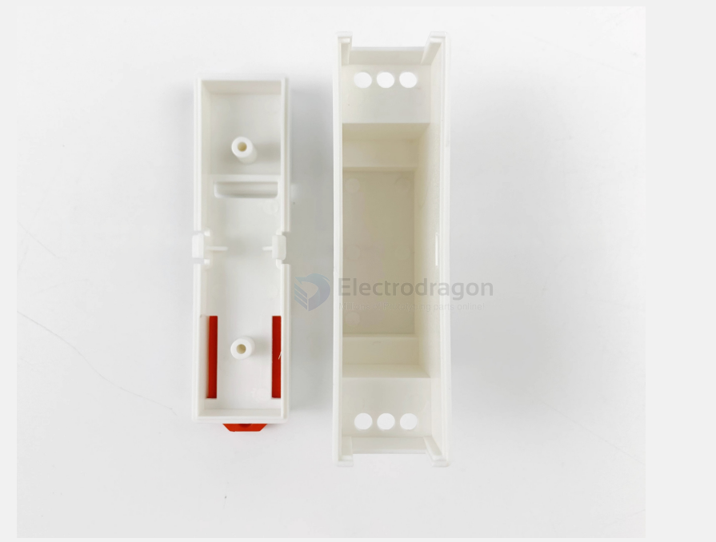

H 95 - D 41 - W 25

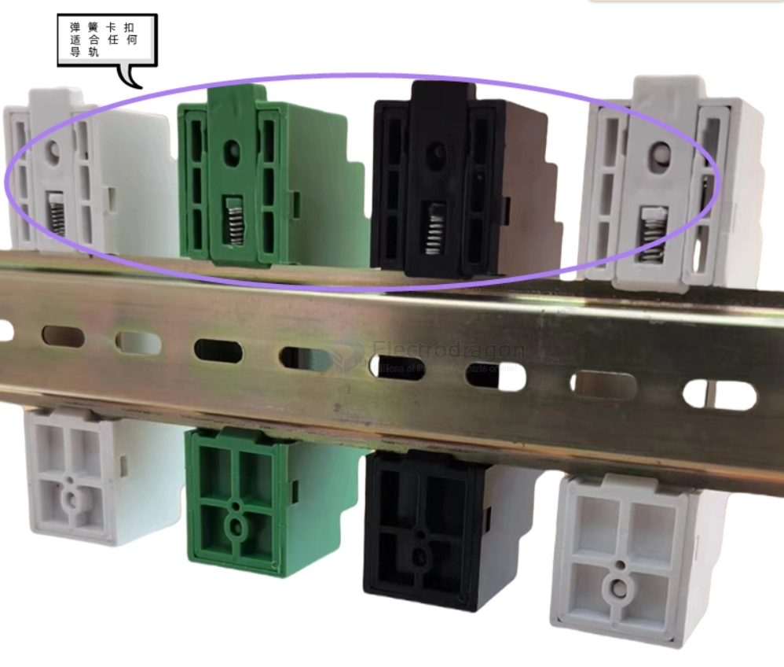

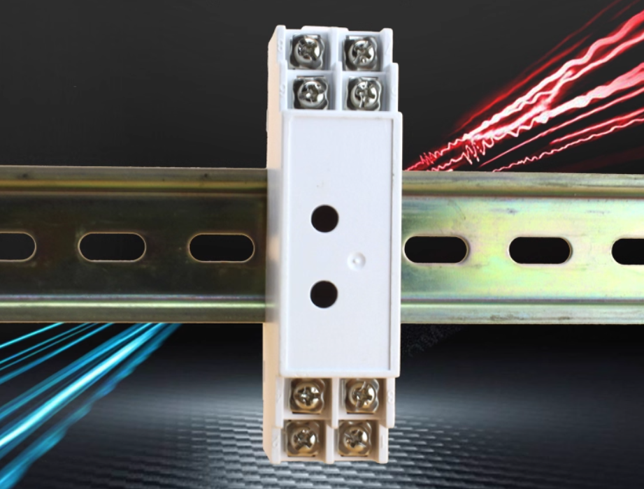

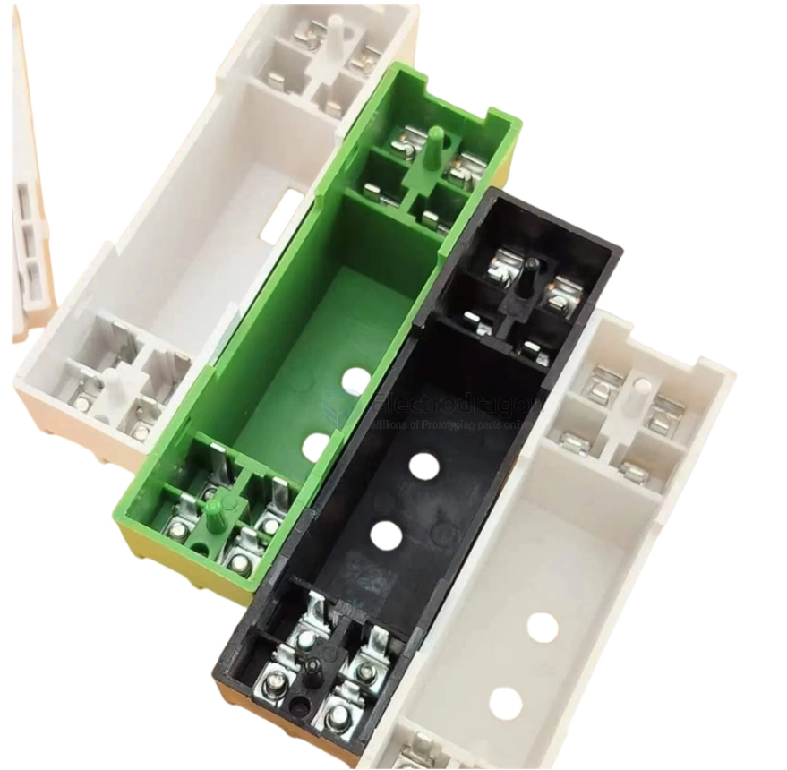

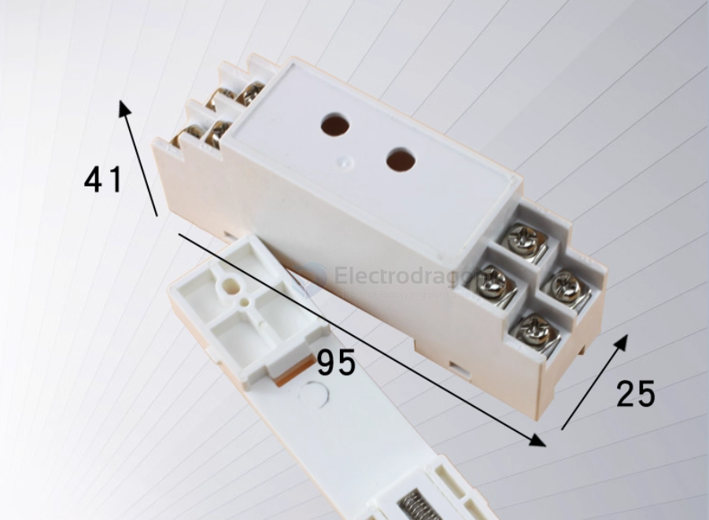

H 88 - D 55 - W 44

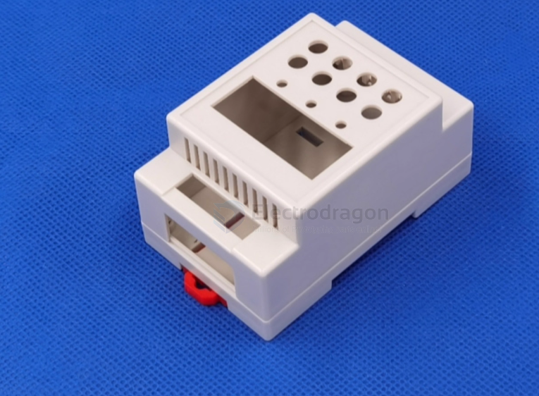

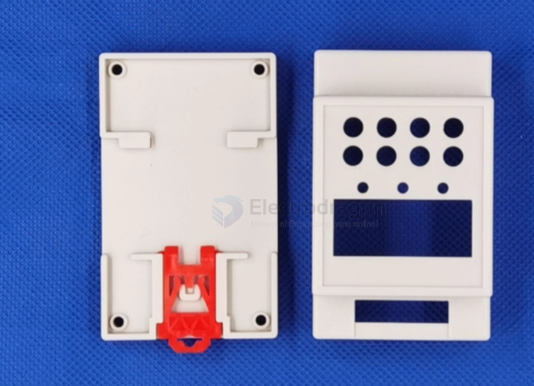

82 - 54 - 32 // 82 - 55 - 32

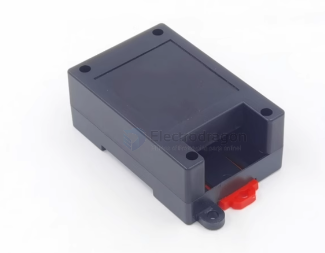

82 - 54 - 32 - 2 

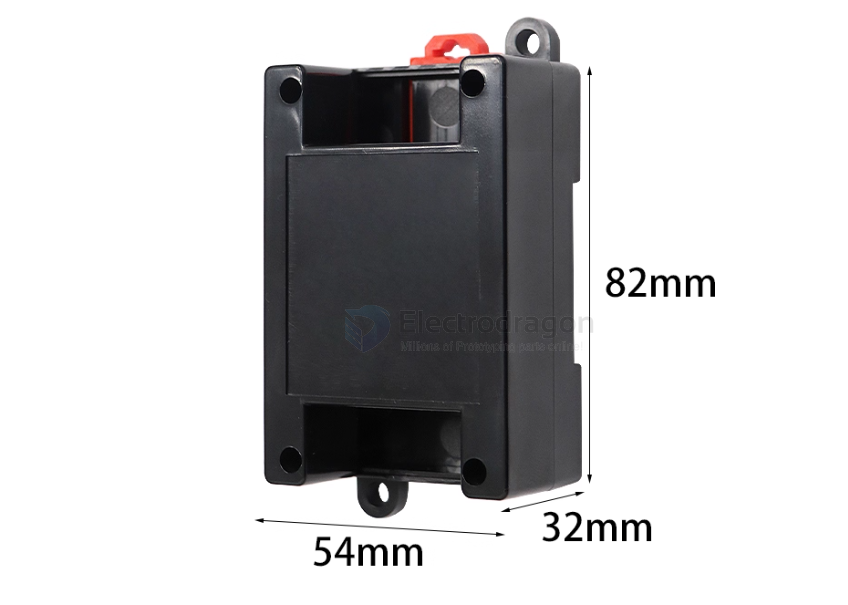

95 - 54 - 32 // 90 - 54 // 90 - 40

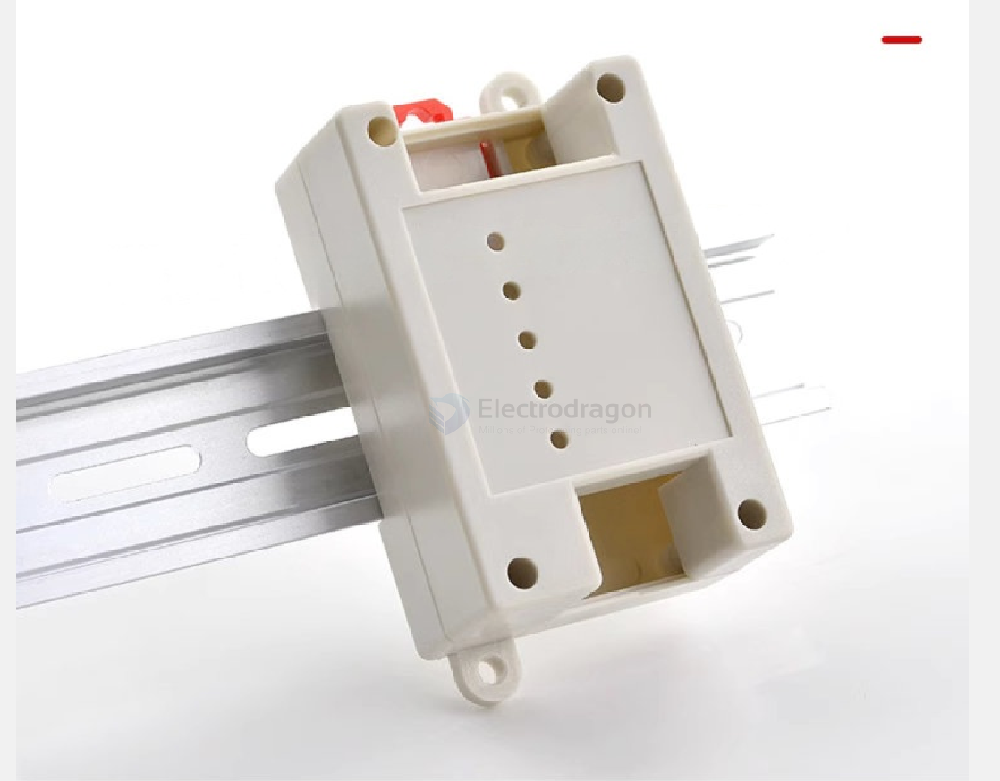

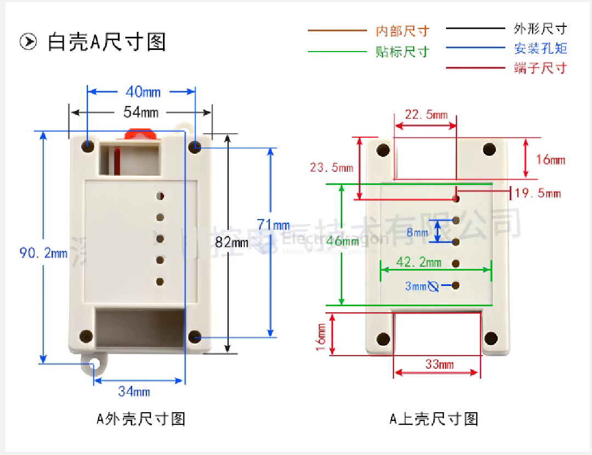

## ref 

- [[case-instruments-dat]] - [[case]]

- [[case-din-rail]]