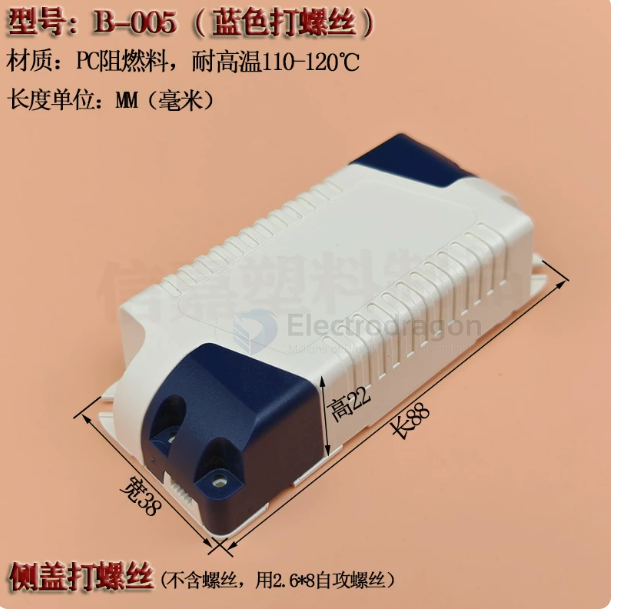
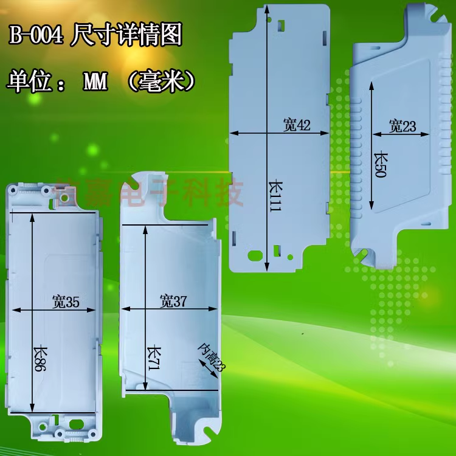

# case-led-dat

## B-005

## B-004 case 

case used by [[NWI1072-dat]] - [[NWI1126-dat]]

- PC Flame Retardant
- Polycarbonate

- use Self-tapping screw M2 * 8 or M3 * 8 

## ref 

- [[screw-dat]] - [[case-led]]

