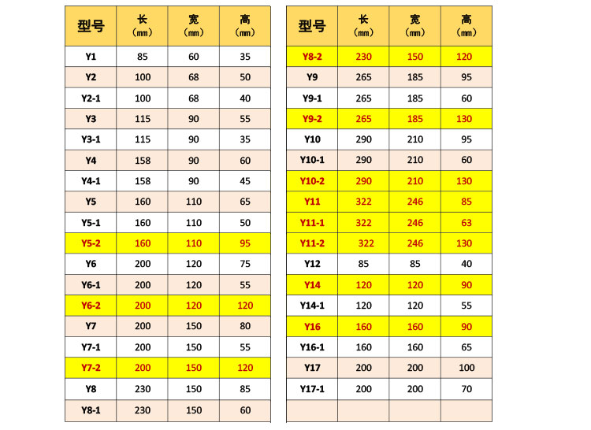
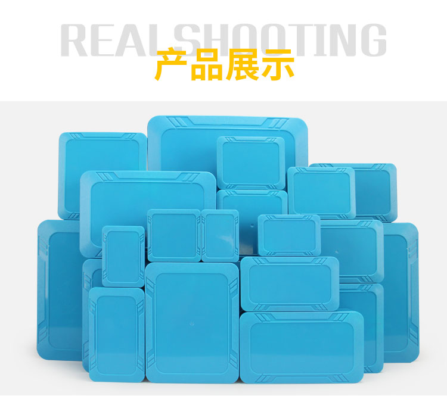
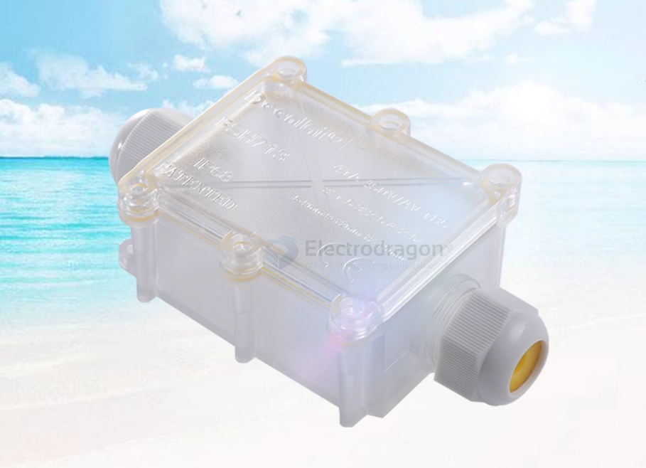
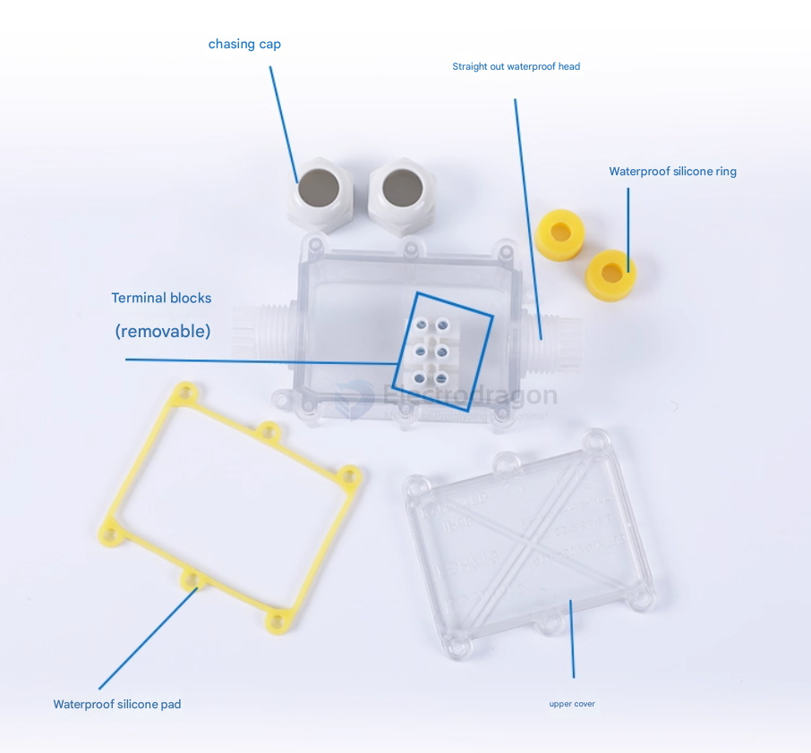
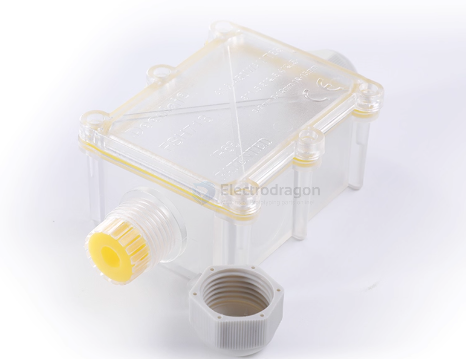
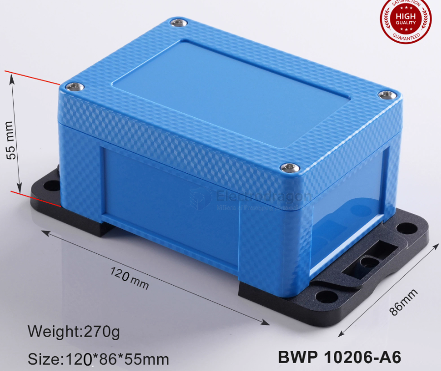

# waterproof-case-dat

- Y1: 85 x 60 x 35 mm
- Y2-1: 100 x 68 x 40 mm

- [[IP68-dat]]

cable case 

inner space == 72 x 49 x 32 mm

## IP68 case 

semi transparent 

## ref 

- [[case-dat]]

- [[waterproof-case]] - [[case]]