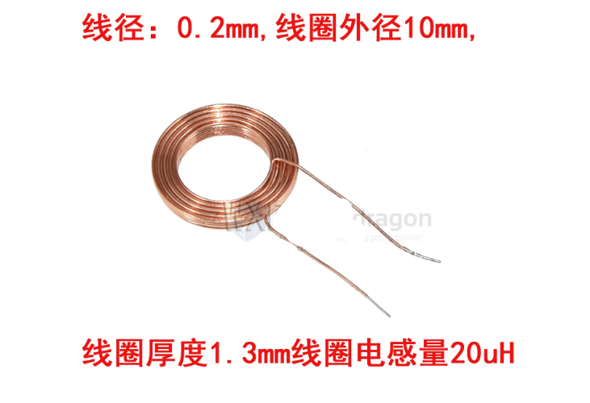
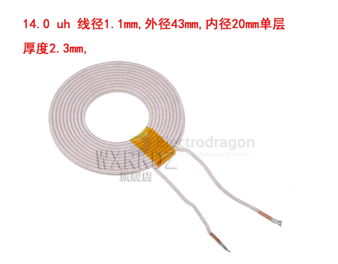
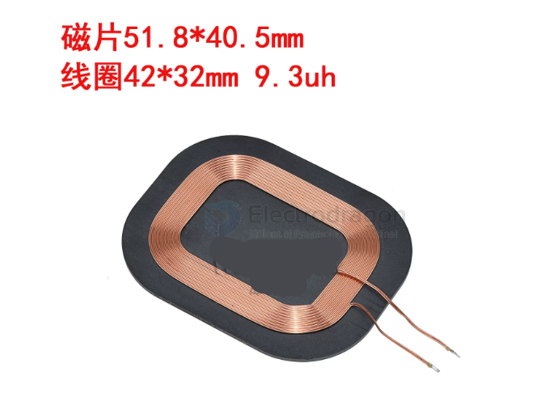
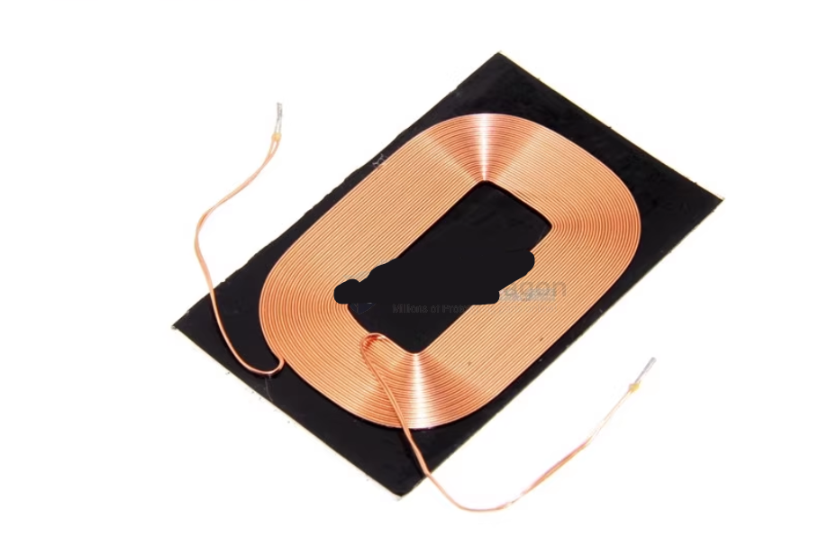
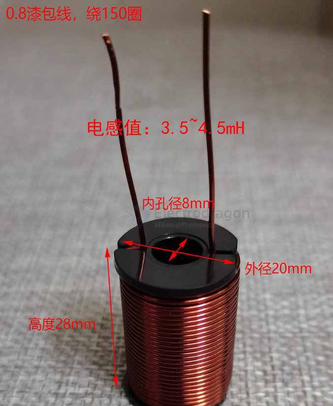
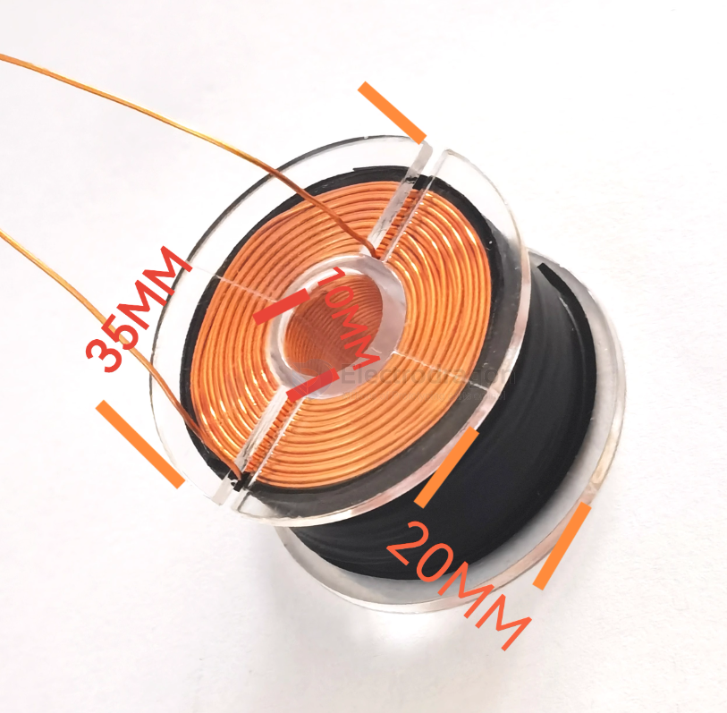

# coil-dat

- [[coil-dat]] - [[antenna-dat]]

- [[BQ500212-dat]] - [[WPC-dat]] - [[TI-dat]] 

- [[TI-power-wireless-dat]] - [[BQ50002-dat]] - [[BQ500511-dat]]

## named A5 A11 coils 

TI Device Part Number TX Type Coil Coil Part Number Vendor
bq500212A
bq50002/bq500511
WPC v1.1 / v1.2
A11
- ETW-00032W -- Elytone
- Y31-60055F -- E & E
- TXL05002A -- Mingstar
- IC505004N-11 -- Mingstar
- 760-308-111 -- Wurth Elektronik

ref 

https://www.ti.com/lit/an/slua649g/slua649g.pdf?ts=1789552663826

## coil wireless charge 

### 10x10mm - 20uh 

### 43x20mm - 14uh 

### 42x32mm - 9.3uh 

42x32mm - 9.3uh 

### 47*32mm -- 12.6uH // 49x30mm 

47*32mm -- 12.6uH

## coil long 

3.5 ~ 4.5mh / 8mm / 28mm 

for bullet diameter 5mm 

## coil magenetic 

- [[coilgun-dat]]

材质：铜漆包线
线径：0.49毫米
圈数：500圈
内阻：3-4欧姆。
电感量：3.0mH
73克

## ref 

- [[tube-dat]]

- [[coil]] - [[BOM]]