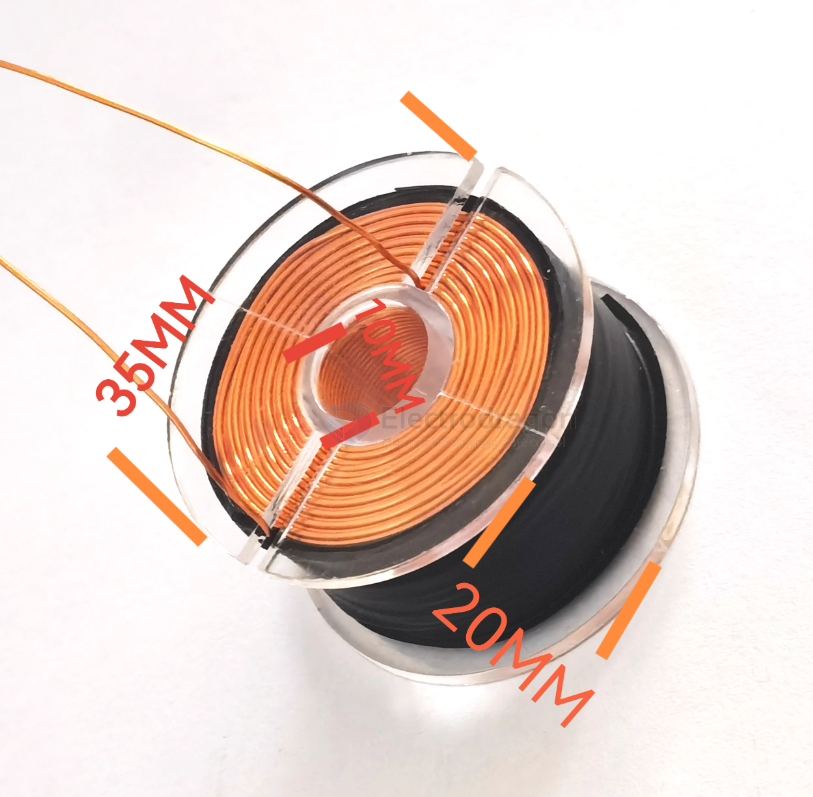

# coil-dat

## coil wireless charge 

47*32mm -- 12.6uH

## coil long 

3.5 ~ 4.5mh / 8mm / 28mm 

for bullet diameter 5mm 

## coil magenetic 

- [[coilgun-dat]]

材质：铜漆包线
线径：0.49毫米
圈数：500圈
内阻：3-4欧姆。
电感量：3.0mH
73克

## ref 

- [[tube-dat]]

- [[coil]] - [[BOM]]