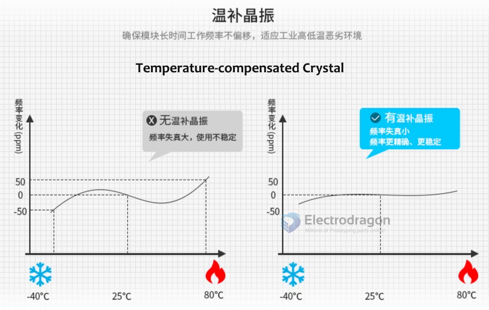

# crystal-dat 

## SMD crystal 

### 3225 

- 24 mhz 
- 14.7456 mhz

## TXCO 

A TXCO crystal is a **Temperature Compensated Crystal Oscillator**. It's a type of crystal oscillator that's designed to maintain a stable frequency output, even when the temperature changes.

Here's a breakdown:

**Crystal Oscillator**: A circuit that uses the mechanical resonance of a vibrating crystal of piezoelectric material to create an electrical signal with a very precise frequency. Crystals are used to provide a stable clock signal for microcontrollers, microprocessors, and other digital circuits.

**Temperature Compensation**: The resonant frequency of a crystal oscillator is affected by temperature. A TXCO includes additional circuitry to compensate for these temperature-induced frequency changes. This compensation can be done using analog or digital techniques.

In essence, a TXCO is a crystal oscillator with extra circuitry to keep its output frequency stable over a range of temperatures. This makes it more accurate than a standard crystal oscillator when temperature variations are a concern.

## ref 

- [[BOM-dat]]