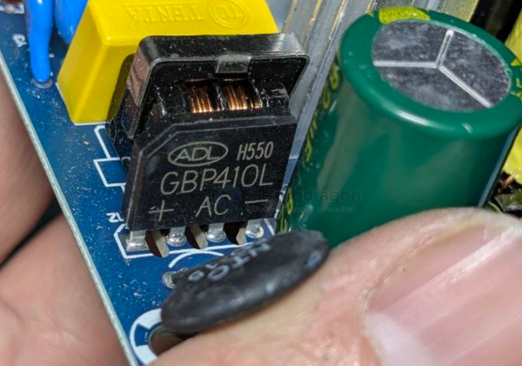
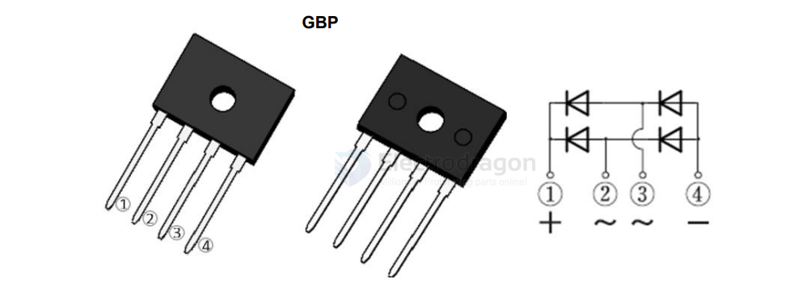

# diode-bridge-rectifier-dat

- [[acdc-dat]] - [[light-spot-dat]] - [[led-driver-PSR-dat]]

V12PM10

High Current Density Surface-Mount TMBS® (Trench MOS Barrier Schottky) Rectifier

[GBP406-GBP410 - 4A STANDARD RECOVERY BRIDGE RECTIFIER](https://www.diodes.com/datasheet/download/GBP408.pdf)

## ref 

- [[diode-dat]]