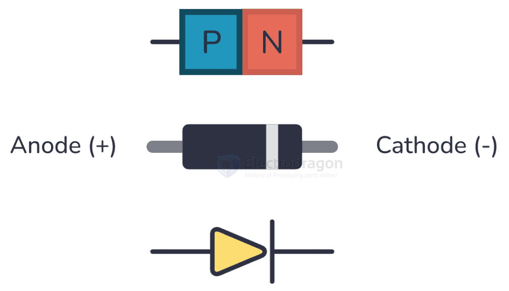
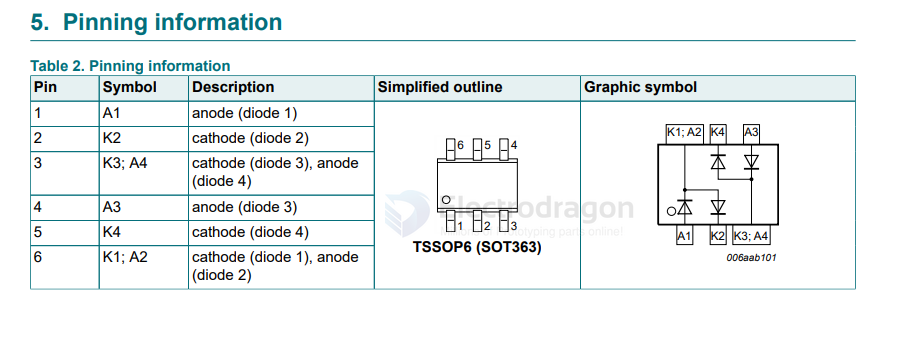
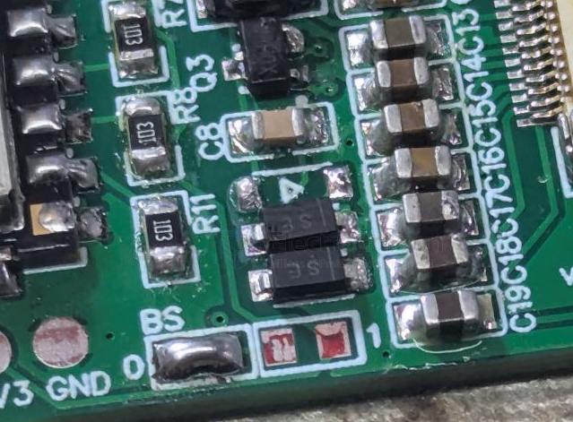

# diode-dat

brand - [[st-dat]]

| model  | footprint | mark    |
| ------ | --------- | ------- |
| SS14   | SMA       | SS14/SL |
| 1N4007 | SMA       | M7      |

- [[diode-zener-dat]] - [[flyback-diode-dat]]

## diode info 

## Schottky diode

Schottky diode SS14 DO-214AC SMA
Schottky diode BAT54J.115 SOD-323F
Schottky diode ES2D DO-214AA (SMB) == [ES2A, ES2B, ES2C, ES2D](https://www.vishay.com/docs/88587/es2.pdf) == Vishay

## Voltage regulator diodes

### nexperia

- [BZX384-C3V3](https://www.nexperia.com/product/BZX384-C3V3)

## Ultrafast Diode

[stth4r02](https://www.st.com/en/diodes-and-rectifiers/stth4r02.html)

- 200 V, 4 A High Effiency Ultrafast Diode
- st 

## SRGC10MH 1N4007 Specs 

| Feature                           | SRGC10MH              | 1N4007                |
| :-------------------------------- | :-------------------- | :-------------------- |
| **Type**                          | Standard Rectifier    | Standard Rectifier    |
| **Package**                       | SMA (Surface Mount)   | DO-41 (Through-Hole)  |
| **Peak Reverse Voltage (VRRM)**   | 1000 V                | 1000 V                |
| **Avg. Forward Current (IF(AV))** | 1 A                   | 1 A                   |
| **Forward Voltage (VF @ 1A)**     | ~1.1 V                | ~1.1 V                |
| **Reverse Current (IR @ VRRM)**   | ~5 µA (Typical)       | ~5 µA (Typical)       |
| **Operating Temperature**         | -55°C to +150/175°C * | -55°C to +175°C (Typ) |

*Operating temperature for SRGC10MH can vary slightly by manufacturer.

- [[SRGC10MH-dat]] - [[1N4007-dat]] - [[diode-dat]]

## voltage drop of diode 

| Diode         | Type     | Max Current | Typical Vf @ 1A | Notes                              | VF  | mark |
| ------------- | -------- | ----------- | --------------- | ---------------------------------- | --- | ---- |
| 1N4001–1N4007 | Silicon  | 1A          | ~0.7V           | General-purpose rectifier          |     |      |
| 1N5401–1N5408 | Silicon  | 3A          | ~0.7–1.0V       | Higher current, bulkier            |     |      |
| UF4001–UF4007 | Silicon  | 1A          | ~0.7V           | Ultra-fast silicon version         |     |      |
| 1N5817        | Schottky | 1A          | ~0.45V          | Good low-drop Schottky             |     |      |
| 1N4148        | Fast     | 0.3A        | ~1.0V           | General-purpose small-signal diode |     | T4   |
| 1N5819        | Schottky | 1A          | ~0.5V           | Slightly higher Vf than 1N5817     |     | S4   |
| SS14          | Schottky | 1A (avg)    | ~0.5V           | Compact SMD version                |     |      |
| MBRS140       | Schottky | 1A          | ~0.5V           | SMD Schottky, low forward drop     |     |      |
| MR754         | Power    | 6A          | ~1.0–1.1V       | High-power stud-mount diode        |     |      |
| BYV29         | Power    | 9A          | ~0.9–1.2V       | Fast recovery, TO-220              |     |      |
| RHRP8120      | Power    | 8A          | ~1.0–1.2V       | Ultrafast recovery, large package  |     |      |
| SS34          |          | 3A          |                 |                                    | 40V |      |
| MBR0530       | Schottky | 0.5A        | ~0.37–0.5V      | SOD-123 package                    | 30V |      |

MBR0530 — Schottky rectifier, SOD-123; VRRM 30 V; IF(AV) 0.5 A; IFSM 5 A (8.3 ms); VF 0.37–0.5 V @ 0.5 A, 25°C; IR ≤ 0.5 mA @ 30 V, 25°C; Tj −55 to +125°C.

1N5401 

MBR0520L

## BAV99S == High-speed switching diode

https://assets.nexperia.com/documents/data-sheet/BAV99S.pdf

## Schottky rectifier

| Part    | Type               | Max Forward Current (IF) | Reverse Voltage (VR) | Forward Voltage (VF) | Package              | Notes                                                    |
| ------- | ------------------ | ------------------------ | -------------------- | -------------------- | -------------------- | -------------------------------------------------------- |
| SS14    | Schottky Rectifier | 1 A                      | 40 V                 | 0.3–0.5 V            | DO-214AC (SMD)       | Surface-mount, common for low-voltage power              |
| 1N5819  | Schottky Rectifier | 1 A                      | 40 V                 | 0.3–0.6 V            | DO-41 (Through-hole) | Through-hole, widely used in DIY circuits                |
| MBR0530 | Schottky Rectifier | 0.5 A                    | 30 V                 | 0.45 V typical       | DO-214AC (SMD)       | Half the current of SS14, used in low-power applications |

## directions 

## To test if a diode is good using a multimeter:

- Set the multimeter to diode mode (look for the diode symbol).
- Connect the red probe to the anode and the black probe to the cathode.
- Read the display:
    - A good diode shows a voltage drop (typically 0.5–0.8V for silicon diodes).
    - If it shows “OL” or no reading, reverse the probes.
    - In reverse, a good diode shows “OL” (open circuit).
    - If both directions show 0V or both show “OL”, the diode is faulty.

## Rectifier Diode

### 肖特基二极管

For lower power consumption and higher efficiency, the rectifier diode (D1 in Figure 1) should be a Schottky diode.

- The breakdown voltage of the diode should be several volts higher than the output voltage (VBR > VOUT).
- The current handling capability should be greater than the maximum output current (IF > IOUT,max).
- The peak forward current should be greater than the peak current of the inductor (IFSM,peak > IL,peak).

alternatives: SS14 / SS34 / SS54 

## other more diodes 

- High Power Switching and Attenuation Silicon PIN Diodes - The **MMP7060** - 69 Series of PIN diodes are fast switching, low series resistance, low capacitance PIN diode chips.

## diode compare 

| Feature                         | **1N4007**                                | **SS34**                                                          |
| ------------------------------- | ----------------------------------------- | ----------------------------------------------------------------- |
| **Type**                        | Standard silicon rectifier diode          | Schottky barrier rectifier diode                                  |
| **Reverse Voltage (VRRM)**      | 1000 V max                                | 40 V max                                                          |
| **Forward Current (IF avg)**    | 1 A continuous                            | 3 A continuous                                                    |
| **Peak Surge Current (IFSM)**   | ~30 A                                     | ~100 A                                                            |
| **Forward Voltage Drop (VF)**   | ~0.7 – 1.1 V @ 1 A                        | ~0.2 – 0.5 V @ 3 A                                                |
| **Reverse Recovery Time (trr)** | Slow (~2–30 µs)                           | Very fast (nanoseconds, <100 ns)                                  |
| **Power Dissipation**           | Higher due to VF and switching losses     | Lower, very efficient                                             |
| **Frequency Use**               | Low frequency rectification (50/60 Hz AC) | High frequency SMPS, DC-DC converters                             |
| **Package**                     | Through-hole (DO-41)                      | Surface-mount (SMA/SMB/SMC)                                       |
| **Temperature Range**           | –65 to +150 °C                            | –55 to +150 °C                                                    |
| **Typical Applications**        | Power supply rectifier (mains, chargers)  | Buck/boost converters, freewheeling diode in switching regulators |

For **low-voltage DC** power paths (e.g., 5V, 12V, battery systems, USB, DC-DC converters):
→ SS34 is much better (low drop, higher current, efficiency).

For **high-voltage AC** rectification (like 220V/110V mains power supplies):
→ 1N4007 is safer (handles up to 1000 V).

⚡ In most modern “power-through” / **series protection** roles at DC (5–24 V), SS34 wins because the low voltage drop keeps the system efficient and avoids unnecessary heating.

## unsort 

- BYV26A, BYV26B, BYV26C, BYV26D, BYV26E == Ultra-Fast Avalanche Sinterglass Diode

MPC555LFMZP40NXP - 3300V, 90A, Silicon Carbide (SiC) Schottky Diode, 2-lead T-MAX® package.

1N5619

## Rectifier Diode vs Schottky Diode

- **Rectifier diode**: A general family; includes standard silicon rectifiers, fast recovery diodes, and Schottky diodes.  
- **Schottky diode**: A subtype of rectifier diode, with low voltage drop and fast switching, but limited voltage rating.

---

✅ **Conclusion**  
**All Schottky diodes can be used for rectification, but not all rectifier diodes are Schottky.**

## ESD protection 

- [[protection-dat]]

## ref 

- [[BOM-dat]] - [[mosfet-dat]]

- [[diode]]
