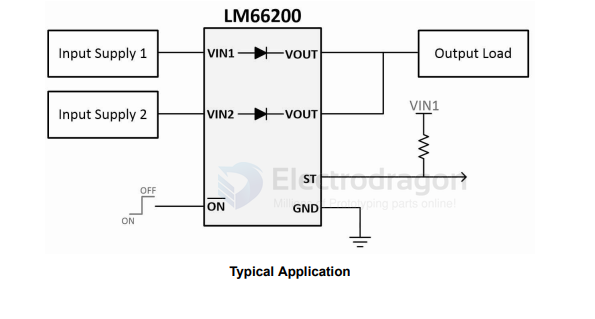
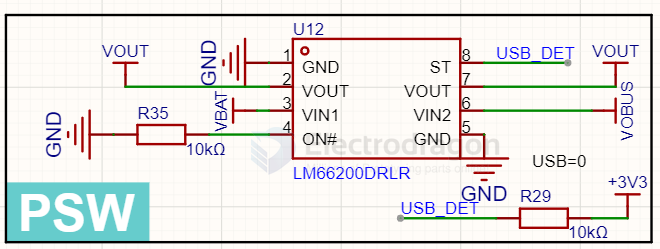

# diode-ideal-dat

- [[diode-dat]] - [[diode-ideal-dat]] - [[TI-dat]] 

LM66200 1.6 V to 5 V, 2.5-A Dual Ideal Diode With Automatic Switchover

`ST 8 O Status pin.` Pulled high when VIN1 is being used and pulled low when VIN2 is being used. Can be pulled up to VIN1 to reduce quiescent current when VIN2 is powering the output.

## build 

SCH 1 

## ref 

