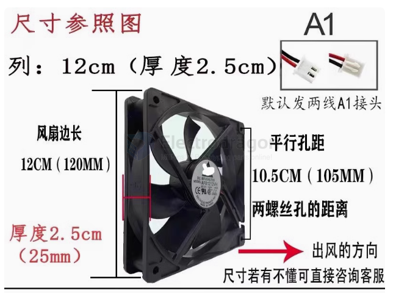
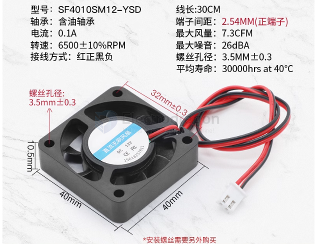

# fan-dat

### Summary of PC Case Fan Types Based on Wiring

- **2-Pin Fans**: Fixed-speed fans without monitoring or control features. Used in basic or low-cooling scenarios and is the most affordable option.

- **3-Pin Fans**: Basic control via voltage adjustment; supports speed monitoring but lacks precise control. Cost-effective, suitable for budget setups.
  
- **4-Pin Fans**: Includes PWM for precise speed control; widely supported by modern motherboards, allowing automatic speed adjustments based on temperature.

- **6-Pin and Multi-Pin Fans**: Found in high-end or RGB fans; includes additional lines for RGB control and advanced synchronization. Requires special connectors or RGB-compatible motherboards.

This summary highlights the key differences in functionality and application based on fan wiring types.
