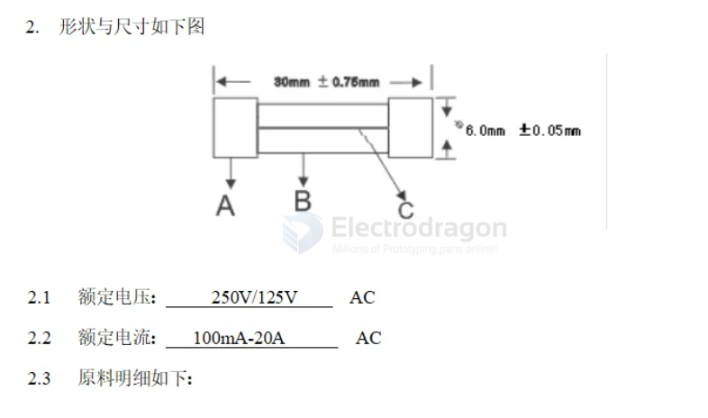
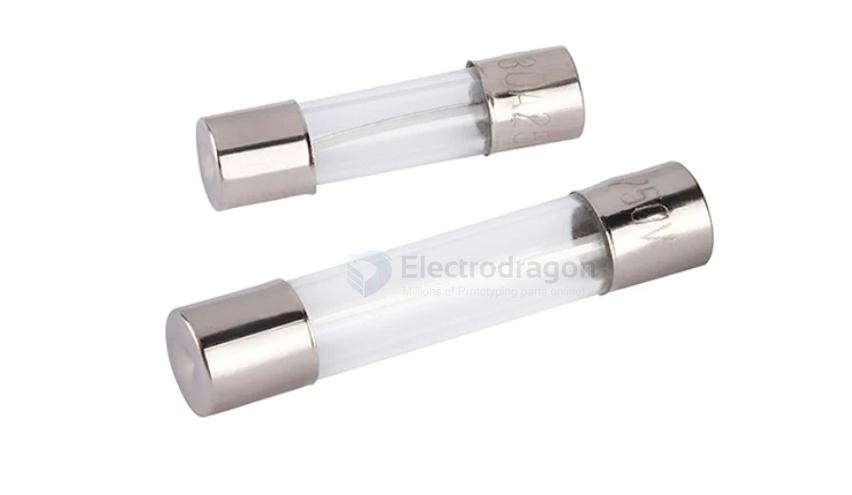
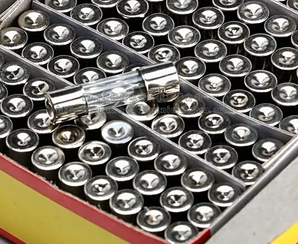
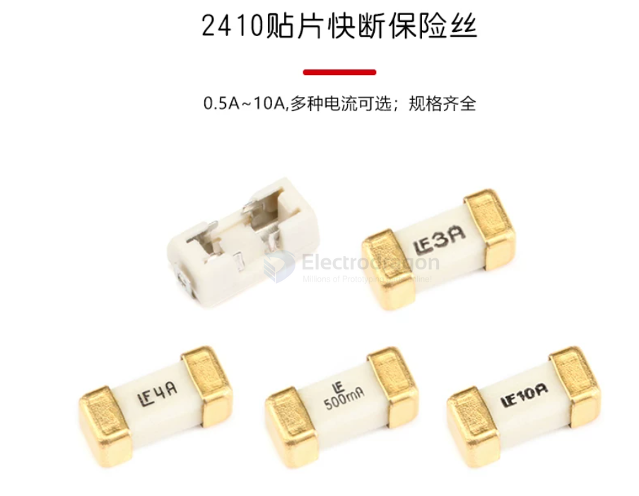
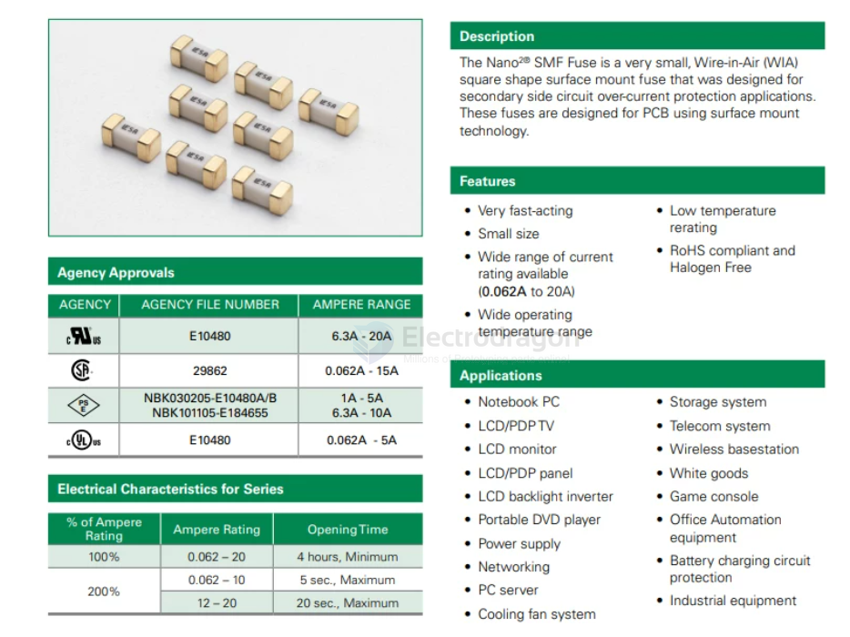

# fuse-dat

## fuse-glass-seal-dat // 250V

break == fast 

5*20 / 6*30mm 玻璃保险管熔断器保险丝 250V 1A - 2A - 3A - 4A - 5A - 6A - 10A - 15A - 20A

## 6.3 熔断/电流特性

| 额定电流 | 熔断                       |
| -------- | -------------------------- |
| 100%     | 4hours Min - （大于4小时） |
| 135%     | 1hours Max - （小于1小时） |
| 200%     | 5sec Max - （小于5秒）     |

## 2410 fast-break fuse // 125V

- 0.5A_125V
- 1A_125V
- 2A_125V
- 3A_125V
- 4A_125V
- 5A_125V
- 10A_125V
- 1808/2410贴片保险丝座

 
## ref 

- [[fuse]]