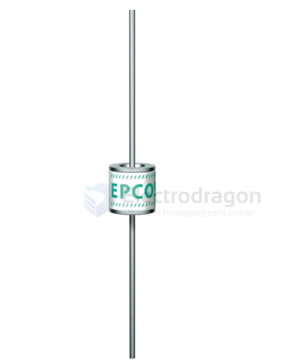
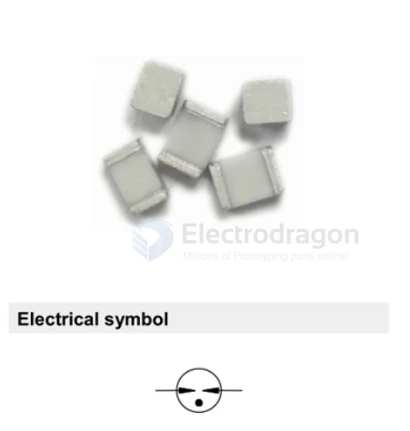

# gas-discharge-tube-dat

- [[gas-discharge-tube-dat]] - [[BOM-dat]]

## types 

2095-350-BLF - Gas Discharge Tubes - GDTs / Gas Plasma Arrestors 08x8mm, 3500V HV Axial GDT - https://www.mouser.com/catalog/specsheets/2095_datasheet.pdf

B88069X2140S102 - Gas Discharge Tubes - GDTs / Gas Plasma Arrestors A71-H08X

## SMD4532-090NF 90V/3KA

`Gas discharge tubes (GDT)` use noble gasses enclosed in ceramic tubes to provide an alternate circuit path for voltagespikes. The ceramic envelope and with nickel connectors allow for high loads. SMD4532 Gas Discharge Tubes(GDT) series has a surge rating of 2kA, 8/20μs.Offered in a Squared Surface Mount package, which helps to make pick and place on PCB process easier.

This GDT series is perfectly suited for broadband equipment applications. The GDT's low off-state
capacitance is compatible with high bandwidth applications and this capacitance loading value does not vary if the voltage across the GDT changes.

SMD4532 Gas Discharge Tube (GDT) series are specifically designed for protection of electrical, multimedia,and communication equipment against over voltage transients in surface mount assembly applications.

## Applications

- Communication equipment
- CATV equipment
- Test equipment
- Data lines
- Power supplies
- Telecom SLIC protection
- Broadband equipment
- ADSL equipment, including ADSL2+ XDSL equipment
- Satellite and CATV equipment
- General telecom equipment

## ref 

