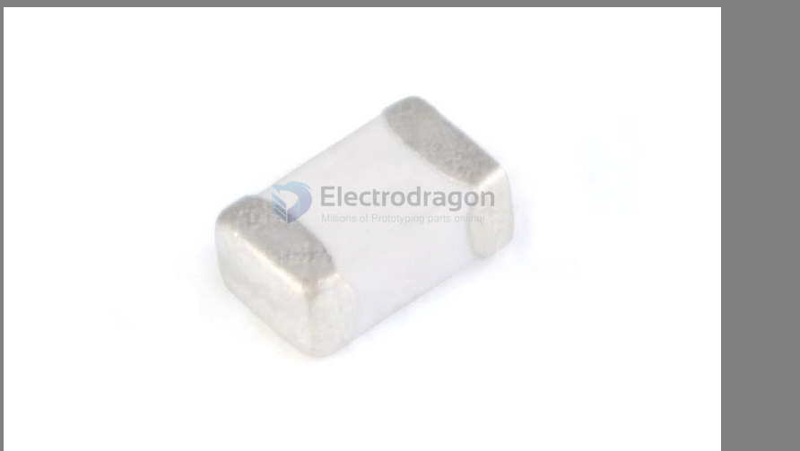

# inductor-dat

## Role of Inductor in an Active Antenna

- [[antenna-active-dat]] - [[circuits-dat]] - [[LC-circuits-dat]] - [[bias-T-dat]]

| Function            | Description                                                   |
|---------------------|---------------------------------------------------------------|
| Impedance Matching  | Matches antenna impedance to active circuit (e.g., LNA).      |
| Filtering / Tuning  | Forms LC circuits to select desired frequencies.              |
| Bias-T (DC Injection)| Passes DC to power the amplifier while blocking RF.          |
| Gain Shaping        | Shapes amplifier response for specific frequency bands.       |

## Choke

"Choke" in electronics typically refers to an inductor, not a ferrite bead. However, its function may be similar to that of a ferrite bead. Here’s the key difference:

1. Choke = Inductor
   
Nature: A type of inductor, usually consisting of a wound coil, with a core made of air, ferrite, or other magnetic materials.

Function: Primarily used for filtering, blocking high-frequency AC signals while allowing low-frequency or DC signals to pass.

Applications:

- Common Mode Choke: Used in EMI filtering to reduce common-mode noise (such as interference on power lines).
- Differential Mode Choke: Used in power circuits for filtering and improving power quality.
- Power Line Chokes: Used in power systems to suppress harmonics in the grid.

## Power Indicator 

### Sumida CDRH size

CDRH2D14NP-2R2NC

- CDRH2D14
- SMD 2.2uH 1.60A 75ohms

CDRH127/LDNP-101MC

### WE-LQS SMT Semi-Shielded Power Inductor == 74404052220

- Power Inductors - SMD WE-LQS 22uH 1.15A DCR=225mOhms AEC-Q200
- Package / Case:	5 mm x 5 mm

### more 

- [NRH2412T2R2MNGH](https://www.mouser.hk/ProductDetail/TAIYO-YUDEN/NRH2412T2R2MNGH?qs=CNQs48zzdnqQ4uJGFCRMww%3D%3D&srsltid=AfmBOorbONwgJOVP5U91Aq9PCxyx5seKdLWzqBq8jmuLSmshvC8Njfuu) == SMD 963-LSXNE2424MKT2R2M RPLCMT PN 2412 2.2uH 168mOhms 1000mA

- [SRP7028A-3R3M](https://www.mouser.com/ProductDetail/Bourns/SRP7028A-3R3M?qs=7z%252BmIopC6%2FLTitLWxClV8Q%3D%3D&srsltid=AfmBOorrXr6al1GPOmKQSg9wmQq6YutyR7t61FIRitgtc2P3wXRlSorp) == Power Inductors - SMD 3.3uH 20% SMD 7028 AEC-Q200

## high freq. inductor 47nh 

## Manufacturers 

common brand: Bourns

## ref 

- [[BOM-dat]]