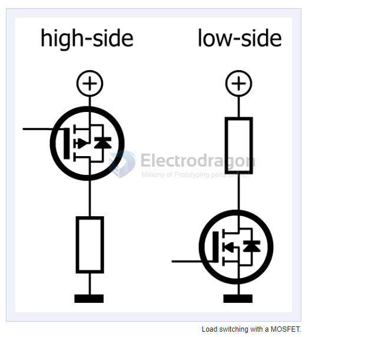

# N-mosfet-control-dat

- [[AOD4184-dat]] - [[D4184-dat]]

### load switching 

### Power switching is better with N-type devices

better to low-side switch with N-type devices

Because N-type transistors in general can carry more current than P-types, they are preferable for switching heavy loads. Low-side switching with N-type devices is easier than high-side switching and can often be done by microcontroller ports without the need for special drivers. 

Using an N-type transistor for high-side switching is possible but requires a control voltage higher than the load voltage connected to the source/emitter. Some sort of charge pump is needed to pull the gate/base above the source/emitter voltage. This complicates the design, not only making it more expensive but also increasing its sensitivity to noise and interference. Controlling such a high-side switch using PWM can be problematic because of the charge pump.

- ref - https://www.elektormagazine.com/articles/high-side-low-side-switching

## ref 

- [[mosfet-dat]] - [[PWM-dat]]