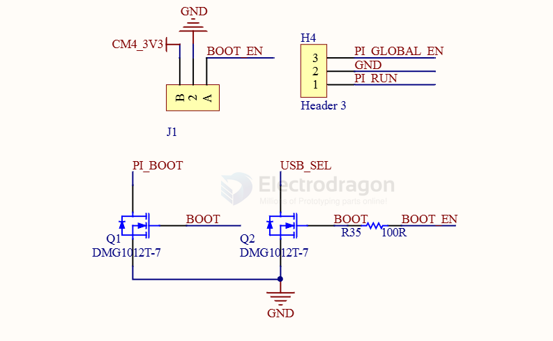

# n-mos-dat

- [[vishay-dat]]

- [[n-mosfet-control-dat]]

- [[AOD4184-dat]] - [[D4184-dat]]

- [[AO4468-dat]]

- [[2N7002-dat]] - 2N7000

## DMG1012T-7

N-CHANNEL ENHANCEMENT MODE MOSFET

BOOT_EN == LOW, BOOT == LOW, PI_BOOT (nRPIBOOT) == HIGH, USB_SEL == HIGH 

## EOF 

FQD3N60CTM - MOSFET N-CH 600V 2.4A DPAK - N-Channel 600 V 2.4A (Tc) 50W (Tc) Surface Mount TO-252AA - 	
FQD3N60CTM-WSTR-ND - Tape & Reel (TR)

## ref 

- [[mosfet-dat]]