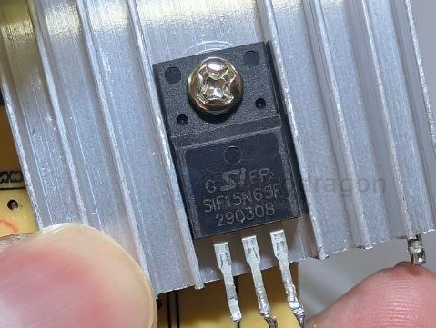

# mosfet-ac-switching-dat

- [[ACDC-dat]] - [[CR6842-dat]] - [[mosfet-ac-switching-dat]]

## SIF15N63F Role Identification in Power Supplies





The **SIF15N63F** MOSFET can serve two possible roles in a power supply circuit. Below is a guide to identify which role it plays based on the surrounding circuitry.

---

### Possibility 1: PFC Boost Switch (Most Common)

```
AC Input → CM Choke → Bridge Rectifier → PFC Inductor → SIF15N63F (MOSFET) → PFC Output (400V DC)
                                                          ↑
                                                     Switching Node
```

If the board uses an **Active PFC** design, the SIF15N63F is the **PFC Boost MOSFET**:

- **15A / 630V** rating is well suited for PFC applications
- **TO-220F** fully insulated package eliminates the need for an insulation pad
- Typical switching frequency: **65–100 kHz**

---

### Possibility 2: Main Power Switch (Flyback / Forward Topology)

```
Bridge Rectifier (~300V DC) → Transformer → SIF15N63F (MOSFET) → GND
                                              ↑
                                         Switching Node
```

If the board has **no PFC inductor** (only a large electrolytic capacitor directly after the bridge rectifier), then the SIF15N63F is the **main power switch**.

---

## How to Tell: PFC vs. Main Switch

The easiest way to decide is to look at what comes after the bridge rectifier:

| Circuit Path | Conclusion |
| :--- | :--- |
| **Large Capacitor → Transformer** | SIF15N63F = **Main Switch** (No PFC) |
| **PFC Inductor → SIF15N63F → Large Capacitor (400V)** | SIF15N63F = **PFC MOSFET** |

---

## SIF15N63F Key Parameters (Reference)

| Parameter | Value |
| :--- | :--- |
| **Vds** (Drain-Source Voltage) | 630V |
| **Id** (Continuous Drain Current) | 15A |
| **Rds(on)** (On-Resistance) | ~0.3–0.4 Ω |
| **Package** | TO-220F |
| **Gate Threshold Voltage (Vgs(th))** | ~2–4V |


## ref 