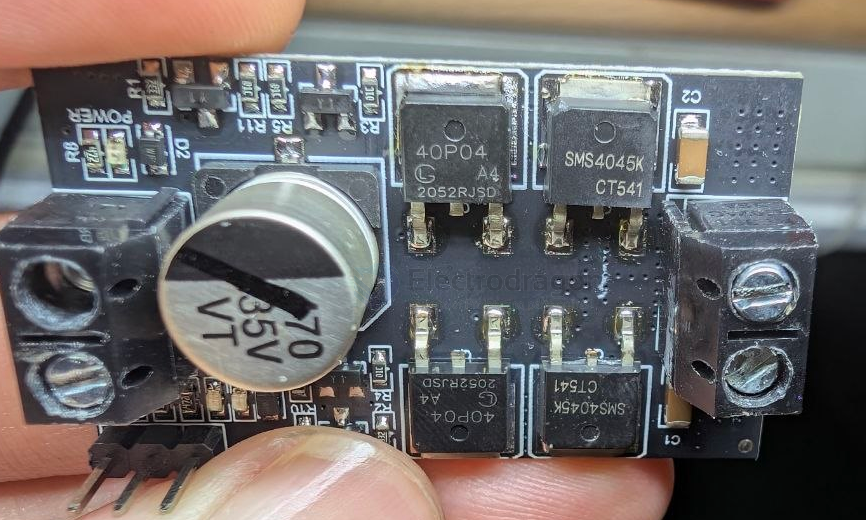
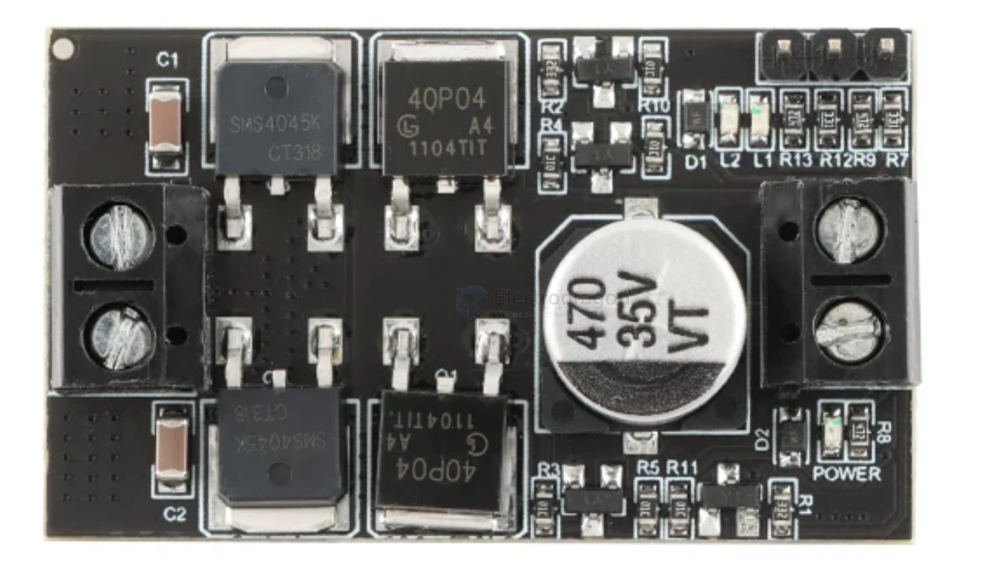
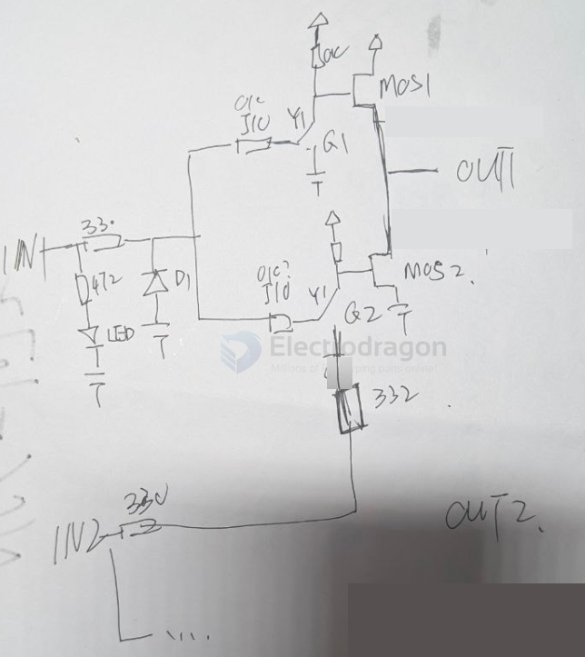

# mosfet-board-dat

- [[mosfet-board-dat]] - [[motor-driver-dat]]

`NCE4045K`	TO-252	40V	45A	50W	+/-20V	9.6mΩ	13.5mΩ

`SMS4045K` = 40V 45A `N-channel MOSFET` field-effect transistor built using Shielded Gate Trench (SGT) technology and housed in a standard TO-252 package.

The code `40P04` most commonly refers to a `P-Channel` Power MOSFET, characterized by a drain-source voltage of -40V and a continuous drain current rating of -40A in a surface-mount TO-252 package.

An H-Bridge uses 4 transistors to reverse voltage polarity across a DC motor (allowing Forward, Reverse, and Braking).

* **Top Side (High-Side switches)**: Two **40P04 P-Channel MOSFETs** connected to positive power supply ($V_{CC}$).
* **Bottom Side (Low-Side switches)**: Two **SMS4045K N-Channel MOSFETs** connected to Ground ($GND$).

diagram 

        +VCC (Battery)
         |          |
     [40P04]      [40P04]   <-- High-Side (P-Channel)
         |          |
         +--[MOTOR]-+
         |          |
    [SMS4045K]  [SMS4045K]  <-- Low-Side (N-Channel)
         |          |
        GND        GND

board map 

- [[resistor-dat]] - [[R0603-dat]] - [[transistor-dat]] - [[S8050-dat]]

- [[mos-n-drive-dat]] - [[mos-p-drive-dat]]

one side circuit 

- [[S8050-dat]] - [[diode-dat]]

## 2. Gate Driving Dynamics (Why P-Channel High-Side Matters)

Using P-Channel MOSFETs on the High Side simplifies driving because **P-Channel MOSFETs turn ON when the Gate voltage is pulled LOW relative to $V_{CC}$**.

### Gate Drive Requirements:
1. **Low-Side N-Channel (SMS4045K)**:
   * Needs **positive Gate-to-Source voltage ($V_{GS} > +3V \text{ to } +10V$)** to turn ON.
   * Can be driven directly by a microcontroller or an intermediate NPN/logic driver.

2. **High-Side P-Channel (40P04)**:
   * Needs **negative Gate-to-Source voltage ($V_{GS} < -3V \text{ to } -10V$)** to turn ON.
   * To turn ON: Gate is pulled down toward $GND$.
   * To turn OFF: Gate must be pulled up all the way to **$V_{CC}$ (Battery Voltage)**.

- [[transitor-dat]]

> **Crucial Detail**: If your battery voltage is **7.4V or 12V**, a 3.3V GPIO signal cannot turn OFF a High-Side P-Channel MOSFET directly because 3.3V is still significantly lower than 12V ($V_{GS} \approx -8.7\text{V}$, keeping it ON). Therefore, your driver board **already contains pre-driver transistors or optocouplers on-board** to handle the gate shifting.

---

## 3. Why This Impacts Your Low-Speed "Motor Whine" & PWM

- [[motor-driver-dead-time-protection-dat]] - [[mosfet-board-dat]]

1. **Shoot-Through Protection (Deadtime)**:
   * When switching between High-Side and Low-Side on the same bridge arm, there must be a tiny delay (deadtime). If both N-FET and P-FET turn ON simultaneously, a direct short circuit ($V_{CC}$ to $GND$) occurs.
   * If applying low PWM frequencies, the pre-driver transistors on the board must charge/discharge the MOSFET gates fast enough to prevent heating.

2. **PWM Driving Strategy**:
   * **Low-Side PWM (Recommended)**: Keep High-Side P-FET continuously ON for direction, and apply PWM to the Low-Side N-FET (SMS4045K). Since N-FETs have lower internal resistance ($R_{DS(on)}$) and switch faster, this mode provides better efficiency and smoother low-speed startup.

---

## Summary Checklist for This Board

| Feature | Details |
| :--- | :--- |
| **Topology** | Complementary H-Bridge (2x P-FET + 2x N-FET per motor) |
| **Max Voltage / Current** | 40V, ~40A–45A peak (plenty for 380 motors) |
| **Pre-Drivers** | On-board driver circuitry present (handles gate voltage translation) |
| **Low Speed Control** | Use **Low-Side PWM** + **Software Kickstart Pulse (20ms)** to overcome stiction |

## Role of the 4 Transistors

In a dual P-FET + N-FET H-Bridge, the 4 small bipolar transistors (BJTs, usually S8050/S8550 or similar) serve three critical functions:

1. **Voltage Level Shifting (For High-Side P-FETs)**:
   * A P-Channel MOSFET turns **OFF** only when its Gate voltage matches the battery voltage ($V_{CC}$).
   * The small pre-driver transistor takes your 3.3V/5V microcontroller signal and switches the full battery voltage ($7.4\text{V} - 12\text{V}$) to the P-FET Gate, ensuring it shuts off completely without shorting.

2. **Signal Inversion & Shoot-Through Prevention**:
   * They prevent "shoot-through" (where both top and bottom MOSFETs on one side turn ON simultaneously, causing a direct short from $V_{CC}$ to $GND$).

3. **Current Amplification for Fast Switching**:
   * MOSFET gates act like small capacitors. The pre-driver transistors quickly charge and discharge this gate capacitance, enabling sharp PWM switching transitions and reducing heat.

## ref 

