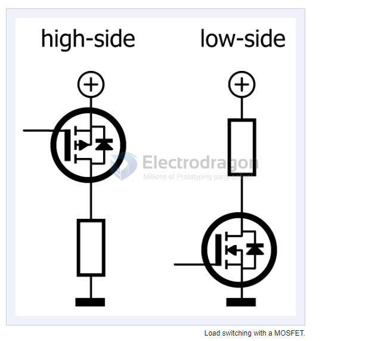
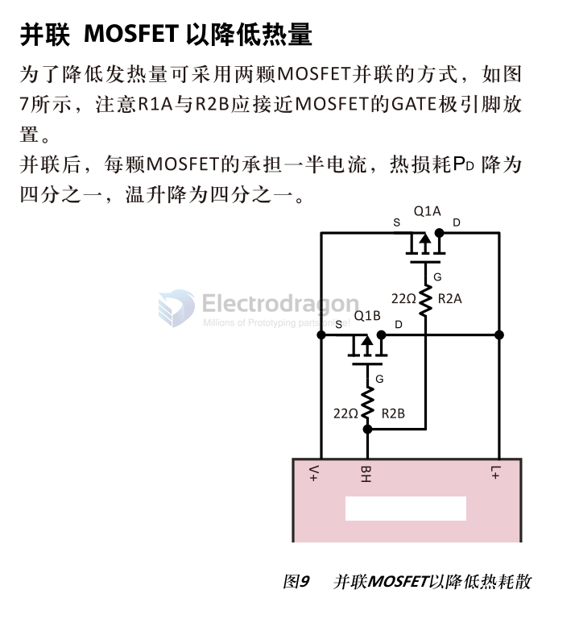

# mosfet-dat

## model selections 

| Model     | Mark | Manufacturers    | Id    | Package  | CH type | Descriptions                                |
| --------- | ---- | ---------------- | ----- | -------- | ------- | ------------------------------------------- |
| AOD403    | D403 | [[AOSMD-dat]]    | 40A   | TO-252   | N       | 40V N-Channel MOSFET                        |
| AOD4184A  | 4184 | [[AOSMD-dat]]    | 50A   | TO-252   | N       | 40V N-Channel MOSFET                        |
| IRF540N   | 540N | [[Infineon-dat]] | 33A   | TO-220AB | N       | 100V N-Channel MOSFET                       |
| NCE6050   |      | [[ncepower-dat]] | 50A   | TO-252-2 | N       | 60V N-Channel Enhancement Mode Power MOSFET |
| AO3401    | A19T | [[AOSMD-dat]]    | 4.3A  | SOT-23   | P       | 30V P-Channel MOSFET                        |
| 2N7002    | 7002 | [[NXP-dat]]      | 115mA | SOT-23   | N       | 60V N-Channel MOSFET                        |
| SI2300    |      | [[Vishay-dat]]   | 2.8A  | SOT-23   | P       | 20V P-Channel MOSFET                        |
| SI2301    |      | [[Vishay-dat]]   | 2.8A  | SOT-23   | P       | 20V P-Channel MOSFET                        |
| SI2302    |      | [[Vishay-dat]]   | 3.1A  | SOT-23   | N       | 20V N-Channel MOSFET                        |
| SI2307    |      | [[Vishay-dat]]   | 3.7A  | SOT-23   | N       | 30V N-Channel MOSFET                        |
| IR F5305  | 5305 | [[Infineon-dat]] | 31A   | TO-220AB | P       | 55V P-Channel MOSFET                        |
| IR FR1205 |      | [[Infineon-dat]] | 33A   | D2PAK    | N       | 55V N-Channel MOSFET                        |

- [[D4184-dat]]

### dual channel 

| Model   | Mark | Manufactuers     | Descriptions |
| ------- | ---- | ---------------- | ------------ |
| IRF8313 |      | [[Infineon-dat]] |

### high power mosfet 

## circuit guides 

### load switching 

### Power switching is better with N-type devices

Because N-type transistors in general can carry more current than P-types, they are preferable for switching heavy loads. Low-side switching with N-type devices is easier than high-side switching and can often be done by microcontroller ports without the need for special drivers. 

Using an N-type transistor for high-side switching is possible but requires a control voltage higher than the load voltage connected to the source/emitter. Some sort of charge pump is needed to pull the gate/base above the source/emitter voltage. This complicates the design, not only making it more expensive but also increasing its sensitivity to noise and interference. Controlling such a high-side switch using PWM can be problematic because of the charge pump.

- ref - https://www.elektormagazine.com/articles/high-side-low-side-switching

## Parallel using Mosfet for higher performance 

## P-mosfet 

| gate | status | source | drain |
| ---- | ------ | ------ | ----- |
| OFF  | ON     | -      | -     |
| ON   | OFF    | -      | -     |

## more mosfet 

- AGM30P05A = 30V 75A 59.5W 5.5mΩ@10V,15A 1.6V@250uA 1PCSPChannel PDFN5x6 MOSFETs ROHS = AGM-Semi

| BVDSS | RDSON | ID   |
| ----- | ----- | ---- |
| -30V  | 5.5mΩ | -75A |

- [[AGM-Semi-AGM30P05A_C6719407.pdf]]

## ref 

- [[vishay-dat]]

- [[mosfet]]