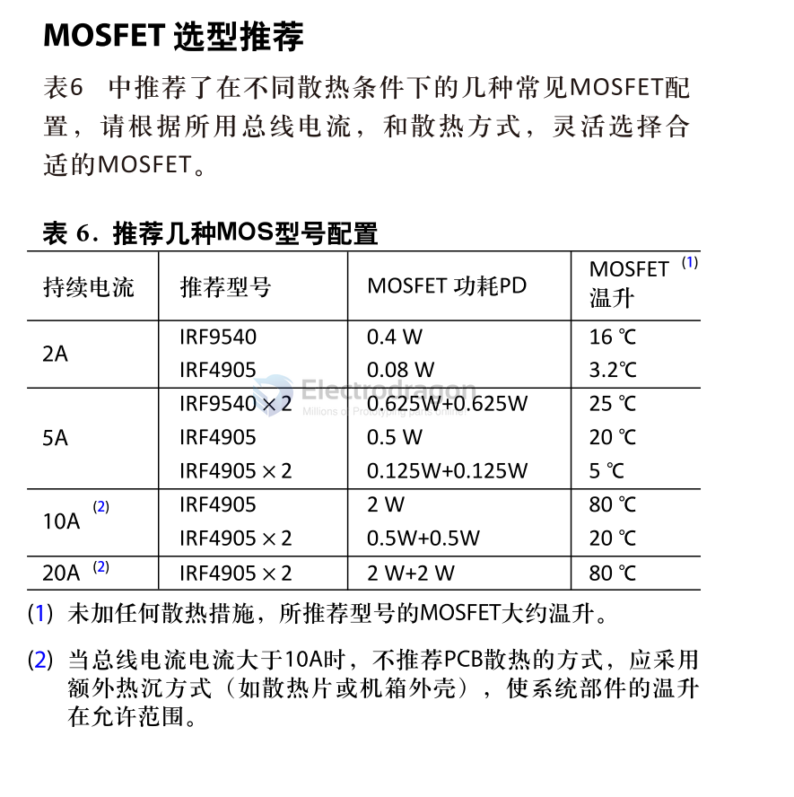
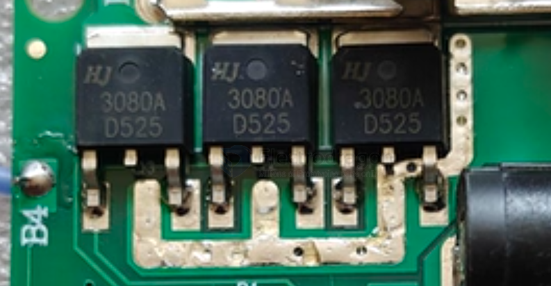
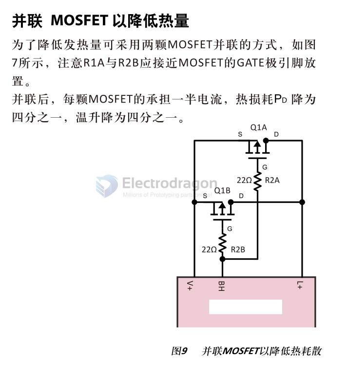
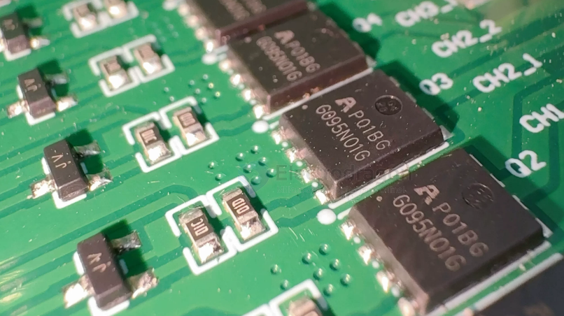
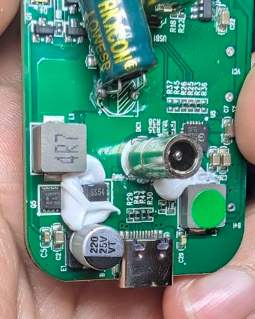
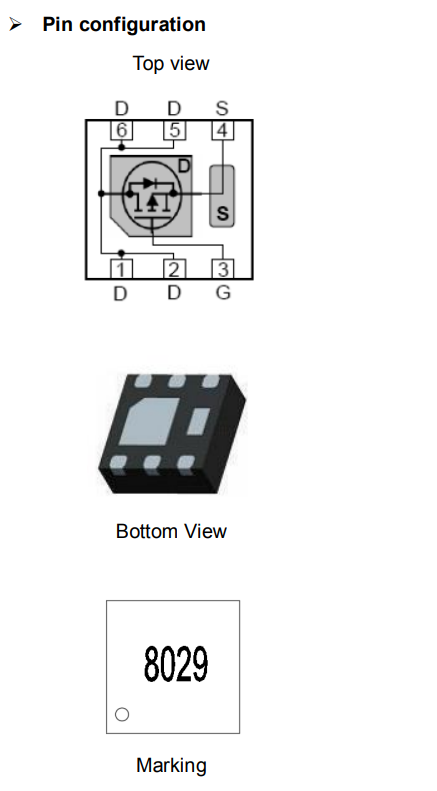
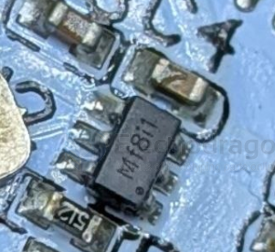
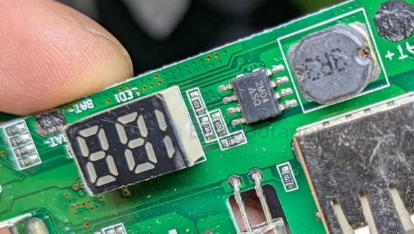
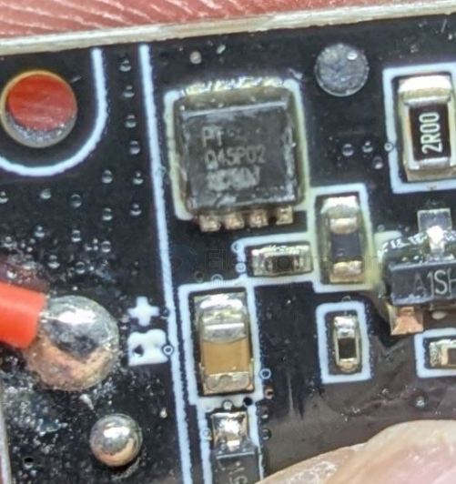

# mosfet-dat

drive [[motor-dat]], [[LED-dat]]

control by [[arduino-dat]] - [[MCU-dat]]

- [[motor-BLDC-driver-dat]] 

- [[mosfet-dat]] - [[mosfet-arrary-dat]] - [[mosfet-driver-dat]] - [[mosfet-rank-dat]]

## tech 

- [[mosfet-driver-dat]] for high speed usage 

- [[PWM-dat]]

- [[n-mosfet-control-dat]] - [[mos-P-dat]] - [[mos-n-dat]]

- [[dual-mosfet-dat]]

- [[3400-dat]] - [[3401-dat]] - [[AOSMD-dat]]

similar  

- [[SCR-dat]] - [[triac-dat]] - [[thyristor-dat]]

- [[ZXTR2005K-dat]] - [[diodes-dat]] - [[XL4301-dat]] - [[AQY212-dat]] - [[dcdc-down-dat]] - [[XL-dat]] - [[mosfet-photo-dat]] - [[mosfet-dat]]

## board 

- [[SCU1063-dat]]

- [[PWM-dat]] generator - [[MSP1046-dat]]

- [[SDR1073-dat]] - [[AOD4184-dat]]

## brand 

common brand: [[Vishay-dat]]

- [[AOD4184-dat]] - [[D4184-dat]]

- [[K3645_FujiElectric.pdf]] - [[AGM-Semi-AGM30P05A_C6719407.pdf]]

- [[onsemi-dat]] - [[onsemi-mosfet-dat]]

- [[NCEpower-dat]] - [[NCE2060K-dat]] - NCE N-Channel Enhancement Mode Power MOSFET 

## model selections 

- [[IOR-dat]]

| Model             | Mark | Manufacturers    | Id    | Package         | CH type | VDS max |
| ----------------- | ---- | ---------------- | ----- | --------------- | ------- | ------- |
| AOD403            | D403 | [[AOSMD-dat]]    | 40A   | TO-252          | N       | 40V     |
| AOD4184A          | 4184 | [[AOSMD-dat]]    | 50A   | TO-252          | N       | 40V     |
| NCE6050           |      | [[ncepower-dat]] | 50A   | TO-252          | N       | 60V     |
| IRF540N           | 540N | [[Infineon-dat]] | 33A   | TO-263 / TO-220 | N       | 100V    |
| IR F5305          | 5305 | [[Infineon-dat]] | -31A  | TO-220          | P       | 55V     |
| IR [[FR1205-dat]] |      | [[Infineon-dat]] | 44A   | TO-252          | N       | 55V     |
| AO4435 / SI4435   |      | [[AOSMD-dat]]    | -10.5 | SO-8            | P       | 30V     |
| AO4468            |      | [[AOSMD-dat]]    | 10.5  | SO-8            | N       | 30V     |
| AO3400            | A0T0 | [[AOSMD-dat]]    | 5.8A  | SOT-23          | N       | 30V     |
| AO3401            | A19T | [[AOSMD-dat]]    | 4.3A  | SOT-23          | P       | 30V     |
| 2N7002            | 7002 | [[NXP-dat]]      | 115mA | SOT-23          | N       | 60V     |
| SI1304            |      | [[Vishay-dat]]   | 5.1A  | SOT-23          | N       | 20V     |
| SI1308            |      | [[Vishay-dat]]   | 8.7A  | SOT-23          | N       | 30V     |
| SI2300            |      | [[Vishay-dat]]   | 2.8A  | SOT-23          | P       | 20V     |
| SI2301            |      | [[Vishay-dat]]   | 2.8A  | SOT-23          | P       | 20V     |
| SI2302            |      | [[Vishay-dat]]   | 3.1A  | SOT-23          | N       | 20V     |
| SI2304            | A04  | [[Vishay-dat]]   | 3.7A  | SOT-23          | N       | 30V     |
| SI2307            |      | [[Vishay-dat]]   | 3.7A  | SOT-23          | N       | 30V     |
| SI2308            |      | [[Vishay-dat]]   | 5.6A  | SOT-23          | N       | 30V     |

- [[AO3401-dat]]

- [[2N7002-dat]]

D2PAK == TO252

P0903BDL-VB Datasheet - N-Channel 30-V (D-S) MOSFET

DMP2066LSN - P-CHANNEL ENHANCEMENT MODE MOSFET

### dual channel 

| Model   | Mark | Manufactuers     | Descriptions |
| ------- | ---- | ---------------- | ------------ |
| IRF8313 |      | [[Infineon-dat]] |

### high power mosfet 

#### IRFL210PBF SOT-223

Third generation power MOSFETs from Vishay provide the designer with the best combination of fast switching, ruggedized device design, low on-resistance and cost-effectiveness.

The SOT-223 package is designed for surface-mounting using vapor phase, infrared, or wave soldering techniques. Its unique package design allows for easy automatic pick-and-place as with other SOT or SOIC packages but has the added advantage of improved thermal performance due to an enlarged tab for heatsinking. Power dissipation of greater than 1.25 W is possible in a typical surface mount application.

- [sihfl210](https://www.vishay.com/docs/91193/sihfl210.pdf)

#### IRF4905PbF HEXFET® Power MOSFET

- VDSS = -55V
- RDS(on) = 0.02Ω
- ID = -74A

#### HJ 

HJ3080A 貼片 TO-252 場效電晶體 替代 SE3080K WP3080K CMD3080M

- 品牌：HJ郎帅华晶型号：HJ3080A封装：TO-252
- 批号：全新环保
- 包装：2500个/盘，可拆散出售。
- 功能：30V/80A，N沟道场效应管。

#### high power mosfet design 

## un-sorted 

[IRFR9024NTRPBF](https://www.mouser.com/ProductDetail/Infineon-Technologies/IRFR9024NTRPBF?qs=Z8%252BeY1k3TIJekAbEhgu%252Bew%3D%3D&srsltid=AfmBOoqKGP8aHm74B9312WuxuX7y4bEFDy1WcflW4OEgSeYNU95cLDF6) == MOSFETs 1 P-CH -55V HEXFET 175mOhms 12.7nC

[IRLR024NTRPBF](https://www.mouser.com/ProductDetail/Infineon-Technologies/IRLR024NTRPBF?qs=nrWyqPbesnXJAeQYJ5m9gQ%3D%3D&srsltid=AfmBOoq1zD7nSwQOb1Sw-hG6Iz-id3Q71fRcyjFm6O5VWGezZW9Dcyfo) == MOSFETs 55V 1 N-CH HEXFET 65mOhms 10nC

## circuit guides 

### Why MOSFET Cannot Complete Turn Off LED

A MOSFET (Metal-Oxide-Semiconductor Field-Effect Transistor) might not fully turn off an LED due to a few reasons:

1. **Gate Drive Voltage:**
   - If the gate voltage is not sufficiently low or negative relative to the source (for an N-channel MOSFET), the MOSFET may not fully turn off.
   - For an N-channel MOSFET to turn off, the gate-to-source voltage (Vgs) must be lower than the threshold voltage (Vth). If the gate voltage is still above the threshold, the MOSFET could still be partially conducting.

2. **Leakage Current:**
   - Even when a MOSFET is "off," there might be a small leakage current (also known as subthreshold or off-state current) due to imperfections in the MOSFET. This small current could be enough to keep the LED dimly lit in certain sensitive circuits.

3. **Incorrect Circuit Configuration:**
   - If the MOSFET is not correctly placed in the circuit, such as using a P-channel MOSFET in an improper setup, or if it’s not properly connected to the ground (in the case of an N-channel), it may not fully isolate the LED from the power source when turned off.

4. **Gate-Source Capacitance:**
   - Sometimes, the gate capacitance might retain charge, which can cause a small current to flow even when the gate voltage is reduced. This could keep the MOSFET in a partially conducting state.

5. **Residual Current Through the LED:**
   - The MOSFET may still allow a small amount of current to pass through due to its internal characteristics or circuit design. This could be enough to make the LED glow faintly.

#### Solutions:
- Ensure the MOSFET receives a strong gate-to-source voltage (either high to turn on or low to turn off).
- Double-check the configuration of the MOSFET in the circuit.

### Why LED Flashing When Controlled by MOSFET

The LED flashing when switched by a MOSFET can be caused by several issues. Here are some common reasons:

1. **Insufficient Gate Drive:**
   - If the gate voltage is not strong enough to fully turn the MOSFET on or off, the MOSFET may switch on and off rapidly, causing the LED to flash.
   - This can happen if the gate is driven by a weak signal (e.g., from a microcontroller or low-voltage source) and does not reach the required threshold voltage to keep the MOSFET fully on.

2. **Gate-Source Capacitance:**
   - The MOSFET's gate has capacitance, and if it's not properly discharged, the capacitance could cause the MOSFET to temporarily turn on even if the gate drive signal is low.
   - This could cause brief flashing as the gate voltage changes, especially if there are slow transitions or noise in the gate signal.

3. **Gate Floating:**
   - If the gate of the MOSFET is not properly connected to a defined voltage (either low or high), it can "float." A floating gate may pick up noise from nearby components or environmental interference, causing the MOSFET to turn on and off randomly, which would result in flashing of the LED.
   - Ensure the gate is either pulled up or down to a defined state when not actively driven.

4. **PWM (Pulse Width Modulation) Interference:**
   - If you are using a PWM signal to control the MOSFET, the frequency of the PWM may be too high or too low for the LED to stay steadily lit. A mismatch in the PWM frequency with the LED’s response time can cause the LED to appear to flash.
   - Ensure the PWM frequency is appropriate for the LED type, and if necessary, smooth the PWM signal using a capacitor to avoid flicker.

5. **Power Supply Issues:**
   - If there is noise or fluctuations in the power supply, it could cause voltage dips or spikes that may result in the MOSFET turning on and off unpredictably. This can cause the LED to flicker or flash.
   - Ensure that the power supply is stable and has adequate decoupling capacitors to smooth out any fluctuations.

6. **MOSFET Threshold Voltage (Vth):**
   - The MOSFET may have a low threshold voltage, meaning it turns on at a relatively low gate-source voltage. If the gate drive is not high enough, the MOSFET could be in a region where it's turning on and off rapidly (not fully on or off), causing the LED to flash.
   - Choose a MOSFET with an appropriate threshold voltage for your application and ensure the gate voltage is sufficiently above this threshold when it should be on.

7. **Incorrect Circuit Design:**
   - An incorrectly designed circuit, such as a missing pull-down resistor on the gate or an incorrectly placed capacitor, could cause erratic switching behavior and lead to the flashing of the LED.
   - Double-check the MOSFET's configuration and the surrounding components to ensure everything is wired correctly.

8. **Overheating or Current Instability:**
   - If the MOSFET is operating near its maximum current limit or overheating, it might intermittently fail to conduct properly, causing the LED to flash or flicker.
   - Check that the MOSFET is rated to handle the current required by the LED, and ensure proper cooling if necessary.

#### Solutions:
- **Increase Gate Drive:** Ensure the gate voltage is sufficiently high (above the MOSFET's threshold voltage) to fully turn it on or off.
- **Use a Gate Resistor:** Consider adding a pull-down resistor to the gate of the MOSFET to ensure it properly turns off when not actively driven.
- **Use a Capacitor:** Use a small capacitor on the gate to smooth out any noise or residual charge, preventing false triggering.
- **Stable Power Supply:** Ensure the power supply is stable and free of noise or fluctuations.
- **Check Circuit Design:** Review your MOSFET circuit and components to ensure there are no design flaws causing the issue.

## Parallel using Mosfet for higher performance 

## more mosfet 

- AGM30P05A = 30V 75A 59.5W 5.5mΩ@10V,15A 1.6V@250uA 1PCSPChannel PDFN5x6 MOSFETs ROHS = AGM-Semi

| BVDSS | RDSON | ID   |
| ----- | ----- | ---- |
| -30V  | 5.5mΩ | -75A |

- [[AGM-Semi-AGM30P05A_C6719407.pdf]]

- SC8205 - [[battery-BMS-dat]]

## mosfet driver 

UCC27324 - UCC27324-Q1 Dual 4-A Peak High-Speed Low-Side Power MOSFET Driver

The UCC27324-Q1 high-speed dual-MOSFET driver can deliver large peak currents into capacitive loads. 

Using a design that inherently minimizes shootthrough current, these drivers deliver 4 A of current where it is needed most, at the Miller plateau region during the MOSFET switching transition. 

A unique bipolar and MOSFET hybrid output stage in parallel also allows efficient current sourcing and sinking at low supply voltages.

- [[NWI1126-dat]]

## mosfet high voltage 

- SiHF080N60E - 600V / 14A == E Series Power MOSFET

## demo video 

- [[SDR1073-dat]] + [[ILE1039-dat]] == [Electric tools battery + 10W high power led #ILE1039 + Arduino + MOSFET control #SDR1073, resistor 3W will smoke after 2 minutes at 51R, 0.75A, 20V](https://t.me/electrodragon3/377)

## mosfet footprint 

- TYN7512 / TO-247J

## mosfet PDFN 

- [[wayon-dat]] - [[WMQ50N04T1-dat]] == wayon QSDN04 - [[led-driver-dat]]

- [[allpower-dat]] == APG095N01G N-Channel Enhancement Mosfet == P01BG G095N01G 

## mosfet TO-252

MOT5N50D - MOSFET 500V 5A TO-252

MOT5N50C - MOT5N50D - N-CHANNEL MOSFET

`20N03` Datasheet. Specs and Replacement

- [[APM-dat]]

## MOSFET SOP-8

- [[xin-fei-hong-dat]] - `FH4811` - N-Channel Enhancement Mode Power MOSFET

`AGM30P10S` - AGM30P10S is the high cell density trenched P-ch MOSFETs, which provide excellentRDSON and gate charge for most of the synchronous buck converter applications

- [[power-bank-dat]]

`4953` - `FDS4953` - Dual 30V P-Channel PowerTrenchÒ MOSFET

This P-Channel MOSFET is a rugged gate version of [[Fairchild-dat]] Semiconductor’s advanced PowerTrench process. It has been optimized for power management applications requiring a wide range of gave drive voltage ratings (4.5V – 25V).

`9926A` 

The 9926A is a dual N-channel enhancement mode MOSFET primarily utilized in power management circuits, battery protection, and motor drivers. Its compact surface-mount design and low on-resistance make it ideal for portable electronics.

FDS9926A 2.5 V Specified

MOSFET – Dual, N-Channel, POWERTRENCH

`A4606` PT4606 == SOP-8

The `AM9435` is the P-Channel logic enhancement mode power field effect transistor is produced using high cell density, advanced trench technology to provide excellent RDS(ON).

This device is suitable for use as a load switch or in PWM and gate charge for most of the synchronous buck converter applications.

The AM9435 is available in SOP8 Package

`DTM4420` - N-Channel 30-V (D-S) MOSFET

The `4435A` SOP refers to a P-Channel enhancement-mode MOSFET housed in a surface-mount SOP-8 (Small Outline Package). Transistors like the `FDS4435A` or `AO4435` are widely used for power management and battery-powered circuits.

## mosfet DFN 

SSC8029GN2 - P-Channel Enhancement Mode MOSFET

This device is produced with high cell density DMOS trench technology, uses advanced trench technology and design to provide excellent RDSON with low gate charge. This device particularly suits low voltage applications such as portable equipment, power management and other battery powered circuits, and low in-line power dissipation are needed in a very small outline surface mount package.

## chip code 

Mf8i1 - Generic SOT23-6 MOSFETs

2M04

The PTQ45P02 is a surface-mount, P-Channel Power MOSFET. It is frequently used in battery management systems, power supplies, and consumer electronics requiring high current switching in a compact format.

- [[fuman-dat]]

03N07F == The 03N07F is a high-power, N-channel MOSFET most commonly used in heavy-duty switching circuits, DC-DC converters, and motor drives. Because of its extremely low on-resistance, it is specifically designed to maximize efficiency and minimize heat generation in high-current applications. - [[ESC-dat]]

90N03 3w333 == SUP90N03-03 == 30V 90A 

N-Channel 30-V (D-S) MOSFET

https://www.vishay.com/docs/74341/sup90n03.pdf

## ref 

- [[vishay-dat]]

- [[transistor-dat]]

- [[mosfet]] - [[mos-p]] - [[mos-n]]

- [[control-dat]]

[[items]]